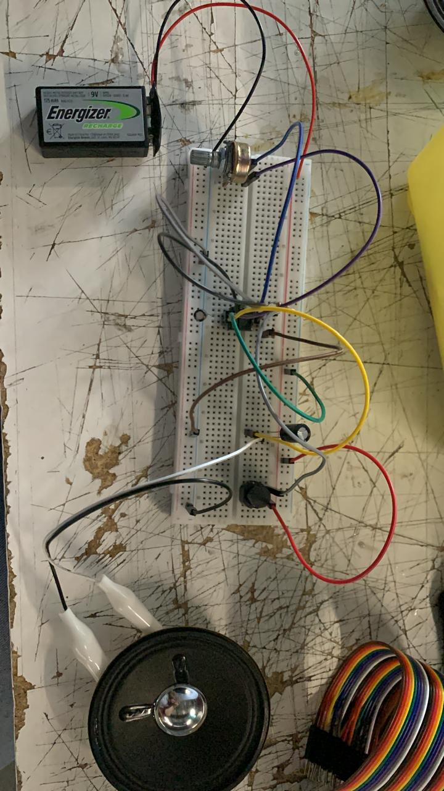

# sesion-03a

### Actividad de clases
Introducción al sonido en la protoboard

**Componentes nuevos**
1.- Pinzas  caimán 
2.- Push button
3.- Parlante 

1.- Las pinzas caimán (o de cocodrilo) son conectores metálicos con resorte y mandíbulas dentadas, usados principalmente en electrónica y electricidad para realizar conexiones temporales rápidas, seguras y sin soldadura. Permiten alimentar circuitos, conectar instrumentos de medición (multímetros) y sujetar componentes con firmeza.
2.-Un push button o pulsador es un interruptor mecánico que abre o cierra un circuito eléctrico momentáneamente solo mientras se ejerce presión física sobre él. Utiliza un mecanismo de resorte interno para regresar a su posición original (encendido o apagado) al soltarlo, permitiendo el control manual en timbres, maquinaria y paneles electrónicos.
3.-Un parlante convierte señales eléctricas en sonido mediante el electromagnetismo. Una bobina recibe corriente, creando un campo magnético variable que interactúa con un imán permanente. Esta interacción mueve un cono hacia adelante y atrás rápidamente, vibrando y empujando el aire para generar ondas sonoras.

Circuito realizado: Victorian oscilator
Circuito sonoro realizado en protoboard a partir de un chip 555, resistores, capacitores, push button, parlante, potenciómetro y una batería. (si funcionó)

## Encargo 
Toy organ en protoboard en dúo: Lucas (no funcionó)
Intentamos realizar el circuito después de que terminara la clase y no nos funcionó, no lo pudimos volver a intentar ni por separado porque al menos yo no tengo las pinzas caimán.

