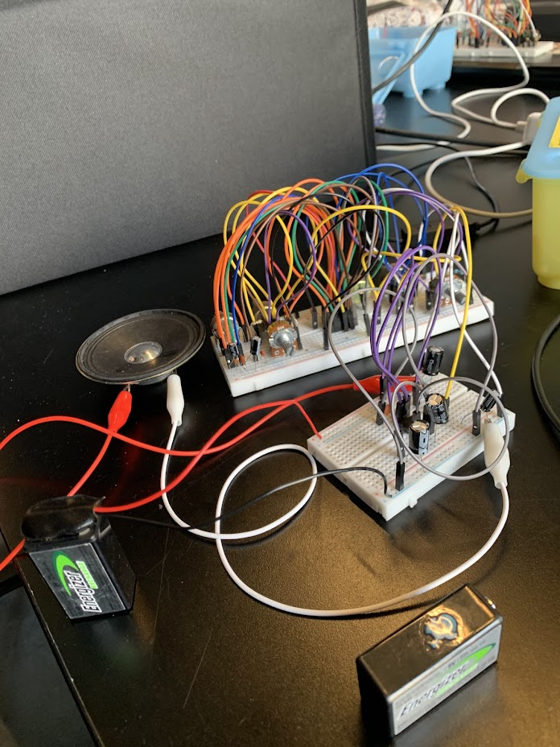
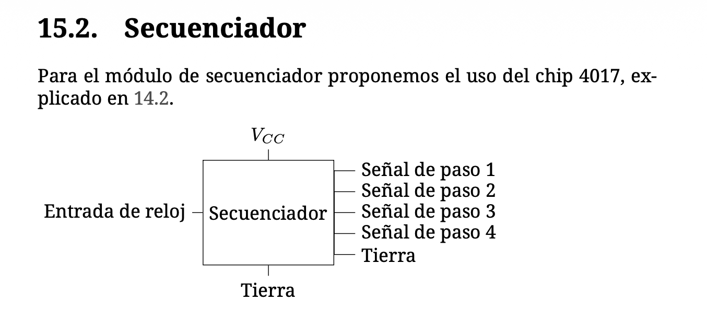

# sesion-06b

## 17.04.2026

**Compuestos**
Regulador/limitador de voltaje (78): Como dice su nombre limita o regula el voltaje, quema o disipa la energía que sobra. Hay diferentes piezas para la cantidad de voltaje que se quiere llegar a adquirir.

**Actividad de la clase**
-Vamos a usar para la sloemne un circuito llamado NANDulator, se compone de 2 chips; un 386 y un 4093.
El sonido que produce el circuito es variado, con el potenciometro puede cambiar estrategicamente dependiendo de los 6 potenciometros que posee.

Estuvimos desarrollando e intentando hacer el circuito 4stepssynth ya que en la clase pasada no nos funcionaba. Creemos que era la parte que tiene el chip del 555, pero en realidad nunca descubrimos por qué. 
El problema es que no suena nada en el amplificador, ahora en el primer intendo de esta clase tampoco suena.

