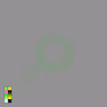

# sesion-01a

## Sisters with transistors (2020)

- Lisa Rovner (Directora)

- ### Suzanne Ciani (1946)

  - 1974 Concierto NY:
    - <https://www.youtube.com/watch?v=PNrkktEqJn0>
  - "La musica electronica esta en movimiento"
  - "Uno trabaja con energia"
  - Hacer arte con las nuevas tecnologias

- ### Clara Rockmore (1911)

  - Tocaba violin y piano con su hermana
  - Por todo Europa
  - Clara hizo sonar los sintetizdores de una manera unica

- ### Delia Deabyshire (1937)

  - Hizo Workshop BBC
    - Muestra Sinewave, Squarewave, Whitenoise en el oscilador(?)
  - Altera cintas en cuanto a la velocidad y corte
    - (Me recuerda a los tape loops)
  - "Se puede hacer cualquier sonido a base de las "waves" de los sintetizadores"

- #### WW2

  - No hay hombres en la ciudad
    - Cambios en el dia a dia de las mujeres, adoptan trabajos que posteriormente eran solo para hombres.

- ### Daphne Oram (1925)

  - 1944 Obtiene un libro de sintetizadores
  - Es pianista
  - Le interesa mucho la tecnologia
  - "La musica electronica es la musica del futuro"
  - Oramnics
    - Musica grafica

- ### Eliane Radigue (1932)

  - Le interesan los sonidos de los aviones
  - Crea sus propias composiciones
  - Cuestiona si esto es musica o no
  - Amor a primera vista con el sintetizador
    - Trabajaba con el tiempo
      - Tonalidades y frecuencias
  - Una nueva manera de escuchar

- ### Bebe Barren (1925)

  - Greenwich, NY
  - Contruyó su propio equpamiento
    - Sobrecargando placas de ciruitos, produciendo sonido
  - En el movimiento Avant-Garde
    - TRabajando en films y sus soundtracks
  - Hacia performance con sus composiciones
  - "Forbidden Planet" (1956)
    - Compuso musica para la pelicula
      - No fue considerado musica/aceptado

- #### Guerra Fría

  - Se empieza a experimentar mucho más en cuanto a las artes
    - Como respuesta a las atrocidades

- ### Pauline Oliveros (1932)

  - Le interesan los sonidos de autos
    - Motores, Estática de radio
  - Grababa sonidos en espacios públicos
    - En 1959 publica Time Perspectives:
      - <https://paulineoliveros1.bandcamp.com/track/time-perspectives-1959>
    - Usó su tina para crear reverb
    - Le gustaban mucho los live performance
      - Uno de 1986:
        - <https://www.youtube.com/watch?v=WZKvIOcP2fo>
      - Uno de 2025 (Una pieza compuesta por Pauline pero presentada por otra gente):
        - <https://www.youtube.com/watch?v=MmZLNr2-JoM>
          - Aquí se usaron Magnetófonos de bobina abierta y generadores de sine waves
    - Nunca se le tomó en serio en su epoca
      - Ser una mujer gay que hacia musica electronica obviamente no era muy aceptado
        -Además de que su musica era cargada politicamente

  - ### Maryanne Amacher (1938)

    - Escuchaba la ciudad
    - Le interesaba mucho la ciencia computacional
    - Estudiaba el acto de "escuchar"

  - ### Wendy Carlos (1939)

    - Switched-On Bach:
      - <https://archive.org/details/wendy-carlos-witched-on-bach/01+Sinfonia+To+Cantata+No.+29.mp3>
        - No está completo en plataformas de streaming convencionales
    - Trabajó en soundtracks para películas
      - Clockwork Orange:
        - <https://archive.org/details/wendy-carlos-wendy-carloss-clockwork-orange-complete-original-score>
      - The Shining:
        - <https://www.youtube.com/playlist?list=PLV2qgnGaGrIrr_fHkshXx_q13MtwZYR_X>
      - Tron (1982):
        - <https://www.youtube.com/watch?v=NBL2XVNG2BQ>

  - ### Laurie Spiegel (1945)

    - Menciona la precisión de los computadores
    - Interacción con el sonido
    - "Los computadores eran la deshumanización de la música"
      - Excepto para los que lo veían como una liberalización
    - Veía la tecnología como una extensión de uno mismo
      - Uno le dice qué hacer a la máquina, no al revés
    - Crea un programa musical para el Macintosh
      - Music Mouse

  - ## Wendy Carlos Deeper'ish Dive

    - Video con sintetizadores Moog en 1970 BBC:
      - <https://www.youtube.com/watch?v=UsW2EDGbDqg>
        - Este sintetizador tiene moduladores, filtros, amplificadores etc...
      - Muestra que con filtros (EQ si no me equivoco) se pueden crear nuevos sonidos más complejos a partir de los waves básicos
    - Con esa marca de sintetizadores produjo Switched-On Bach
      - Que terminó ganando 3 grammy
      - Y en 1986 se certifica platino
    - Es ultra pionera de la música electrónica

- #### Jasper Marsalis (Slauson Malone 1)

  - Me recordó que en una entrevista habla sobre los instrumentos que trabaja y los efectos que usó para su album Excelsior:
    - <https://www.youtube.com/watch?v=-gNBqmeckz4> (Entrevista)
      - "Si lo puedes romper, lo puedes armar... probablemente"
    - <https://slausonmalone.bandcamp.com/album/excelsior> (Album) (Muy recomendado!!!)
    - 
  - Usa muchos synths en Excelsior (También uso Tapeloops)
    - Se hizo instrumentos en Max (También efectos)
      - Me recordó a los protoboard/circuitos pero hechos de manera digital
    - Comenta que Max es como una comunidad
      - Se publican los trabajos mayormente de manera gratuita
      - Y si hay errores la gente te los comenta y te ayuda a arreglarlos

  - Concierto que me encanta de el:
    - <https://youtu.be/UStKlIpw72k?si=vIMp-mwWB2X_je9H>
      - Timestamps de cosas bacanes!!!
        - [1: Buen Cello](https://youtu.be/UStKlIpw72k?si=orTbFVve4aM8uUQZ&t=230)
        - [2: Mini performance mid concierto](https://youtu.be/UStKlIpw72k?si=orTbFVve4aM8uUQZ&t=357)
        - [3: Me encanta como comienza esta canción (sobretodo la versión en vivo)](https://youtu.be/UStKlIpw72k?si=orTbFVve4aM8uUQZ&t=500)
        - [4: Buen Cello 2 y duo con el instrumento que programó en Max](https://youtu.be/UStKlIpw72k?si=orTbFVve4aM8uUQZ&t=680)
        - [5: Cinema](https://youtu.be/UStKlIpw72k?si=orTbFVve4aM8uUQZ&t=920)
        - [6: Synth(?)](https://youtu.be/UStKlIpw72k?si=orTbFVve4aM8uUQZ&t=1060)
        - [7: LA GUITARRA CON DISTORCION IMPACTANTE!!!!!!1!!!!](https://youtu.be/UStKlIpw72k?si=orTbFVve4aM8uUQZ&t=1340)

