# sesion-02b

- ## circuitos 555 trabajos clase y variaciónes
- 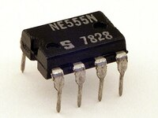
  - 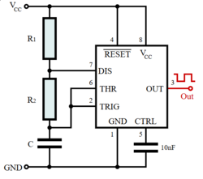
    - https://en.wikipedia.org/wiki/555_timer_IC#/media/File:555_Astable_Diagram.svg
      - timer chip 555
      - cada pin (8) tiene una función
        - se enumeran de abajo a la izquierda (del sacado) a contra reloj

  - ## capacitores
  - barril
    - 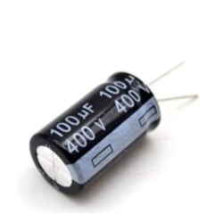
    - nos dieron 4 tipos
      - barril/lata bebida
        - este es polarizado
        - de 100uf 10uf y 1uf
  - ceramica
    - 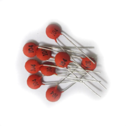
      - se llaman 104 por que su resistencia es de 10 x 10000 = 100k (0.1µF)
      - y este no es polarizado
    - los capacitores guardan energía por cierto momento hasta que se necesite liberar
      - https://www.youtube.com/watch?v=5sluIFfocqY
     
  - ## fotoresistencia
    - 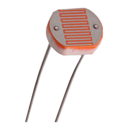
      - los fotoresistores funcionan regulando la resistencia dependiendo de la intensidad de luz que capta
        - los resistores variables pueden regular la resistencia que imponen en el circuito
        - https://www.youtube.com/watch?v=u9Riurh4y9U

  - ## potenciómetro
    - 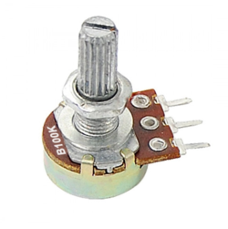
      - los potenciómetros tambien cuentan como resistores variables que pueden regular la resistencia dependiendo de un input
        - en este caso el input es una perilla que se puede ajustar para aumentar o reducir la resistencia
        - https://www.youtube.com/watch?v=sWbSeJmUFfw
        - se puede usar para regular la potencia de las LED, volumen, velocidad y motores entre otros

------------------------

  - ## **ejercicios pin 555**
    - base
      - 
  - ### **en protoboard y encendido** 
    -  
    - 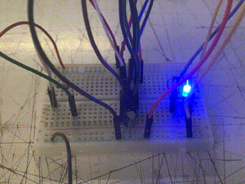 (este con capacitor de 1µF)
    - 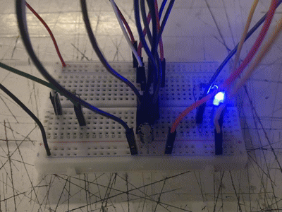 (este con capacitor de 10µF)
    -  (este con capacitor de 100µF)
   
      - aqui se ve la diferencia de velocidad intermitente del LED dependiendo del capacitor
        - en el ejemplo de 1uf a traves del ojo humano se ve normal prendida
          - pero al verlo con la camara del celular se notan más los mini impulsos del LED
            - esto se debe a la velocidad de obturación de la camara que es distinta a la del ojo humano
              - si uno cambia el frame rate del video se ve un parpadeo distinto
                - buen video que explica esto
                  - https://www.youtube.com/watch?v=ft2Al-kpc4E
    - cambio tiempo real de capacitores en protoboard
      - 
        - si no mal recuerdo los electrones son flojos por lo que van más lento si hay mas espacio por el que puedan pasar
       
    - ### **potenciómetro en protoboard**
      - 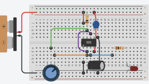
      - 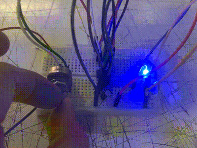
        - el potenciómetro que usamos es el B100K
          - tiene 3 pins y 100k Ω de resistencia
          - al girar la perilla se permite controlar el voltaje
    - ### **fotorresistencia en protoboard**
      - 
      - 
        - este aparato reaccióna a la luz que le llega
          - taparlo cambia el voltaje
            - cambiando el ritmo del LED
    - ### **mezcla fotorresistencia y potenciómetro**
      - 
        - tenia la duda de que ocurriria si se conectaran ambos
          - ambos controlaban el voltaje pero el fotoresistor solo hacia cambios notables con el potenciómetro en un nivel bajo
          - me falta conectar 2 o más fotoresistores para ver que se puede hacer

-----------------------------------
- ## **refuerzo**

- no entendí muy bien como funcionaba el 555 y como conectarlo para hacerlo funcionar
- ### **a base del diagrama más conceptual**
  - 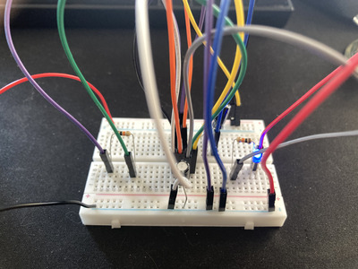
    - no funcionó el intermitente, por lo que algo hice mal
- ### **a base del esquema KiCad**
  - 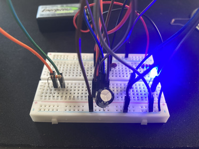
    - ahora si me funcionó
      - eso si no le presté mucha atención a las resistencias, y puse cualquiera
        - fuí cambiandolas hasta que me diera la intermitencia que buscaba
  - ### **probando los pin del potenciómetro**
    - 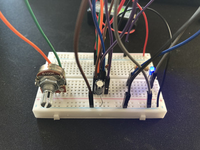
      - aquí fui intercambiando los pines del potenciómetro a ver que pasaba, y para este citcuito si o si necesitaba el del medio
        - si no se conectaba, se quedaba prendida la LED sin apagarse intermitentemente
  - ## **que pasa con 2 potenciómetros**
    - 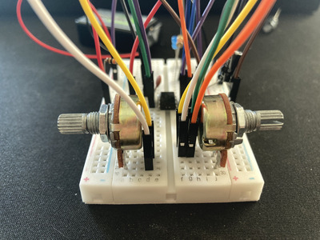
      - habia probado 1 potenciómetro y 1 fotoresistor pero no 2 del primero
      - al tener 2 conectados con los pines del medio y derecho en ambos lados se podia controlar facilmente
        - se sentia un poco como una moto(?) pero al reves
        - si habia un limite donde la LED estaba prendida nomas y ambos potenciómetros no podian estar a más de aprx la mitad
  - ## **que pasa con 2 fotoresistores**
    - 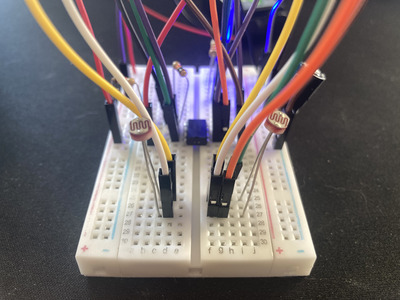
      - muy parecido a los 2 potenciómetros
        - hay un limite donde tener los 2 en algún valor, no cambia mucho el efecto individual de cada fotoresistor
          - si me imagino un aparato que funcione mas producido con distintos fotoresistores como tecla

-----------------------------------
- ### **mini extras**
  - ### **3 LED ** 
      - 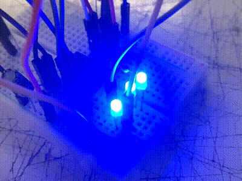
  - viendo/escuchando ejemplos de artistas que usan sintetizadores me recordé de una banda que me gusta mucho y nunca busqué mucho que instrumentos utilizaban y encontre una entrevista que hablan exactamente de lo que usan además de tener una lista escrita en la descripción
    - la banda es "belong"
      - https://www.youtube.com/watch?v=jtI3GKlCqo0&t=
      - tienen el "Nord Micro Modular" que es un synth modular que mezcla hardware y software para funcionar
        - https://www.youtube.com/watch?v=irHhyChSyGw
      - también usan el "Sequential Prophet-5"
        - es un sintetizador analógico polifonico de 5 voces
          - no entendí muy bien lo que era polifonico y segun la RAE es "Música en que se combinan varias voces o partes simultáneas, con líneas melódicas distintas, formando un todo armónico"
          - y cuesta solo 3.999.999 CLP !!!!11!!!
      - hacen musica muy bonita ambiental/noise
      - 
        - https://spectrumspools.bandcamp.com/track/i-never-lose-never-really
          - una de mis favoritas irl
        - y el title track
          - https://spectrumspools.bandcamp.com/track/october-language
         
    - tambien está "tim hecker"
      - ha hecho conciertos con sintetizadores analogicos (o por lo menos asumo que lo es)
        - https://www.youtube.com/watch?v=8gkpp7dn2j8
      - en una pagina de la cual no se si se puede confiar muestran sus instrumentos/efectos/equipamiento general
        - https://equipboard.com/pros/tim-hecker
          - mencionan el "Moog One Polyphonic Analog Synthesizer"
            - marca que habian mencionado antes en las clases
              - y synth muy lindo esteticamente
              - https://www.moogmusic.com/synthesizers/moog-one/
        - una de mis favoritas es "I'm Transmitting Tonight"
          - https://timhecker.bandcamp.com/track/im-transmitting-tonight

    - y esto lo encontre chistoso pero muy interesante porque no entiendo muy bien como funciona
      - https://www.tiktok.com/@gonzosightseeing/video/7615463322128829726
---------------------------------

- ## preguntas
  - como podemos hacer funcionar el parlante?
    - le he enchufado directo a la bateria pero más que eso no
  - que hace cada pin del potenciometro?
  - como se pueden hacer sonidos para hacer sonar el parlante?
    - se pueden modificar? (más ruidoso/reverb/tipo drone...)
  - que hace los otros chips que nos dieron?
    - CD40106BE
    - CD4017BE
    - LM386
  - hay/vamos a trabajar con otros tipos de sensores?
    - proximidad/temperatura/sonido etc...
  - que tipos de proyectos que podriamos hacer?
    - mencionaron que fueran vinculados al sonido más que nada pero, quieren algo en especifico o se va a poder hacer algo más a lo loco
      - podria llegar a hacer un gorro que tenga trabajo con sonidos o nos quedariamos más en las PCB como piezas de por sí
  - las PCB se pueden personalizar?
    - color/propiedades/no se me ocurre más pero si hubiera algo que se le pueda personalizar
  - cuales son los usos generales del 555?
    - se usa en productos comerciales o solo en prototipos
  - podria haber una mini clase de KiCad?
    - no entendí como usarlo
  - como funciona esto?
    - https://www.tiktok.com/@gonzosightseeing/video/7615463322128829726
    - lo puse antes en el readme y aprovecho a preguntar como funciona
  - hay más referentes musicales que nos recomienden(?)
