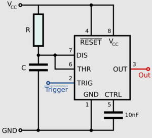
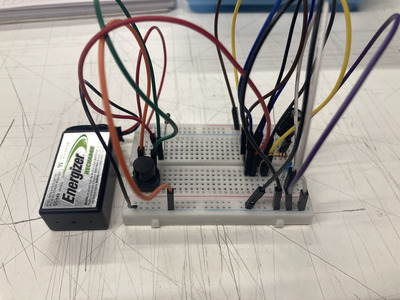
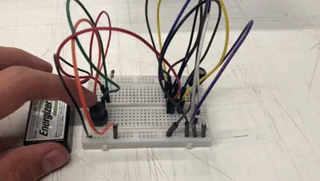
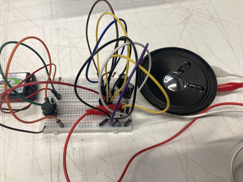
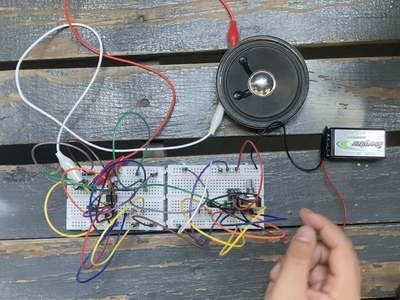
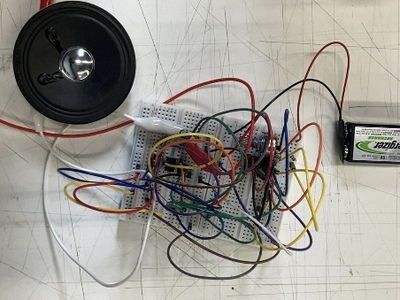
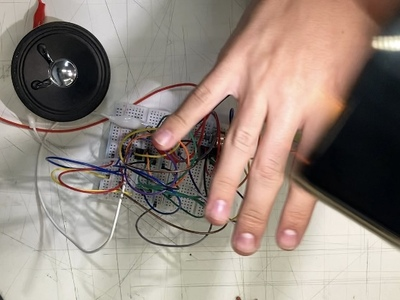
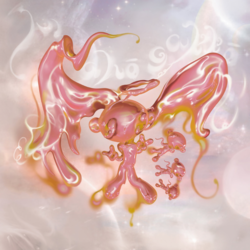

# sesion-03b

- ## apuntes hola
  - ## **Resistencias equivalentes**
    - en serie
      - 
        - en este caso se calcula la resistencia sumando cada una
          - R1 + R2
    - en paralelo
      - 
        - si ambas (o más) resistencias son del mismo valór se puede calcular como el valór dividido en 2

  - ## nuevo modo de 555!!!!!!!!!!!!!!!
    - monoestable
      - 
      - 
        - ahora se conecta el 6 y el 7, no el 6 y 2 wooooooowwwwwwwwww
    - ### **con LED**
      - 
        - 
          - se prende al apretar el botón y se apaga al rato
    - ### **con parlante** 
      - 
        - de curioso nomas enchufamos el parlante
           - si se conectaba al condensador de 100uf se veia bien (y lento) el movimiento del parlante subiendo y tras un rato bajando
            - lo conectamos al de 1uf
              - subía y al bajar hacia un sonido de como error(?)
 
  - ## atari punk omg
    - circuito atari punk console
      - 
        - el atari punk consiste en dos 555
          - uno en modo astable y el otro en monoestable
            - que se conectan entre si desde el pin 3 del astable al 2 del monoestable
              - y del pin 3 del monoestable se conecta un parlante!!
                -para controlar el sonido se conecta un potenciómetro
      - este personaje muestra con un osciloscopio lo que se escucha en el atari punk console!!
        - (eso si tiene 2 potienciómetros, uno para volumen y otro para el tono, no se si afecta en algo)
        - https://www.youtube.com/watch?v=uBJKCRK7hd0 
    - ### irl
      - 
        - (el monoestable a la izq y el astable a la derecha)
      - 
        - le conectamos un fotoresistor a las mismas barras que se conecta el potenciómetro para ver como se controlaría
          - 
            - al tapar el fotoresistor con unos dedos y pasar una luz por encima se creaba como una especie de sidechain muy malo pero entretenido
  
       
  - ### **musica electronica interesante!!!!!!!11!**
    - referentes chilenos 
      - 
        - https://dismissyourself.bandcamp.com/album/000-deluxe-edition
          - musica electronica con demasiadas cosas pasando al mismo tiempo
          - nightcore, hard trance
        - (en chile tmb está segunda mordida)
          - https://segundamordida.bandcamp.com/album/mundo
    - persona X japonesa que hace musica impactante
      - 
        - https://hakushihasegawa.bandcamp.com/track/enbami
          - suele hacer una mezcla de jazz con elementos electronicos
            - pero tiene esta canción que tiene imo el mejor diseño de sonido(?) que he escuchado en una canción hace rato
          
  - ### **documental de escena electronica en chile!!!!!!**
    - https://www.youtube.com/watch?v=yIyhc8ojSi8
      - muy bueno
        - muestra distintas secciones de la electronica en chile
      - las imagenes de los rave en 1999 y 2000's lo encontré muy lindo con la gente el la plaza apropiandose del espacio publico
      - y al final muestran a LluviaAcida
        - se relacionan con lugares y trabajan con ello
          - ej: la antártica

      - 
