# sesion-04a

- ## **apuntes clase!!!!1!**

  - ### **parte más teorica**
    - vimos en especéfico el número en dígito de las resistencias y lo que significaban las abreviaciones

| Abreviación | Nombre | Numero            | Potencia |
|-------------|--------|-------------------|----------|
| T           | Tera-  | 1.000.000.000.000 | 10^12    |
| G           | Giga-  | 1.000.000.000     | 10^9     |
| M           | Mega-  | 1.000.000         | 10^6     |
| k           | Kilo-  | 1000              | 10^3     |
| -           |        | 1                 | 1^1      |
| m           | Mili-  | 0.001             | 10^-3    |
| µ           | Micro- | 0.000.001         | 10^-6    |
| n           | Nano-  | 0.000.000.001     | 10^-9    |
| p           | Pico-  | 0.000.000.000.001 | 10^-12   |

  - los resistores se ubican aprx por los kilo y mega
  - los condensadores por los mili, micro y nano

  - esto me recordó a un meme de una zipbomb de supuestamente **55.4 YOTTABYTES**
    - que seria 10^24 (o 1.000.000.000.000.000.000.000.000) x 55.4 bytes
  - 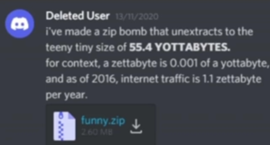
    - (esto es posible porque se crea un archivo comprimido que al descomprimir genera muchisimo contenido)
      - ejemplo de como lo explicaron en reddit

      
            - archivo normal: holaholahola
              - comprimido: hola{3}
                - entonces se puede hacer hola{9999999999999999999999999999999999999999999999999999999999999999999999}
              - el archivo ZIP funciona como un comando de lo que se va a hacer para descomprimir el contenido del archivo
                - o eso entendí quizas reddit me mintió

    - ### **hablamos sobre los pin del 555**
      - 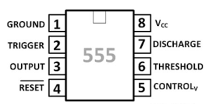
        - 1: Va a tierra (GND)
        - 2: Activa el flip flop interno con una carga negativa
        - 3: Output
        - 4: Resetea el flip flip interno y controla en estado del output en el pin 3
        - 5: Controla el timer (suele no estar en uso e incluso se puede dejar solo)
        - 6: Resetea el flip flop haciendo que el output del switch cambie de alto a bajo cuando la corriente se excede del limite
        - 7: Descarga el "timing capacitor"
        - 8: Vcc/Carga positiva
       
      - (de esto entiendo parte pero hay algunos especificos que me confunden, pero no necesito saber para hacer funcionar el 555)
        - https://www.eimtechnology.com/blogs/articles/pin-configuration-of-555-timer?srsltid=AfmBOoq4Smml05Zj4L-xfwbBtgogC3tOMcc5SWqfCJOw-OGTBbpFC_1G

    - ### **atari punk console 2**
      - hicimos de a 2 la versión inversa del APC
        - con un monoestable conectado a un astable
          - para poder controlar mejor cuando producía sonido
          - además de añadir un LDR
   
      - primero hice yo el astable
        - 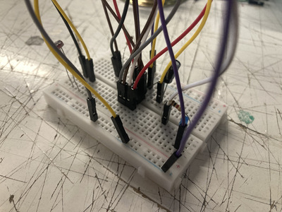
          - 
         
      - después teniamos que conectar un parlante
        - cambiaba un poco el circuito pero es muy parecido
        - 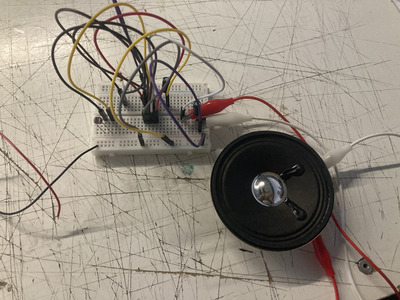 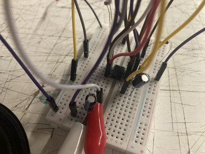
          - no me funcionó
            - 
        - lo intenté denuevo con más orden en los colores de cable (gracias Aaron)
          - 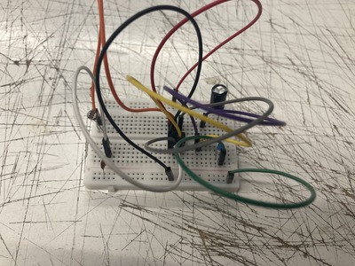
            - no me funcionó
              - 
        - una vez más
          - 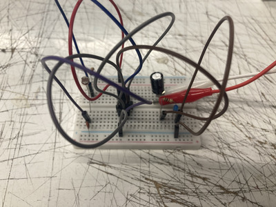
            - nuevamente no funcionó
              - 
              - dudé del chip, pero efectivamente no era el problema
                - le cambié varios componentes para ver y nada cambiaba
        - le pregunté al misaa e inmediatamente me indicó que tenia mal conectado el parlante
          - #lol
        - 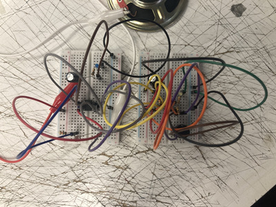 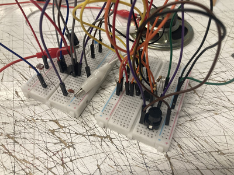
          - ahora si funcionó conectandolo con el de mi compañero
            - al apretar el botón se activaba el parlante y el LED
              - y con el LDR se cambiaba la frecuencia del sonido
             
    - ## encargo
      - teniamos que abrir dispositivos electronicos y ver el interiór de ellos
        - ver las PCB y componentes como los resistores/condensadores/chips ic que puedan tener
          - e intentar explicar como funcionan
    - no tenía dispositivos que pueda abrir en mi casa por lo que fuí a una tienda de arreglos elecronicos
      - aquí hay una placa madre de un laptop que estaban reciclando
        - 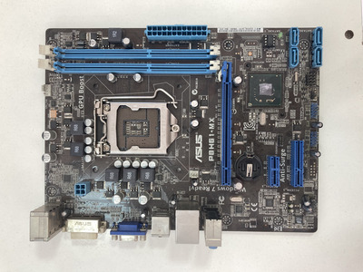 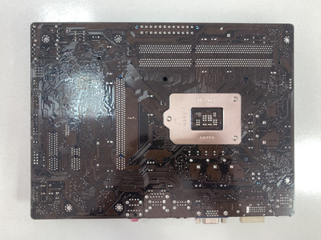
          - se ve donde va el CPU al medio izquierdo de la placa
            - al rededor hay condensadores de distintos valores conectados a IC's
          - 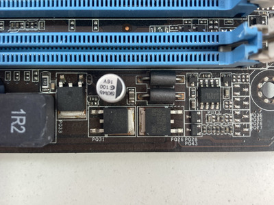
            - aquí se ven los resistores
              - estan acumulados abajo a la derecha
                - no son los que nosotros trabajamos obviamente ya que necesitan otros valores y algo mas compacto
                  - también se ve un PA102FDG
                    - al parecer es un semi-conductor que sirve como switch o para amplificar señales en circuitos electricos
                - por la locación en la que están soldados, asumo que estos componentes ayudan a manejar los slots del RAM en la placa
          - 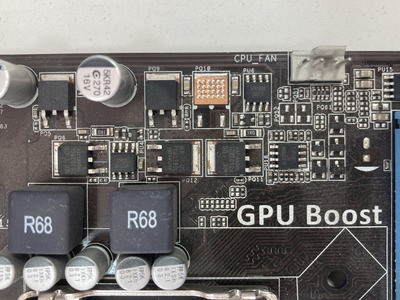
            - se ven más IC's y resistores/condensadores
              - estos contienen un reloj interno para asegurarse que todos los componentes estén sincronizados y funcionando al par
                - también se ve impresa un texto indicando que los 4 pins al borde están ahí para conectar el fan del CPU
                  - las cajas "R68" están ahí para que no se filtre ninguna señal o frequencia indeseada al resto de los componentes
      - también me conseguí un laptop muerto para ver en otra tienda de arreglos electronicos
        - el amigo de la tienda que amablemente me dejó ver el laptop me dió una mini-masterclass de que era cada parte y que hacían
          - lamentablemente por falta de lenguaje tecnico entendí menos de la mitad de lo que decía (iguál anoté lo que pude)
            - muy amable de igual manera 
        - 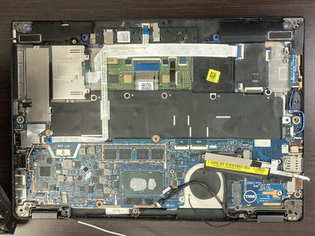
          - un laptop DELL
            - más en grande
              - se ven las distintas secciónes del laptop
                - donde cada una hace algo especifico
        - 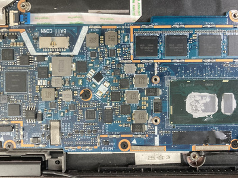
          - se puede ver el conectór para la batería y todos los componentes a cargo de manejar el VRAM
            - se puede ver el VRAM en la parte superiór derecha de la foto
              - la linea naranja que rodéa el VRAM tiene mini heatsinks para ayudar con el sobrecalentamiento
        - 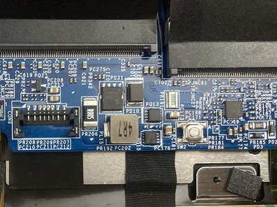
          - en otro laptop encontré este componente muy interesante
            - el que me atendió explicó que era un resistor de 0,005 Ω
              - que es muy poco
                - pero contaba que más que nada estaba ahí para poder calcular el voltaje (si no mal recuerdo)
                  - el computador hace pasar corriente por ahí
                    - el resistor es de muy bajo Ω pero tiene un margen de error minimo comparado con otros
                      - y al hacer pasar corriente, usa la ley de ohm para calcular el voltaje internamente
                        - esto debe ser asumo yo para tener una constancia de la energía usada por cierto sectór de la placa
                          - además de asegurarse de que nada se queme/explote
             
      - ### **mini extra**
        - nuevamente musica electronica interesante
          - esta vez Jane Remover
          - 
            - productora de musica electronica
              - también hace shoegaze, emo rock, *dariacore*, rage, pop rap etc...
            - lo que me interesó es que a los **18 años** crea este subgenero de musica electronica
              - el **dariacore** mezcla elementos del hyperpop con sonidos metalicos y digitales
                - y se caracteriza por lo complejo sonoramente, el uso de samples, la velocidad de las canciones y el humor
                - 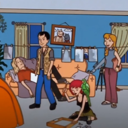
                  - https://soundcloud.com/c0ncernn/sets/d-core (leroy es uno de los 13 proyectos/alias diferentes de Jane Remover)
                    - este es el tercer (y ultimo) "Dariacore" que ha sacado hasta ahora
                    - si lo escuchan, se darán cuenta que es muy hiperactivo y que samplea canciones pop como "Heads Will Roll - Yeah Yeah Yeahs" e incluso canciones de sus amigos como "Gunk - Underscores"
                    - por temas legales de copyright no puede estar en spotify/apple music
                   
                - proyectos importantes de Jane Remover fuera de lo que es su genero de "Dariacore"
                  - https://janeremover.bandcamp.com/album/ghostholding
                    - su proyecto "Venturing" es Slowcore
                  - https://janeremover.bandcamp.com/album/census-designated
                    - su segundo album "Census Designated" fue un cambio radical en su usual genero musical
                      - este es más Shoegaze
                  - https://janeremover.bandcamp.com/album/revengeseekerz
                    - su ultimo album bajo el alias de Jane Remover
                      - es más Rage pero sigue con su estilo maximalista
                - no se como lo hace pero saca una cantidad enorme de musica consistentemente
                  - albumes/ep's en distintos alias suyos
                  - NTS Radio mix
                  - Remixes muy buenos
                    - https://frostchildren.bandcamp.com/track/shake-it-like-a-jane-remover-remix
                      - uno de mis favoritos de JR
                     
        - ### **mini extra 2**
          - también quiero poner a Ninajirachi
          - 
            - artista de EDM australiana
              - que tuvo muchisimo exito con su ultimo album "I Love My Computer"
            - encuéntro que es una de las artistas de EDM más clasicas e innovativas de los ultimos años
              - tiene los elementos clasicos del EDM pero tiene algo muy exclusivo de Ninajirachi
            - una canción que me encanta es "Fuck My Computer"
              - https://ninajirachi.bandcamp.com/track/fuck-my-computer-2
                - "I wanna fuck my computer, Coz no one in the world knows me better"
                  - que de manera muy simple, habla de su relación con su computador
                    - además de que tiene estos synths que nunca había escuchado antes
                      - suenan como cuando movíamos el potenciometro, haciendo que la señal fuera "más rapida o lenta"
                        - también tiene vocal chops suyos y de contedido pop como Walter White gritando
            - otra canción muy buena es "CSIRAC"
              - que más que la canción en sí, me interesó el nombre de la canción
                - el "CSIRAC" fue el primer computador moderno de Australia
                  - 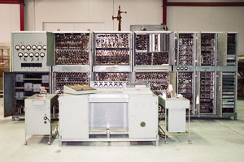
                    - al parecer la memoria podia almacenar 2 kilobytes
                      - algo que hoy en dia no es mucho
                        - pero en la epoca (y claramente por el tamaño del computador) era algo impresionantemente dificil de lograr
                     

          - 
          
