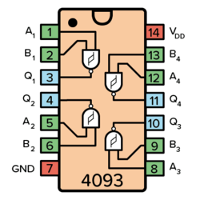
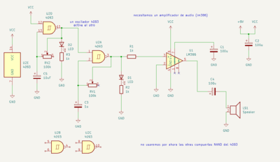
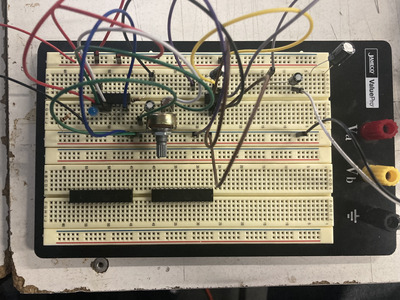
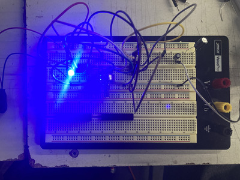
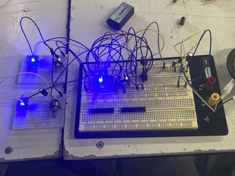
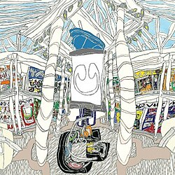

# sesion-04b

## nuevo chip!!!!!!

- **4093**
  - 
    - nuevo IC que claramente no es como el 555
      - tiene 6 secciones
        - 1 de GND
        - 1 de VC
        - y 4 NAND Gates
       
| X | Y | Z | Z- |
|---|---|---|----|
| O | 0 | 0 | 1  |
| O | 1 | 0 | 1  |
| 1 | 0 | 0 | 1  |
| 1 | 1 | 1 | 0  |

  - ### **trabajo en clase** 
    - teniamos q hacer este circuito
      - 
        - usando el 4093 y un AMP (LM386) para poder escuchar el sonido
          - primero para ver si funcionaba el 4093 hicimos una prueba con un diodo
            -  
              - ahora podemos añadir el AMP y configurar un LFO
                - LFO siendo un "Low-Frequency Oscillator", que nos sirve para modular
            - 
              - se ve que cuando el LFO está "prendido" la luz en el 4093 parpadea
            - decidímos añadir un LFO que module el primer LFO
              - 
                - este con los condensadores del esquema si no me equivoco
- ### **decidímos ir probando con distintos componentes y moviendo el potenciometro para ver que pasaba**
  - 
  - 
  - 
  - 
    - ??????? los gif parecen como si tuvieran datamosh
      - no se que pasó ahí
        - lo importante es que sonaba muy interesante
          - con intervalos y si uno posicionaba la perilla del potenciometro correctamente tenia ritmos reconocibles
            - en un intento logramos un sonido como la intro de "Poker Face" de Lady Gaga
           

- ### **mini extra**
  - yayyyyy musica electronica!!
    - ahora: "Underscores" (April Harper Grey)
    - 
      - es una artista gringa que lleva haciendo electronica/indie-pop/electro-pop/hyper-pop hace ya varios años
        - harto pop
      - empezó a ganar popularidad con su EP "Skin Purifying Treatment"
        - https://underscores.bandcamp.com/album/skin-purifying-treatment
      - pero su primer album más "mainstream" dentro de lo que era el UG del momento fue "Fishmonger"
        - https://underscores.bandcamp.com/album/fishmonger (y "Fearmonger", un EP que le sigue al album)
          - https://underscores.bandcamp.com/album/fishmonger
        - un album más orientado al hyper-pop, que justo estba siendo más escuchado en el momento (pandémia)
          - fue aclamado como uno de los mejores del año y uno de los mejores dentro del genero
      - tiempo después Underscores sacó "Wallsocket"
        - https://underscores.bandcamp.com/album/wallsocket-directors-cut
        - su album más ambicioso
          - con un ARG y con más producción en cuanto a los videos y merch
            - también le fué muy bien, con fans haciendo un documento con todo lo que había del ARG
              - https://docs.google.com/document/d/1PyxkFjZeEzmSzhS4xx_xZ9tsf7C3cHeOdk89gs6AnsE/edit?tab=t.0
              - y con notas muy altas de criticos
      - eso si, su ultimo album (y del que quería hablar) es el que, segun yo, es el más "pulido" hasta ahora
        - "U - Underscores"
          - 
            - https://underscores.bandcamp.com/album/u
            - este album se aparta un poco del hyper-pop y del aire medio country que tiene "Wallsocket"
              - con solo 9 canciones sin features (cabe mencionar que todo lo que hace lo produce ella misma y también suele dirigir sus videos)
                - este album questiona los limites de lo que es el pop
                  - siguiendo las estructuras del pop, con hooks muy pegotes y temáticas
                    - pero con su estio de producción propio
                      - (destaco la intro de "Wish U Well")
                    - se siente mucho más prolijo comparandolo con "Wallsocket"
            - para mí, este album es realmente muy pegote y extremadamente entretenido
              - cada vez que lo escucho me quedo pegado con algo nuevo que quizás no había escuchado antes
        - mis favoritas:
          - "Music"
          - "The Peace"
          - "Lovefield"
          
             
        - 
