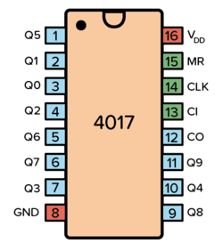
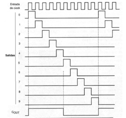
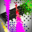
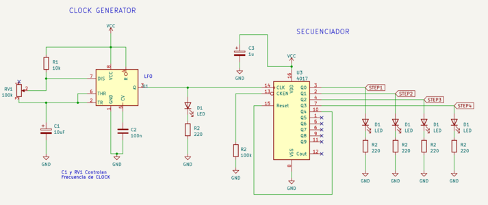
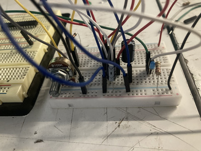
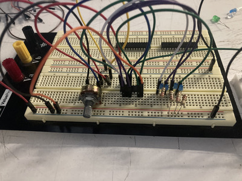

# sesion-05a

## **secuenciador!!!!!!!!!!!!!!!!!!!!!!!!!!!!!!!!!**
- nuevo chip
  - 4017
  - 
    - tiene 10 salidas
      - cada uno con una etapa distinta
      - 
      - https://www.incb.com.mx/index.php/articulos/53-como-funcionan/8859-como-funciona-el-4017-art812s
        - ejemplo de las distintas combinaciones/estados con 4 bits (salidas)
          
|    | led 1 | led 2 | led 3 | led 4 |
|----|-------|-------|-------|-------|
| 1  | 0     | 0     | 0     | 0     |
| 2  | 0     | 0     | 0     | 1     |
| 3  | 0     | 0     | 1     | 0     |
| 4  | 0     | 0     | 1     | 1     |
| 5  | 0     | 1     | 0     | 0     |
| 6  | 0     | 1     | 0     | 1     |
| 7  | 0     | 1     | 1     | 0     |
| 8  | 0     | 1     | 1     | 1     |
| 9  | 1     | 0     | 0     | 0     |
| 10 | 1     | 0     | 0     | 1     |
| 11 | 1     | 0     | 1     | 0     |
| 12 | 1     | 0     | 1     | 1     |
| 13 | 1     | 1     | 0     | 0     |
| 14 | 1     | 1     | 0     | 1     |
| 15 | 1     | 1     | 1     | 0     |
| 16 | 1     | 1     | 1     | 1     |

- nosotros lo usamos ahora para LED
- 
  - pero se pueden usar para sonido si se les añade un amp y parlante
 
- ### **trabajo en clase en grupo hola**
  - 
    - para este circuito necesitamos un 555 astable y 4 outputs del 4017
      - el output del 555 astable se manda al pin 14 del chip 4017
        - los output del secuenciador no están ordenados
          - el "primero" en la secuencia sería el pin 3
          - un pin importante es el 15
            - este funciona como reset para reiniciar el circuito
              - para nuestro caso conectamos el pin 10 (4to en la secuencia) al 15
                - ahí cuando el IC vé que el Q4 lo manda al reset
                  - se devuelve al Q0
                    - iniciando nuevamente la secuencia
        - **fotos circuito**
          - 
            - 555 astable que va al 4017
          - 
            - 4017 con 4 outputs a LED
- ### **gifs wow**
  - 
  - 
  - 
  - 
    - al mover el potenciómetro en el 555 la secuencia de las luces cambiaba velocidad
      - esto ya que el 555 funciona como el reloj
        - dehecho cambiamos condensadores en el circuito del 555 para ver si alteraba la velocidad
          - si lo alteraba
      - también intentamos remplazar el 555 por un botón
        - no nos funcionó
          - 

- ### **mini extra**
  - musico muy inteligente!!!!!
    - aloisius
    -  (no hay muchas fotos del personaje)
      - hace musica experimental
        - mayormente con instrumentos acústicos
    - lo que quería destacár de aloisius es su proyecto "the unfolding rose"
    -  2023-???
      - https://aloisius.bandcamp.com/album/the-unfolding-rose
      - lo bonito de este "album" es que crece junto al artista
        - en la descripción cuenta que el album va a ser actualizado con nuevas canciónes a lo largo de la vida de aloisius
          - hasta que muera, donde le van a cambiar el nombre a "the unfolded rose"
            - las canciónes son muy DIY
              - varias son grabaciones espontáneas o demos
              - algunas son hechas por amigos/familia y el simplemente estaba presente con su grabadora
              - las canciónes tienen numeros que indican el dia en las que fueron grabadas
                - 040724 = 4 de Julio 2024
             
            - mis favoritas son:
              - (also) - 120224 (4)
                - https://aloisius.bandcamp.com/track/120224-4
              - aloisius - organ 061023
                - https://aloisius.bandcamp.com/track/organ-061023
              - aloisius - accordion 040124
                - https://aloisius.bandcamp.com/track/accordion-040124
              - aloisius - new method (three little birds) 020324
                - https://aloisius.bandcamp.com/track/new-method-three-little-birds-020324
              - aloisius & Isaiah Hull - 020324 (2)
                - https://aloisius.bandcamp.com/track/020324-2
              - aloisius - organ 030324
                - https://aloisius.bandcamp.com/track/organ-030324
              - quintet (no parte del compilado de "the unfolding rose")
                - https://aloisius.bandcamp.com/track/quintet-2
               
  - 
