# sesion-05b

- ## encargo clase
  - habia que hacer funcionar un:
    - 555 astable
    - 4093
    - 4017
    - lm386 (si es que uno queria escucharlo)
   
    - 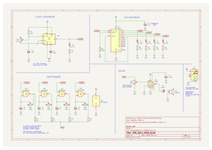
   
      - decidimos hacer funcionar el 555 astable y el 4017 primero
        - 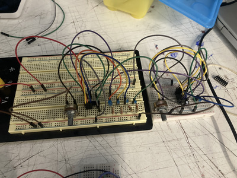
          - lo conectamos a la bateria y las luces funcionaban en secuencia
      - después decidimos intentar conectar el 4093
        - 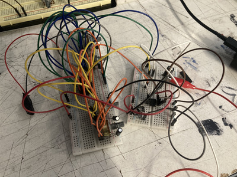
          - aquí tuvimos muchos problemas
            - la primera vez que lo conectamos no pasó nada
              - luego nos dimos cuenta que habian algunos potenciómetros mal conectados
                - y los cables estaban muy desordenados
            - lo volvimos a conectar, ahora con los cables por color
              - decidimos ver si la corriente llegaba al 4093
                - y efectivamente llegaba
                  - pero algo pasaba que no salía audio por el parlante
              - probamos las conexiónes de los Step 1-4 a ver si ese era el problema
                - pero tampoco funcionó
            - lo intentamos una ultima vez
              - ahora con cables de colores adecuados
                - verificamos multiples veces los chip para asegurar que no estén quemados
                  - baterías cargadas
                    - seguíamos haciendo algo mal
                      - 
      - ## intento nandulator
        - encontré un esquematico para un synth/noise-generator que me llamó mucho la antención
        - 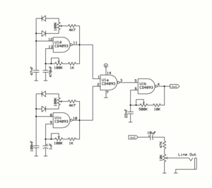
        - https://electro-music.com/forum/phpbb-files/nandulator_11_138.gif
          - es "simple" en el sentido de que no son muchos componentes
            - y varios ya los hemos visto en clase
              - (todos menos los diodos)
              - y se trabaja con un 4093
             
          - ### primer intento
            - 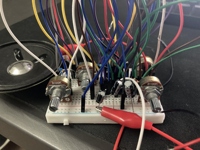
              - la protoboard era muy pequeña para poder almacenar todos los componentes
                - además de que confundí los diodos por LED
            - ### segundo intento
              - 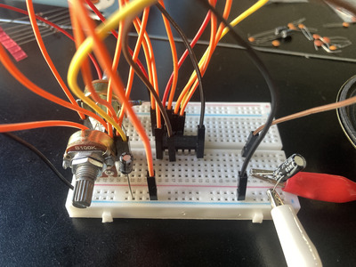
                - ahora con los diodos correctos queria ver si sonaba

        -  https://github.com/user-attachments/assets/21b3d5dc-a70b-4bc8-bae3-2719ce1da1fa

          - sonaba bajo
            - pero sonaba
              - le añadí un 386 para poder escuchar mejor
                - 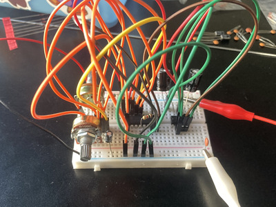
                - 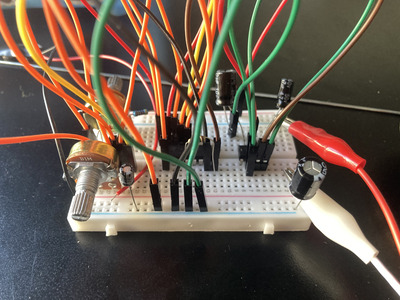
                  - fui viendo con distintos condensadores
                    - no hubo mucho cambio
                      - no se si fue porque al estar conectador directamente a tierra, el condensador no afecta/interfiere el parlante
                        - o si el cambio era muy minimo para notarlo 
                        
        - https://github.com/user-attachments/assets/1953e90a-7493-4849-99c7-e46d5d869bd8
       
          - ahora con el amp se escuchaba más
         
            - ### ahora full
              - con una protoboard más grande y todos los componentes necesarios intenté hacer el nandulator full
                - eso si quize añadir un muffler como efecto para hacer algo que no he hecho antes
                - 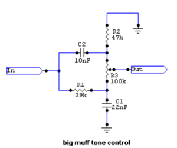
                  - https://generalguitargadgets.com/how-to-build-it/technical-help/articles/design-distortion/
                    - una pagina que muestra esquematicos para pedales/efectos de guitarra
                      - usa condensadores y resistores con un potenciómetro para medir el Wet/Dry del efecto
                      - 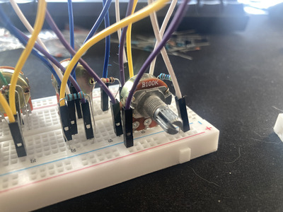
                        - solo tenía un potenciómetro de 10k (debería ser de 100k)
                      - 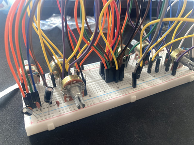
                        - nandulator full en protoboard
                          - aquí también cambie un potenciómetro de 500k por uno de 100k
                            - todo esto afecta el sonido pero los resultados fueron muy bonitos de igual manera

                - https://github.com/user-attachments/assets/057e6135-0bd8-45cc-ad71-bfb052088ef2
               
                  - en persona el ruido es mucho más potente
                    - me gusta mucho como suena y jugar con los potenciómetros
                    

                  -  https://github.com/user-attachments/assets/98a66a80-1254-4219-8ed1-3c655149a15e

                   - el muffler funcionó extrañamente bien
                     - en mi cabeza no tiene sentido como resistores y condensadores pueden hacer eso
                       - pero por eso mismo me fascina
                       

                  -  https://github.com/user-attachments/assets/638de848-be24-4270-aed3-4fbe4544ceaa
                 
                    - llegué a este tono/nota(?)
                      - mi favorito
                        - no se si estoy escuchando cosas que no son pero escucho distintas frequencias
                          - suena complejo

      - ### **mini extra**
        - Chuquimamami-Condori (Elysia Crampton)
          - 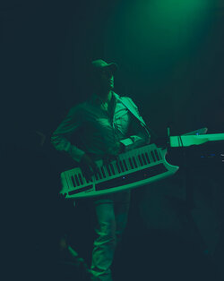
            - artista de musica collage/electronica/indigena/deconstruida
          - Album realmente unico
            - 
            - https://chuquimamani-condori.bandcamp.com/album/dj-e
              - no queria poner este album porque no se mucho como describirlo
                - es realmente algo que nunca había escuchado antes
                  - tiene melodías muy pegotes
                  - sonidos muy trabajados(?)
                  - samples
                  - estructura de canciónes fuera de la norma
                  - y un genero musical muy raro, en el buen sentido de la palabra ofc ofc

              - todas las canciónes se sienten sobrecargadas
                - hay momentos en los que hay 1000 sonidos distintos al mismo tiempo
                  - y logra que suene bien
                - la mezcla de sonidos acusticos de aire con synths casi espaciales es muy entretenido
               
              - quisiera destacár canciónes en especifico pero todas son buenas
                - igualmente estas son **mis favoritas**:
                  - Breathing
                    - 2:00 - 4:17 es no normal
                  - Return
                    - toda la canción
                  - Until I Find You Again
                    - el violin(?) a lo largo de la canción
                    - muy buen final al album
                   
              - mini ps
                - también trabaja en un grupo llamado "Los Thuthanaka"
                  - tienen un album parecido en cuanto al estilo de producción
                    - y muy bueno
                  - https://losthuthanaka.bandcamp.com/album/los-thuthanaka-2
                    - se destaca:
                      - Kullawada "Awila"
                      - Salay “Titi Ch’iri Siqititi”
                        - (mi favorita del album)
                       
- 
