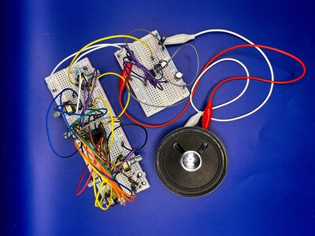
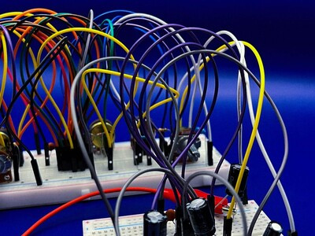
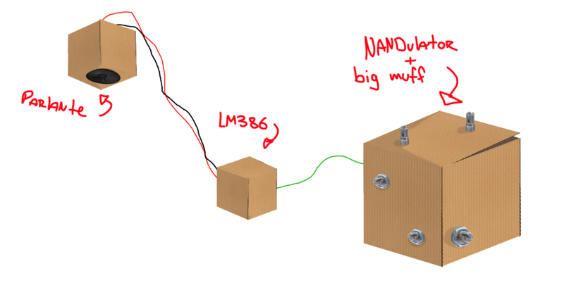
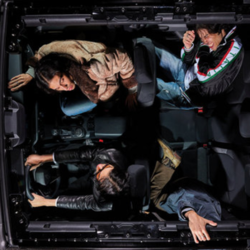
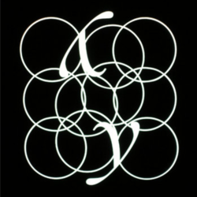
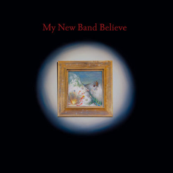

# sesion-06a

- ## avance presentación synths
  - fotos pro del NANDulator + big muff (gracias emi)
    - 
    -     

https://github.com/user-attachments/assets/5cb2ede1-4b29-4cc2-8e7f-6c8add4a62c8

  - en el video se escucha bien como afecta el "big muff" al sonido
    - nunca entendí muy bien como funcionaba
      - 
      - https://generalguitargadgets.com/how-to-build-it/technical-help/articles/design-distortion/
        - en la pagina de donde sacamos el filtro explica:
          - tiene un low-pass (R1 y C1) y un high-pass (R2 y C2) filter y un linear pot (R3) que se usa para controlar los filtros
            - yo personalmente no entiendo todavia muy bien como funcionan las variables y los filtros con condensadores y resistencias
              - si no me confundo es que dependiendo de los valores de los componentes, estos dejan pasar/atenuan ciertas frecuencias
              - me ví estos video para intentar entender un poco más, quizás con un poco más de experiencia pueda entender mejor
                - https://www.youtube.com/watch?v=8IdCYjax5VI
                - https://www.youtube.com/watch?v=lagfhNjMuQM
                - https://www.youtube.com/watch?v=oHKwwvcn77Y
                  - igual logré captar algunas cosas
  - ideas para cajas modulares de los synths
    - 
      - esta es la idea inicial de como queremos presentar los synths
        - con el parlante colgando de algo
          - probablemente de alguna luz o poste
      - con el NANDulator y el big muff en una caja absurdamente grande (comparado con el tamaño de las proto)
      - el LM386 en una caja independiente como el AMP
      - y el parlante colgando en su caja
     
  - ### IMPORTANTE VARIABLES DEL NANDULATOR
    - volví a visitar el forum de donde saqué el NANDulator
      - encontré un update del creador contando que había notado cambios en cuanto al sonido con distintos 4093's
        - de distintas productoras del mismo IC
          - supuestamente el de Texas Instruments (CD4093BE) no es bueno
            - ahora esto no significa que no funcione, simplemente que no como el creador había destinado
            - https://electro-music.com/forum/post-421041.html#421041
              - lo encontré interesante
                - nunca pensé que IC's "iguales" de distintas productoras podrían afectar el resultado
               
-----------------------------------------------------------------------

  - ### mini mini extras de musica
    - quería poner algunos artistas que escuché mientras trabajaba en los encargos
      - 
      - https://bodymeat.bandcamp.com/album/starchris
        - Starchris - Body Meat
          - tiene algo de glitchy con percusiones que se sientes desfasadas y muy buen diseño de sonido
          - https://bodymeat.bandcamp.com/track/crystalize
            - mi fav del album
          - https://www.youtube.com/watch?v=buB3xcL5LBA
            - mejor video suyo imo
      - 
      - https://injuryreserve.bandcamp.com/album/my-ghosts-go-ghost
        - My Ghost Go Ghost - By Storm (aka Injury Reserve)
          - nuevamente mis personajes favoritos de la musica haciendo cosas que no pensé que se podían hacer
            - el uso de la guitarra en el album es algo nuevo para ellos y lo incorporan con sonidos que se distorciónan al limite de lo posible
            - https://injuryreserve.bandcamp.com/track/double-trio-2
              - en canción está sobrecargada de energía
              - el sax solo del final es lo mejor de la vida
            - https://www.youtube.com/watch?v=ujoCsb-o4xU
              - video precioso y la parte de los 3:00 en adelante es muy emotiva
                - amo todo
      - 
      - https://mynewbandbelieve.bandcamp.com/album/my-new-band-believe
        - My New Band Believe - My New Band Believe
          - Cameron Picton ex-personaje de la ex-banda Black MIDI
            - musica más progresiva/folk que tiene un algo raro en cada canción
              - lo siento como una foto de una pintura clasica que tiene un pixel muerto metído entremedio
              - https://www.youtube.com/watch?v=GzZbdUHo35g
                - 2:35 - 3:20 es no normal
              - https://www.youtube.com/watch?v=zztKclSNRz8
                - el mejor video de este album
                  - dirigido por Parker Corey (personaje que forma parte de By Storm/Injury Reserve)
                 
        
