# sesion-06b

## pre-entrega preparación !!!!!

- aprendimos a soldar en clases :D
  - no es tán dificil**
    - probablemente hay manera mucho mejores de soldar para que todo quede más prolijo y mejor conectado
      - pero para ser la primera vez soldando componentes electronicos siento que no lo hice nada mal
      - 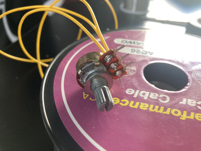
- había terminado de armar el synth con amp parlante y todos los potenciómetros ya soldados con cables (comunes) a la protoboard y lamentablemente se me ocurrió la gran idea de soldar finales de dupont out a los cables ya soldados en los potenciómetros
- 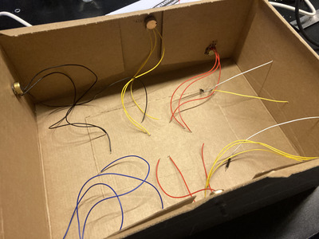
  - quería hacer esto para facilitar la conexión a la protoboard ya que al mover la caja estos se desconectaban
 - 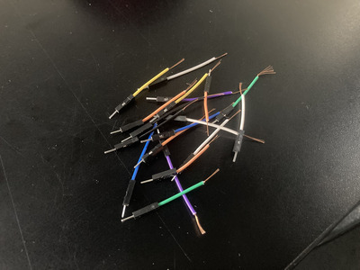
  - en retrospectiva me da pena haber sacrificado tantos cables...
 - al conectar todos los cables ahora con punta dupont me falló todo el synth
   - 
 - busqué quizas algo que se desconectó mientras manipulaba el synth pero no encontré nada
   - intenté con la batería, ver si habían componentes tocandose (los que no deberían), revisé si las conexiónes de los potenciómetros estaban en los pin correctos...
     - en el LID me indicaron al multimetro
       - no tenía ni idea que era ni como funcionaba pero dijieron que me podría aydar para ver si alguna de las conexiónes de los potenciómetros se había quemado al soldar/ver si algún componente se había hechado a perder
         - todo indicaba a que los potenciómetros no eran el problema
      - la Emi me hizo con un diagnostico y me refirió a Aaron para ver si me podía ayudar con el problema
        - junto a Aaron hice un ejercico para escribir detalladamente como se armaba el synth mientras conectaba uno nuevo en una proto vacía
          - algo que me ayudaría para ver si algún componente en el original estaba mal conectado/si faltaba algo que quizas se calló al moverlo
            - no encontré nada pero con la protoboard nueva y un mejor entendimiento del paso a paso de como armarlo decidí partír armando uno de 0 con el esquematico y ver si me resultaba
- 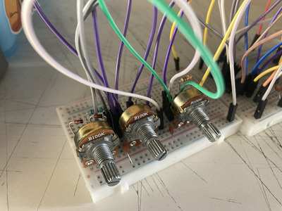
  - antes de hacer todo conecté solo un conjunto de potenciómetros/schmitt trigger a un LM386 para ver si lo que llevaba esta bien
    - no sonaba
      - 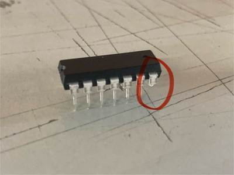
        - claramente no sonaba
          - el pin 7 del 4093 estaba doblado por lo que no estaba conectado al GND
      - hice todo de 0 nuevamente 
  - 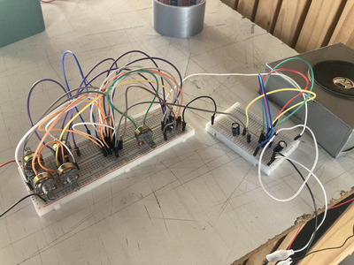
    - FUNCIONÓ!!!!!!!!!!!!!!!!!!!!!!!!!!!!!!!!!!!!!!!!!!!  

https://github.com/user-attachments/assets/67b28a6d-84e5-4475-8971-366d0b5aaea6

  - salí corriendo por el pasillo de la emoción
    - ahora faltaba añadir el Big Muff, soldar los nuevos potenciómetros (ahora directamente con cables dupont) y ponerlo en la caja
- para avanzar soldando fui al LID
  - me quedé hasta las 8pm pero me fuí con todo soldado y funcionando, un nuevo llavero (gracias santiago), me comí unos chispop y con un piezoelectrico (gracias Aaron)

https://github.com/user-attachments/assets/2db86b7a-a07b-4511-b5a2-0e3f8d33bf2d

## 🚨**DIA ANTES DE PRESENTACIÓNES**🚨
- faltaba:
  - forrar las cajas/modulos con la cinta gaffer
  - hacer el texto en la carpeta de nuestro grupo
  - hacer un video con el synth en contexto
  - armar el synth dentro de la caja

- cuidadosamente colocamos la proto con el 4093/Big Muff en la caja grande y lo aseguramos con cinta aislante
  - vimos bien las conexiónes entre los modulos
    - usamos cables dupont in/out para alargar los cables donde necesitabamos
      - al asegurarnos que todo estuviera adentro y bien conectado terminamos de forrar las cajas
      - 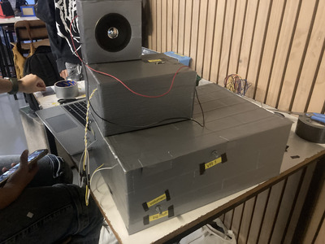

https://github.com/user-attachments/assets/fab27b8e-579f-4978-8ba1-d802243accba

  - (con una salida para conectar la batería por arriba directamente a las cajas)

- ### **fotos y videos/registro!!!!!!!!!!!!!!!!**
  - para hacer un registro de fotos más aesthetic nos fuimos al estacionamiento de derecho UDP
    - calzaba con lo más brutalista(?)/de las cajas con los colores
    - 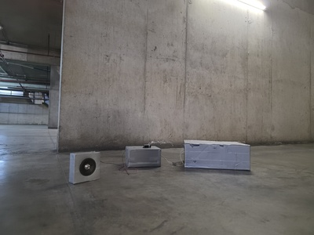  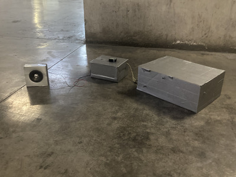
   
    - y un videos!!!!!!!!
   

https://github.com/user-attachments/assets/b096b479-aafa-43e5-936a-89e99c05910e

https://github.com/user-attachments/assets/5b2bb36b-29f7-4896-84ec-8ee3ebca86ee

  - video editado super pro
  - después de hacer todo eso nos fuimos a la casa para poder avanzar en el texto para registrar todo el proceso
    - hicimos el esquematico del synth en KiCad (super pro)
      - 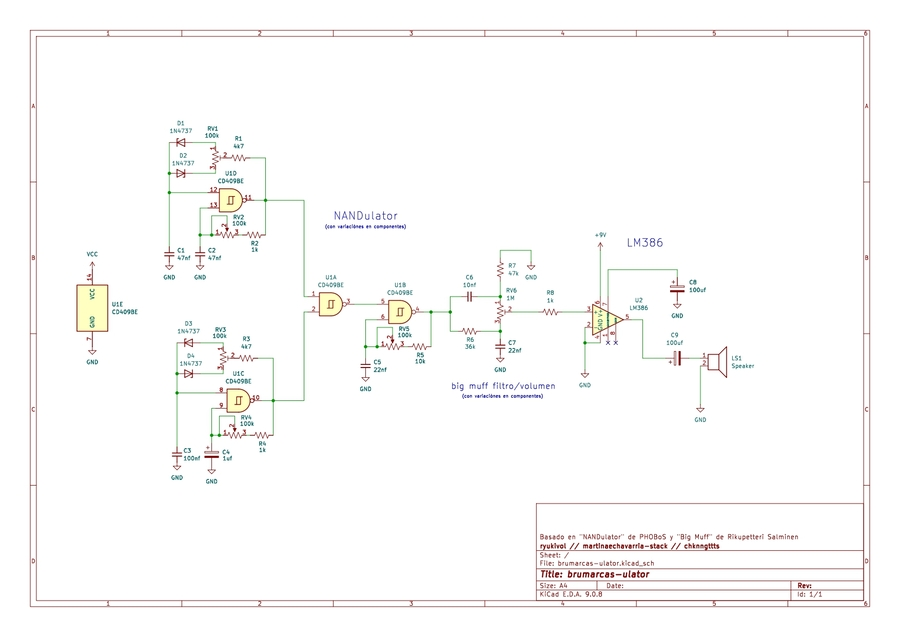
  
## **🚨DIA DE PRESENTACIÓN🚨!!**
  - 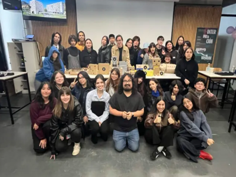
    - Al presentar pudimos mostrarle al resto del curso lo que fue hacer este synth desde cero
      - pensando que hace menos de 2 meses no teniamos ni idea de como prender un LED es realmente loco ver lo que podemos hacer todos
      - fue muy lindo también ver todos los trabajos de los compañeros y poder usar los synth que crearon
        -  estoy muy emocionado para ver lo que hacemos en el resto del semestre!!!!!!!!!!!!!!!!!!!!
