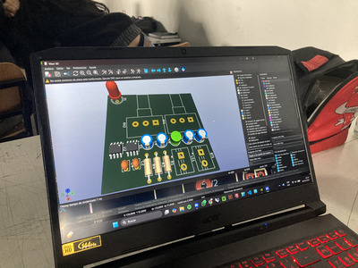
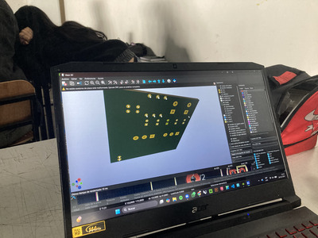
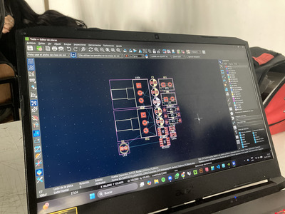
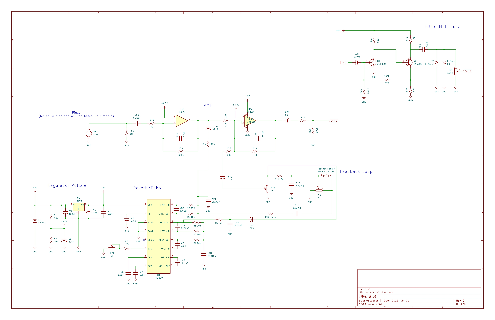

# sesion-07a

- ## clase KiCad!!!!!!!!!!!!!!
  - aprendimos a usar KiCad
    - y a tener un orden al hacer un proyecto
      - 1: dinujar el esquematico en KiCad
      - 2: asociar huellas a simbolos
      - 3: abrir PCB para interpretar el esquematico
      - 4: definir el tamaño de las pistas (cables)
      - 5: repartir componentes
      - 6: rutear
      - 7: adornar
     
- llegamos al punto 3 en clases
  - 
  - 
  - 
    - todo esto lo hicimos con que la PCB seria THT
      - donde uno instala y solda los componentes a la placa
 
- vimos que cada componente tiene dimensiones unican en la vida real
  - una resistencia puede ser instalada verticalmente u horizontalmente
    - y uno debe especificar eso con las huellas para que la placa sea funcional

- ## practica esquematico
- para practicar hacer esquematicos en KiCad decidí hacer el ciruito para el pedal "Boy in Well"
- https://www.diyguitarpedals.com.au/shop/boms/Boy%20in%20Well.pdf
  - este usa un PT2399 y un TL072
    - sirve para hacer que el audio tenga reverb/echo
      - algo interesante que encontré en youtube es un mod al circuito que añade una unión entre el In y Out del PT2399 para crear feedback
        - el mod del circuito no lo muestra en el video por lo que tuve que asumir como se conectaba el componente (Switch ON/OFF)
        - 
          - mi idea es que la señal venga de un piezo para que sea un Noisebox con reverb integrado
            - le añadí un filtro "Muff Fuzz" para que tenga más distorción/ruido
            - https://beavisaudio.com/beavisboard/projects/bbp_MuffFuzz.pdf
           
- para poder hacer el Noisebox necesito una caja de aluminio pero todas son muy caras
  - eso si mientras caminaba a una clase en la U me di cuenta de las cajas electricas
    - https://www.sodimac.cl/sodimac-cl/articulo/142722323/Caja-Metalica-Pregalvanizada-Lisa-A-11-100X100X65MM-Sin-Nocaut/142722324
      - es bastante más economica en comparación a las otras considerando el tamaño
        - debe ser más debil pero dudo que se rompa
           
- me falta asignar huellas a cada componente para poder verlo en PCB 3D

- ## musica!!!!!!!!
  - JOHNNASCUS
  - 
    - personaje muy loco que hace musica experimental glitch/hip-hop industrial
      - para mi sus canciónes son collages de sonidos
      - y tiene una estética que me gusta mucho
        - tiene algo teatral(?) pero usa camaras de baja calidad y unas mascaras que personalmente encuentro feas pero siento que van con su personalidad(?)
    - mis canciones fav
      - https://www.youtube.com/watch?v=Le1ZD3bppWU
        - cortes constantes y un cambio a algo más agresivo
          - mi fav de JOHNNASCUS hasta ahora
      - https://www.youtube.com/watch?v=Jlh_N-VeQbU
        - aquí también contrasta algo más agresivo con partes orchestrales-ish
        - nuevamente un buen [MV]]
      - https://johnnascus.bandcamp.com/album/sitting-at-the-end-of-the-world
        - album suyo con caracteristicas de sus ultimos 2 singles (las 2 canciónes que mencioné antes)
    - en general el sonido que tiene es muy unico y realmente no he podido encontrar a otro artista que haga lo que JOHNNASCUS hace
      - espero que saque un album con el sonido de sus ultimos 2 sigles 
      
