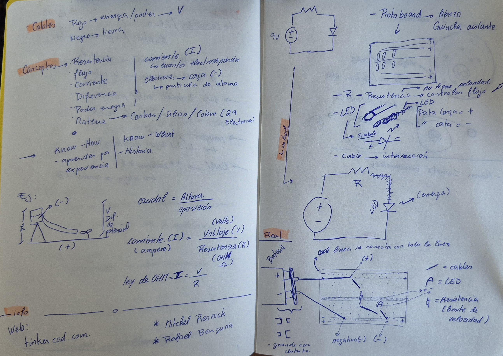
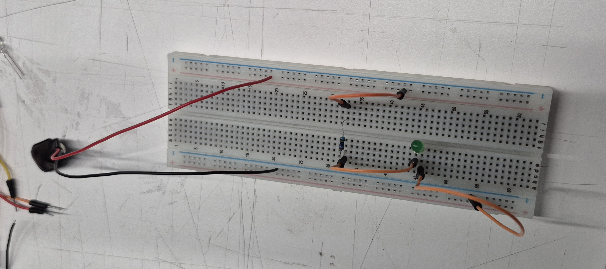
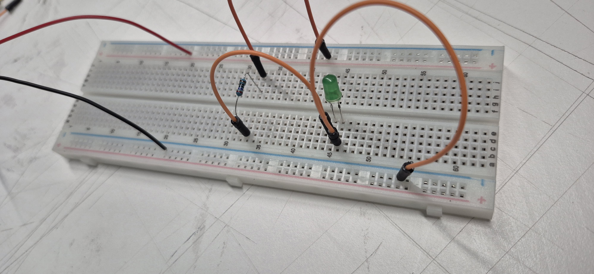

# sesion-01b

APUNTES 13-03

-----------

***Protoboard***

Elementos

| ELEMENTO        | DESCRIPCIÓN  | FUNCIÓN      |
|---------------- |--------------|--------------|
| Cable rojo      | Cable de energía > signo V en la línea (+) del protoboard (parte superior). Toda la línea sirve para conectar.    | Transporta la energía positiva desde la batería.   |
| cable negro     | Cable de tierra > signo (–)  del protoboard (parte inferior). Toda la línea sirve para conectar.     | Cierra el circuito llevando la corriente de regreso, permitiendo que la electricidad fluya.     |
| Cables naranjos | Cables conductores que se conectan a las huecos del protoboard donde esté en la misma la linea el LED, la resistencia y los cables rojo y negro.     | Conductos para el paso de electrones, conectando los distintos componentes del circuito.    |
| Resitencia      | forma doblada y un cuerpo central parecido a un hueso. Debe estar conectada en la misma línea que algún punto de los cables naranjos.     | Controla el flujo de corriente.   |
| LED verde       | pata larga (+) y pata corta (–).     | Emite luz cuando la corriente eléctrica circula bien. |

-----------

Cobre:

Los electrones de la capa externa de sus átomos están débilmente unidos ( 1 electron no tiene pertenecia, esta solo). Esto significa que pueden moverse con facilidad cuando hay una diferencia de energía (voltaje).

+ Alta conductividad eléctrica
  
+ Permitiendo que los electrones se muevan libremente y con mínima resistencia. Permitiendo que los electrones se muevan libremente y con mínima resistencia.

-----------

***Documental "The internet own boy"***

Aaron Swartz

+ the info.org ( blog personal) a lso 14 años

+ Defensor de los derechos de autor en internet -cc . creative commons

+ Reddit > co-fundador

+ openliblery.org- libreria de información donde todos puedan acceder

+ Pacer- pagar por info publica

+ Detención- tachado  rechazado  vigilado - figura activista

+ jstor- “el conocimiento debe ser libre, abierto y accesible”

+ Cargos aumentos- gobierno contra- cierre de puertas- intimidación y enjuiciamiento

***ACTIVISMO***

"Manifiesto de la Guerrilla por el Acceso Abierto"

**“El Movimiento para el Acceso
Abierto ha luchado valientemente para asegurar que los científicos no firmen
derechos de autor y en cambio se aseguran que su trabajo sea publicado en
Internet, bajo términos que permiten que cualquier persona tenga acceso a
este. Pero incluso en el mejor de los casos, su lucha solamente se aplicará
para cosas que se publiquen en el futuro. El resto, lo publicado hasta
ahora, se habrá perdido.”**

***Stop Online Piracy Act***

Contra la ley SOPA: Permitiría al gobierno y empresas bloquear sitios web que compartieran contenido con derechos de autor, provocando grandes protestas por el riesgo de censura y limitación de la libertad en Internet.

***PACER***

Publica documento gratis y de acceso publico en la plataforma donde de daban cobros por informacion publica

***JSTOR***

Descargar grandes cantidades de artículos de revistas académicas financiados con fondos públicos

***Planteamiento***

Cómo asegurarnos de que lo que le pasó a Aaron Swartz no vuelva a suceder:

¿Qué puedo hacer yo, como individuo, para marcar la diferencia? (Megan,2014)
Donde el documental le pregunta al espectador, que puede hacer uno como persona individualcontra un sistema corrupto, pero no quita el que esta misma persona mantuviera y lograra el objetivo de los derechos digitales.

"En lugar de depender del altruismo de un compañero, cada acusado debe apoyarse en la magnanimidad colectiva de decenas de miles para lograr el efecto deseado. Es una carga demasiado pesada para que la soporten." Las personas por si solas, no pueden llegar mayormente a nada pero en comunidad pueden llegar a l mismo objetivo.

***Conclusión***

El documental muestra como un prodigio puede abogar por el derecho de toda una sociedad que ignora la información dada por el mismo sistema que debería de ser la protección de sus derechos, terminando el documental con un trágico final, donde no fue un sicuudio, fue una muerte provocada por la intimidación del mismo gobierno que debería proteger, los derechos de información válidos para la libertad de conocimiento ye l saber a que se le esta dando esta información sin  el conocimiento general , ocupando trabajadores gratis para alimentar al sistema y en el caso del dia de hoy, a la ia.

Ejemplo: el juego Pokemon go, que ocupo a los mismo usuarios como trabajadores gratis, ocupando su información personal del juego para alimentar a la ia y un robot dando al usuario como un trabajador del sistema, regalando todo.

Aaron, una persona con un talento extraordinario puede llegar a defender el derecho de toda una sociedad frente a un sistema que, paradójicamente, controla y limita el acceso a la información que debería proteger. A lo largo de la historia se evidencia cómo gran parte de la sociedad ignora el funcionamiento de estas estructuras y el uso que se hace de los datos y del conocimiento.
El relato concluye con un final trágico. Más que presentarse únicamente como un suicidio, el documental sugiere que fue el resultado de una fuerte presión e intimidación ejercida por el mismo gobierno que, en teoría, debería garantizar la protección de los derechos de acceso a la información y a la libertad del conocimiento.

Asimismo, se plantea una reflexión sobre cómo los sistemas digitales actuales se alimentan constantemente de la información que entregan los usuarios y ellos no darse cuenta por la confianza al sistema, muchas veces sin que exista plena conciencia de ello. En este contexto, las personas terminan funcionando como trabajadores invisibles dentro de una gran red de datos, aportando información que luego es utilizada para alimentar sistemas tecnológicos, incluyendo la inteligencia artificial.

-----------

***Bibliografia:***

How to Make Sure What Happened to Aaron Swartz Doesn’t Happen Again, Megal.D (2014), <https://www.vice.com/en/article/aaron-swartz-jury-nullification-demand-progress/>

Manifiesto de la Guerrilla por el Acceso Abierto, Swartz.A (2008), <https://web.archive.org/web/20140113210434/http://openaccessmanifesto.org/manifiesto-de-la-guerrilla-por-el-acceso-abierto/>
