# sesion-02b

## ¿Qué aprendí? 

Comenzamos la clase con una mención a Ángel Abusleme, quien es un diseñador electrónico enfocado en microelectrónica, microcontroladores y sistemas embebidos. 

También se mencionó a John Widlar, quien, según Wikipedia, fue un ingeniero electrónico y diseñador de circuitos integrados. 
Dato freak: adquirió una cabra para que le cortara el pasto. 

**Ley de ohm**

V = I · R 

+ V: voltaje, se mide en volts 

+ I: corriente, se mide en amperes 

+ R: resistencia, se mide en ohm 

 Hicimos un ejemplo para calcular la corriente en un circuito: 
 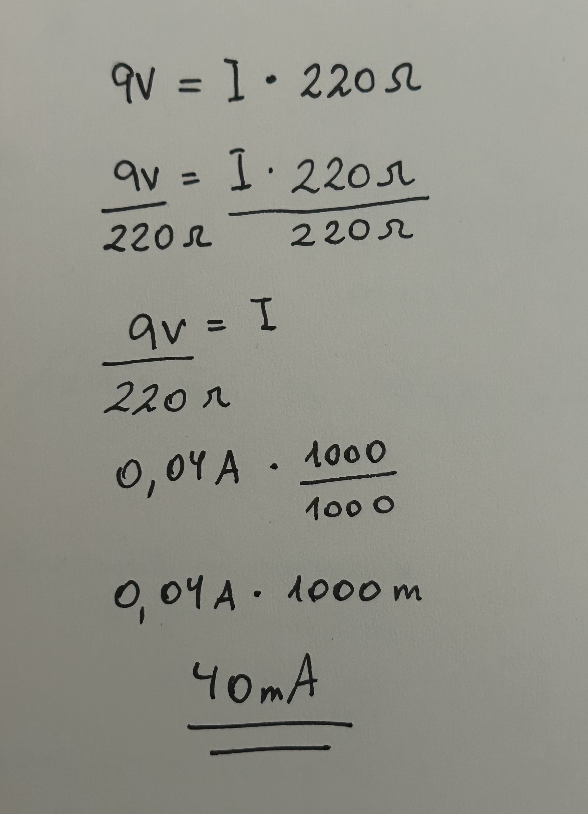
m = dividido por mil 

voltaje dividido por ohm = ampere

**Grafo (topología)**

+ conjunto de puntos conectados entre sí. 
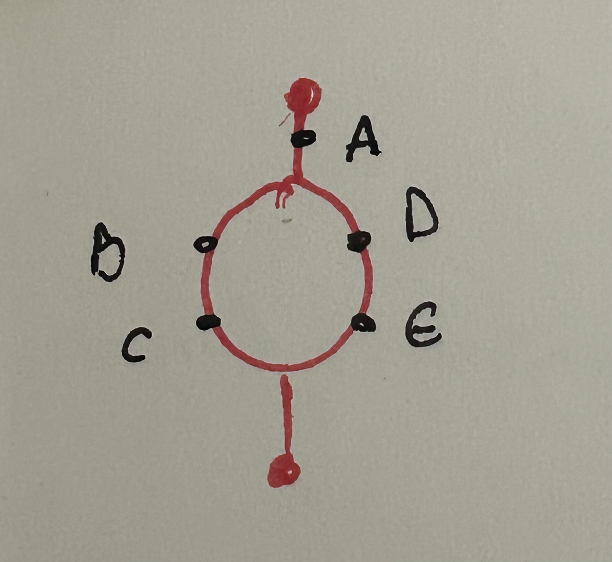 

B - C en serie 

D - E en serie 

BC // DE en paralelo 

**A - (BC // DE)**

Hicimos un ejemplo en un circuito donde sacamos el cable positivo de la batería que estaba conectado al protoboard; luego, sacamos otro cable que iba desde una resistencia al positivo, desconectándolo de este. Al unir ambos cables (hacer contacto entre ellos), se encendía la luz. Fue un ejemplo introductorio para lo que haríamos posteriormente. 

Recibimos capacitadores o condensadores electrolíticos y cerámicos. 
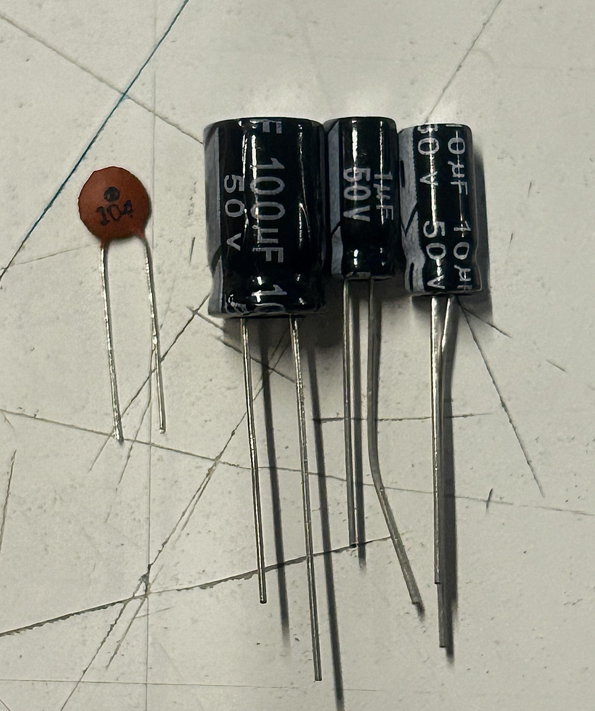 
+ Electrolíticos: son polarizados, tienen positivo y negativo, se miden en µF y tienen un límite de voltaje (50 V).
+ Cerámicos: no son polarizados, no tienen positivo ni negativo, se pueden conectar en cualquier sentido y son más pequeños. 

µ: significa micro 

 

Recibimos también un chip 555

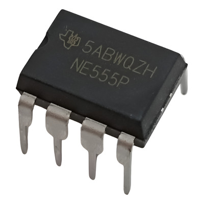

**¿Cómo conectarlo y cómo leerlo?**

+ Tiene 8 patas, cada una con nombre y función distinta. 

+ Se lee desde el “sacadito” que tiene. 

+ La pata 1 está ubicada abajo a la izquierda (en algunos casos indicada con un punto rojo). 

+ Las patas se cuentan en sentido contrario a las agujas del reloj. 

Se llama circuito integrado (IC). 

Circuito de ejemplo
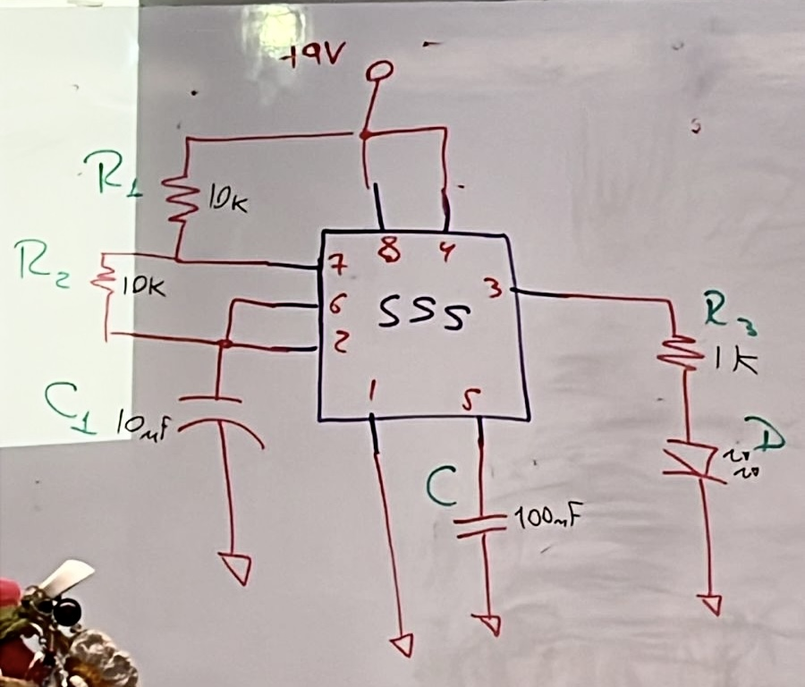
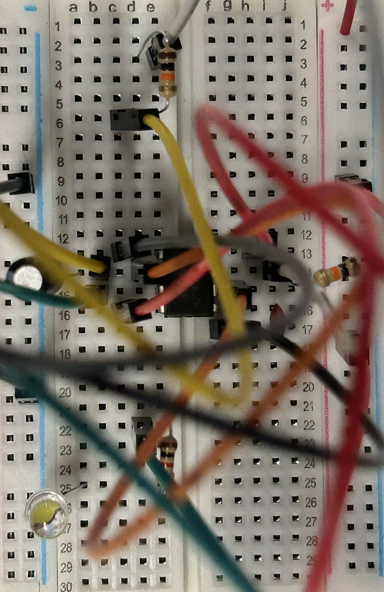

Símbolos para entender mejor el circuito: 
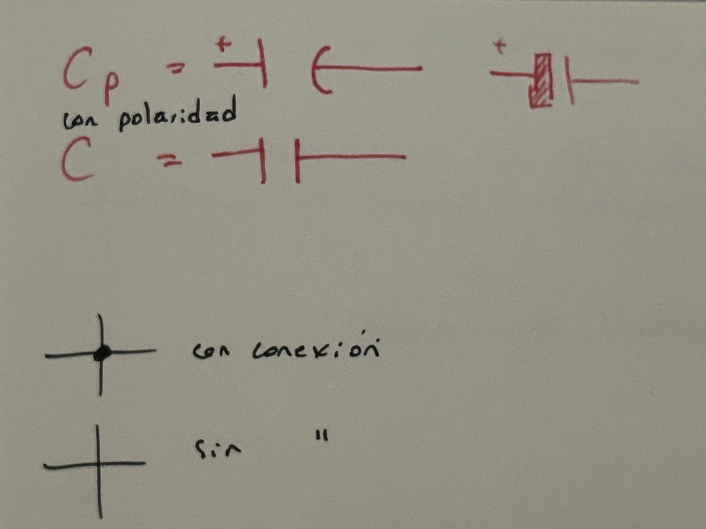

Ejemplo de caja negra: solo importan la entrada y la salida, no lo que sucede adentro. 
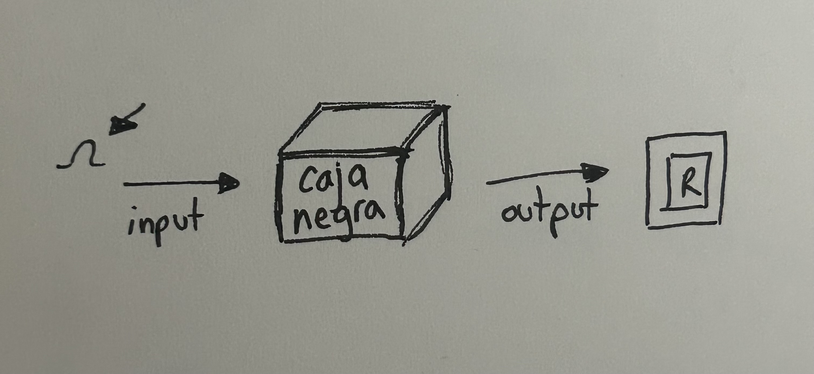

Trabajamos con una nueva resistencia: 

café (1), negro (0), naranjo (3), dorado = 10000 Ω 

Al terminar el circuito, probamos con diferentes condensadores electrolíticos y observamos qué sucedía: 

+ 10 µF = el LED parpadeaba rápido 

+ 1 µF = parpadeaba mucho más rápido, casi imperceptible 

+ 100 µF = parpadeaba lento 

Agregamos un potenciómetro, que regula el voltaje o la corriente de un circuito, y con él regulamos la velocidad con la que parpadeaba la luz. 
Para agregarlo, retiramos la R2 y conectamos el potenciómetro en su lugar. 
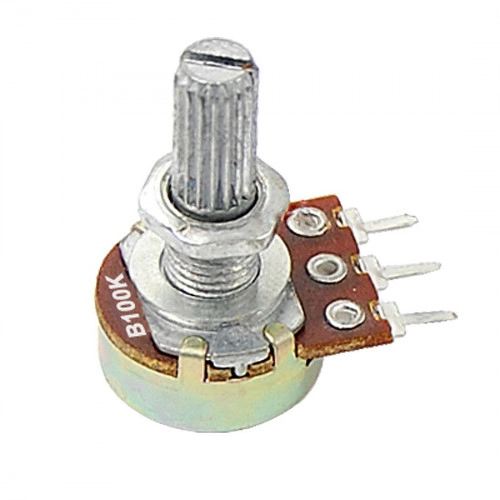

También conocimos el fotoresistor, que cambia su valor según la luz. 
Mientras más luz recibe, más rápido es el parpadeo de la luz; mientras menos luz, más lento. 

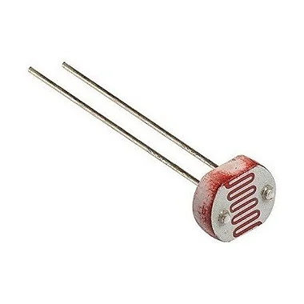

___

### Práctica encargo

Práctica de ejercicio con chip 555, realizada para repasar y practicar de forma autónoma, sin ayuda. El resultado fue bueno; sin embargo, al parecer la batería está descargada o el cable negativo está en mal estado, ya que debía acomodarlo en cierta posición para que el LED encendiera, y solo lo hacía por muy poco tiempo. Quizás también pudo haber ocurrido algún otro error. Confirmar en clase.
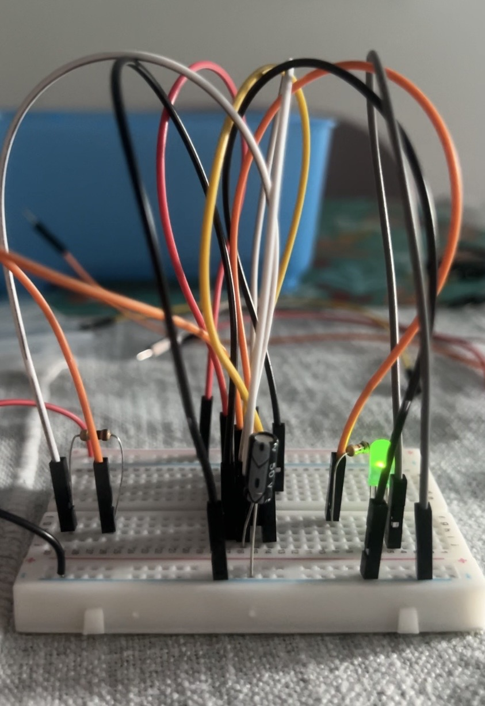

**10 preguntas próxima clase**

+ ¿Qué significa representar el circuito como grafo?
+ ¿Cómo saber qué resistencia elegir?
+ ¿Qué ocurre si usamos una batería de mayor voltaje?
+ ¿Afecta el funcionamiento del circuito si usamos más o menos cables Dupont?
+ ¿Qué ventajas tiene usar múltiples resistencias en serie para un LED en vez de una sola resistencia con el mismo valor total?
+ ¿Cómo influye el valor del potenciómetro en el comportamiento del circuito?
+ ¿Qué pasa si se conectan resistencias de distintos valores en paralelo?
+ ¿Qué ocurre si una resistencia se sobrecalienta?
+ ¿Qué consecuencias tiene un cortocircuito para los componentes?
+ ¿Cómo influye la disposición física de los componentes en el circuito?

