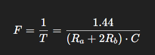
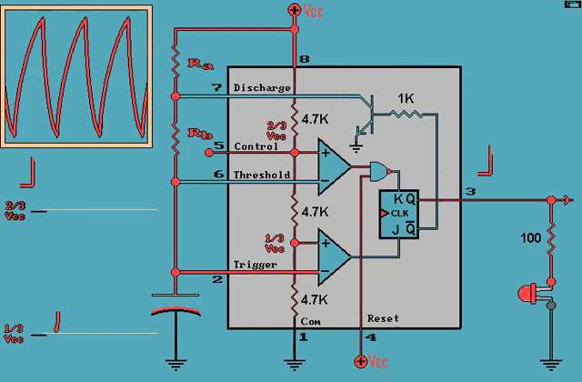
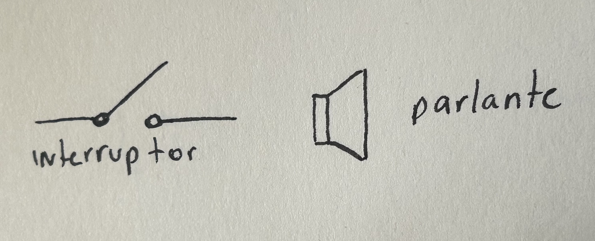
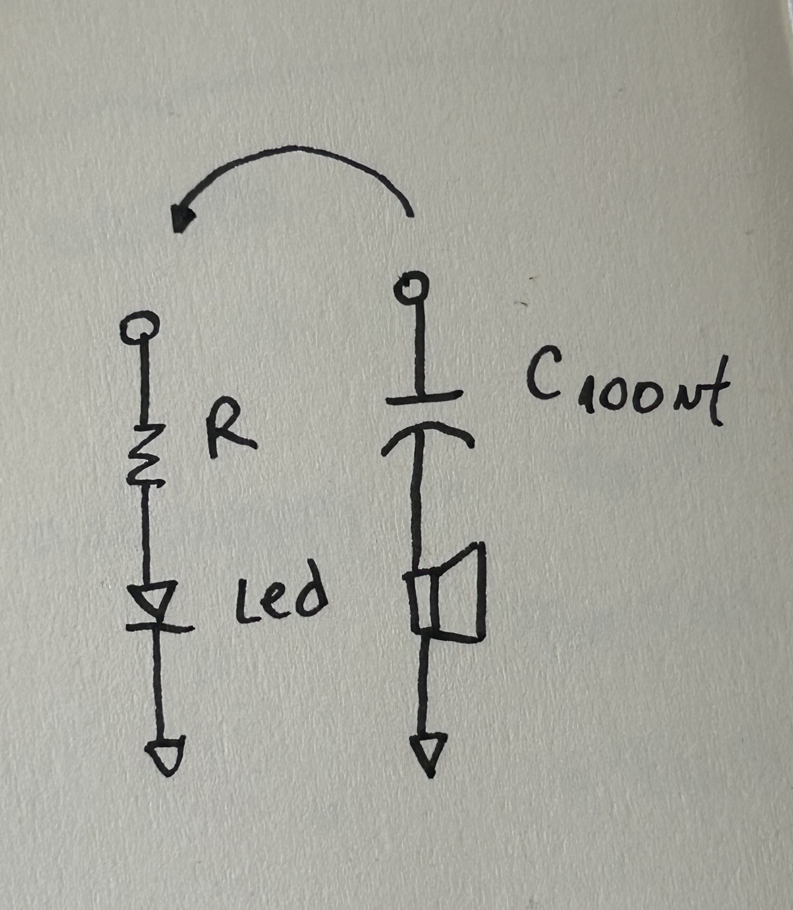
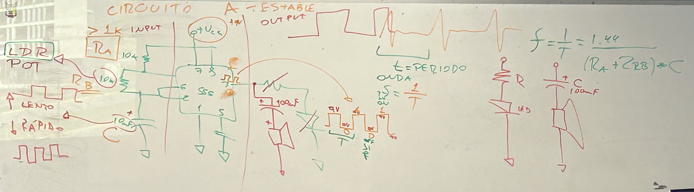
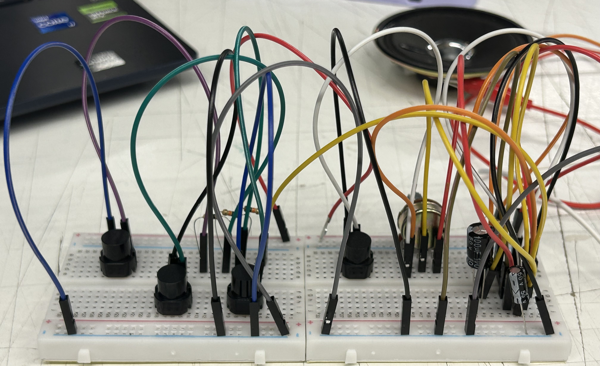
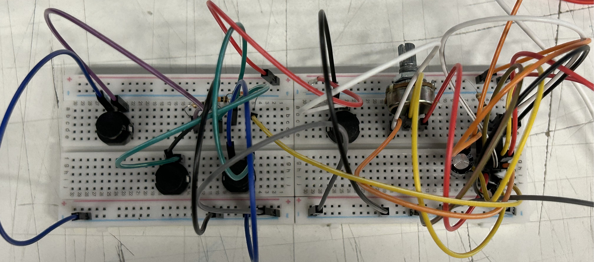
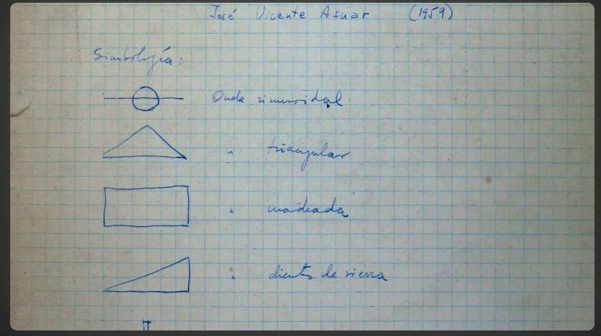

# sesion-03a

## ¡Arte, sonido y electrónica! 

Se mencionó a Sokio, artista cuya práctica cruza arte, tecnología y experimentación sonora. Su trabajo se enfoca en la relación entre dispositivos electrónicos, percepción y espacio. 

Actualmente presenta una obra en el Centro Cultural Gabriela Mistral (GAM), donde explora el uso del sonido y circuitos electrónicos como medio artístico. 

También se mencionó a Gordon Matta-Clark fue un artista conocido por intervenir arquitecturas existentes, cortando edificios para generar nuevas formas de percepción del espacio. 

### Repaso: Chip 555 y circuito astable 

+ Se llama circuito astable porque no tiene un estado estable, sino que cambia constantemente entre encendido y apagado (oscilación). 
+ Esto produce una señal que se repite todo el tiempo, y se puede ver como una luz que parpadea o escuchar como un sonido. 

**Estructura del sistema (modelo "caja negra")**

Input (entrada):  

+ LDR (fotoresistor)  
+ Potenciómetro  
+ Condensador  

Proceso (caja negra):  

+ Chip 555 (donde ocurre la oscilación)  

Output (salida):  

+ LED (luz)  
+ Parlante (sonido)

**Frecuencia y Periodo** 

La frecuencia indica cuántas veces ocurre un ciclo por segundo. 

Se revisó la fórmula: 
 

+ F (frecuencia): número de repeticiones por segundo (Hz)  
+ T (período): tiempo que tarda un ciclo completo  
+ Ra y Rb: resistencias  
+ C: capacitancia
 
**Mayor resistencia o capacitancia → menor frecuencia (más lento)**  

**Mayor resistencia o capacitancia → menor frecuencia (más lento)**

**Oscilación del circuito:** Aunque vemos que el LED parpadea, la oscilación no ocurre en el LED, sino en la patita 3 del chip 555, que es la salida. 
 

## ¡Hacer ruido!

Reconocimos simbología nueva e hicimos cambios en el circuito, como reemplazar la resistencia por un condensador de 100 µF y el LED por un parlante. Usamos cables caimán para conectar el parlante al circuito. Con esta nueva conexión pudimos generar sonido y experimentar con el potenciómetro y el fotoresistor, observando cómo cambiaba el sonido. 

**¿Cómo funciona el parlante?**

El sonido se genera por el movimiento de un electroimán dentro del parlante: 

+ La corriente eléctrica produce un campo magnético  
+ Este mueve una membrana hacia adelante y atrás rápidamente
+ Ese movimiento genera ondas sonoras (lo que escuchamos)

**Experimento con la batería**

Hicimos una prueba conectando el parlante directamente a la batería (lo cual no es muy recomendable, porque puede descargarla más rápido). 

+ Con el positivo, el parlante se “infla”  
+ Con el negativo, se “retrae”  

Esto nos permitió ver el movimiento de la membrana, pero en este caso no se genera sonido continuo, porque no hay oscilación. 

El “Victorian oscillator” es una forma muy simple de generar sonido usando un parlante y una batería. En este caso, el mismo movimiento del parlante hace que el contacto eléctrico se abra y se cierre repetidamente, generando una oscilación. 

Se mencionó a John Cage, compositor que propone nuevas formas de entender la música, incorporando el silencio y el azar. 

Su obra 4'33" consiste en que el intérprete no toca ningún sonido intencional, y la “música” pasa a ser el sonido del ambiente. 

David Tudor fue el primer intérprete de 4'33", y su rol fue marcar los tiempos de la obra sin tocar el piano, permitiendo que los sonidos del ambiente se convirtieran en la música.  

+ Fue pionero en música electrónica experimental, construyó sus propios dispositivos y circuitos y trabajó con sonido, feedback y sistemas electrónicos

**Tipos de interruptores**

Un interruptor es un componente que permite abrir o cerrar el paso de la corriente eléctrica en un circuito. 

Existen dos tipos principales: 

+ El switch (interruptor permanente) es aquel que, al activarse, mantiene su estado (encendido o apagado) hasta que se vuelva a cambiar manualmente. Un ejemplo común es el interruptor de una ampolleta. 
+ El interruptor temporal (pulsador) solo permite el paso de corriente mientras se está presionando. Al soltarlo, vuelve automáticamente a su estado original. Un ejemplo es el timbre.

**Uso del interruptor en el protoboard**

+ La parte plana del interruptor debe ir hacia abajo  
+ Se coloca interrumpiendo el flujo de corriente  

En el circuito: 

+ Se quitó el cable que iba del pin 8 del chip a la batería  
+ El interruptor se colocó entre ese punto y la batería
  

___

## Encargo: Circuito TOY ORGAN 

Unimos dos protoboard porque necesitábamos más espacio y empezamos a armar el circuito con el chip 555 y todos los componentes paso a paso. Cuando agregamos el último interruptor y lo encendimos, quedamos súper sorprendidos con lo que logramos hacer. Fue muy entretenido escuchar cómo cambiaba el sonido cada vez que apretábamos un interruptor, y además no tuvimos grandes problemas para leer el circuito, así que pudimos avanzar bien y entender cómo funcionaba.

___

## Encargo: Variaciones Espectrales 

El documental comienza mencionando la integración de distintos tipos de sonidos generados por oscilaciones eléctricas, los cuales se vuelven audibles a través de la vibración de los parlantes. En este contexto, se mencionan los sonidos puros, que se producen por una sola vibración (una sola frecuencia) y que abarcan desde los tonos más graves hasta los más agudos. A partir de estos, es posible construir sonidos más complejos combinando distintas frecuencias. También se introduce la idea de una interfaz sonora-lumínica (ISL), que propone una relación entre sonido y luz como formas conectadas de percepción.

Mika Martini dice que en el pasado el acceso a máquinas electrónicas para experimentar con sonido era un privilegio de pocos, mientras que hoy existe mayor acceso, lo que permite ampliar las posibilidades creativas. En este contexto, espacios como el Museo de Arte Contemporáneo y festivales como Ai-Maako han permitido difundir el trabajo de compositores chilenos como José Vicente Asuar, Gustavo Becerra-Schmidt y Gabriel Brncic.

Francisco Pinto plantea que el uso de máquinas busca generar una interfaz entre máquina y cerebro.

También aparece la referencia al caleidoscopio (1968) como una forma de entender la variación y los patrones, similar a lo que ocurre con el sonido.

El foco principal se centra en José Vicente Asuar, ingeniero y compositor, asociado a la idea de un “músico misterioso”. Su trabajo parte desde la observación y escucha de sonidos naturales, como el canto de los pájaros, para luego avanzar hacia una abstracción del sonido, entendiéndolo como un fenómeno que puede ser analizado y transformado. En su tesis desarrolla la obra “Variaciones Espectrales”, donde trabaja a partir del espectro del sonido, es decir, las distintas frecuencias que lo componen, generando transformaciones a partir de estas.

Asuar desarrolla una de las primeras piezas en Sudamérica compuestas exclusivamente con sonidos electrónicos, generados, grabados y manipulados mediante tecnología. La música tecnológica no necesariamente requiere partitura, pero puede ser útil como herramienta de análisis, y en este caso Asuar desarrolla una como método para entender lo que ocurre dentro de la obra, relacionando símbolos con estímulos sonoros.

Finalmente, se destaca que Asuar construyó un computador dedicado exclusivamente a la creación musical, capaz de sintetizar una mayor cantidad de voces simultáneamente que otros computadores de su época, lo que refuerza la idea de que el sonido puede ser no solo escuchado, sino también creado, analizado y transformado mediante tecnología.

