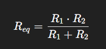
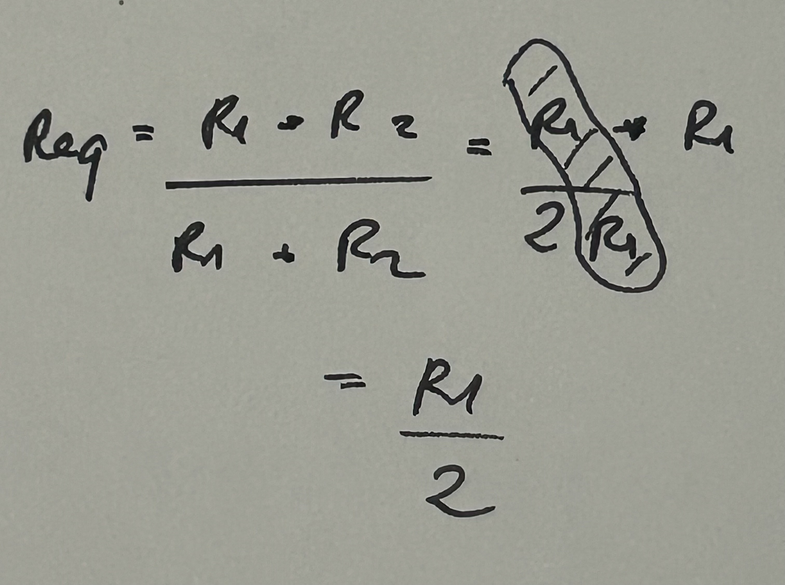
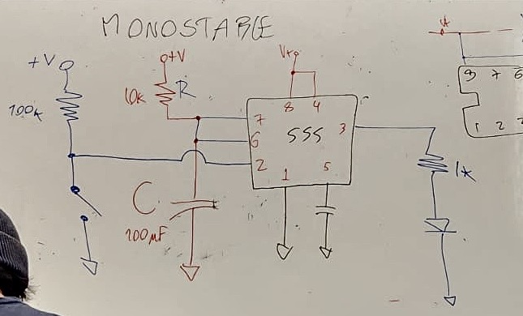
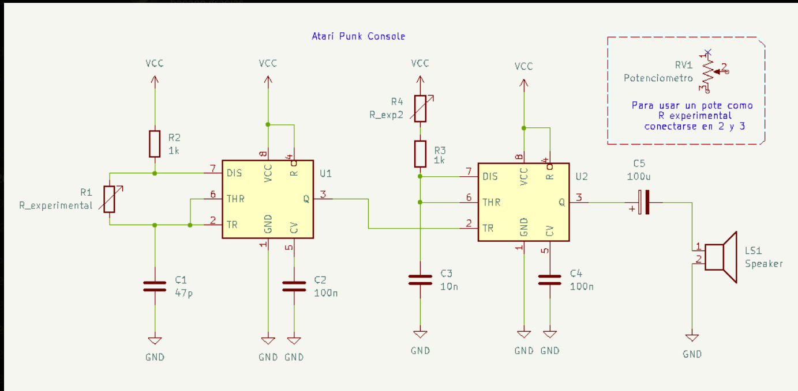
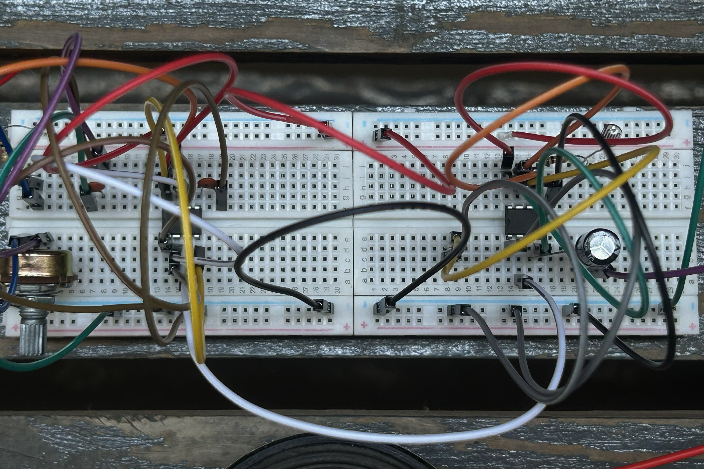

# sesion-03b

## Hoy aprendí

La resistencia equivalente (Req) es el valor único de resistencia que puede reemplazar a una asociación compleja de resistencias (serie, paralelo o mixta) en un circuito, manteniendo la misma corriente y voltaje totales. 

Hay dos tipos: 

+ Serie: Las resistencias se suman directamente, ya que la corriente es la misma en todas ellas.
  Req = R1 + R2 + R3... 
+ Paralelo: El recíproco de la resistencia equivalente es la suma de los recíprocos de las resistencias individuales.
  1/Req = 1/R1 + 1/R2 + 1/R3... 
+ Caso especial: para solo dos resistencias en paralelo.
 

Aprendimos un nuevo circuito, esta vez llamado monoestable, que es un tipo de multivibrador que tiene un solo estado estable (generalmente apagado/0) y un estado casi estable. Al recibir un pulso de disparo externo, cambia temporalmente al estado activo, mantiene esa posición durante un tiempo predeterminado por una red RC y luego regresa automáticamente a su estado original. 

Hicimos el circuito monoestable con 555

Apreciamos cómo se encendía y se apagaba luego de unos dos segundos. 

___

Luego, como segunda parte de la clase, desarrollamos el circuito “Atari Punk Console”

+ R1 potenciómetro
+ R4 LDR
+ C1 de 100n 

Junto con dos compañeros comenzamos a armar nuestro circuito sin mayores complicaciones, y al terminar de armarlo lo probamos. Funcionó por un tiempo corto, ya que uno de los chips se había quemado y el circuito dejó de sonar. Al revisarlo, notamos que nos faltaba una conexión con un cable hacia el potenciómetro. Al solucionar eso y cambiar el chip, el circuito funcionó correctamente y pudimos experimentar sonidos con el potenciómetro y el fotoresistor. 

Personalmente, me siento feliz por las cosas que logro armar, ya que antes de esto no me veía capaz de hacerlo. 

___

Como parte final de la clase, mencionamos a Forrest Mims, quien fue un ingeniero y autor de manuales de electrónica en los años 70. Sus libros, vendidos por RadioShack, enseñaban a construir circuitos simples y accesibles. 

Uno de sus circuitos usaba un temporizador 556 para generar sonidos electrónicos básicos (tipo zumbidos y tonos cuadrados). 

Años después, aficionados a la electrónica y la música experimental redescubrieron este circuito y notaron que sonaba similar a los videojuegos antiguos de Atari. 

Por eso, de forma informal, comenzaron a llamarlo “Atari Punk Console”, combinando: 

+ “Atari” → por el sonido retro de videojuegos  
+ “Punk” → por su estilo simple, ruidoso y DIY 

 

