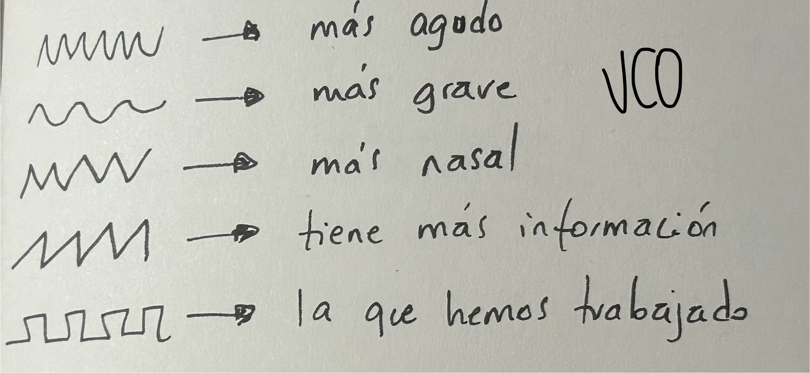
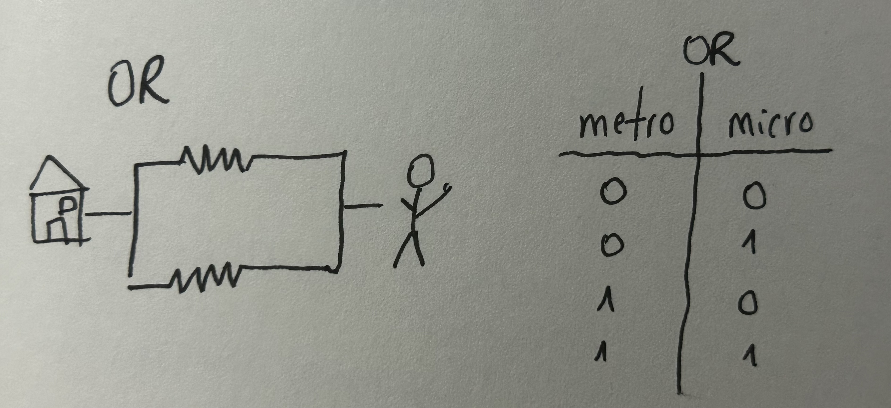
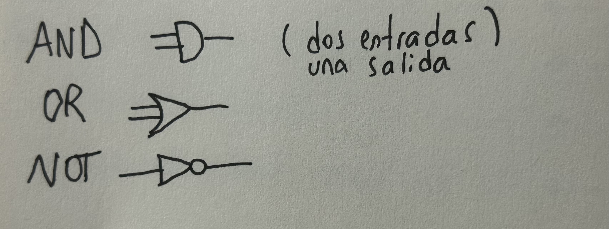
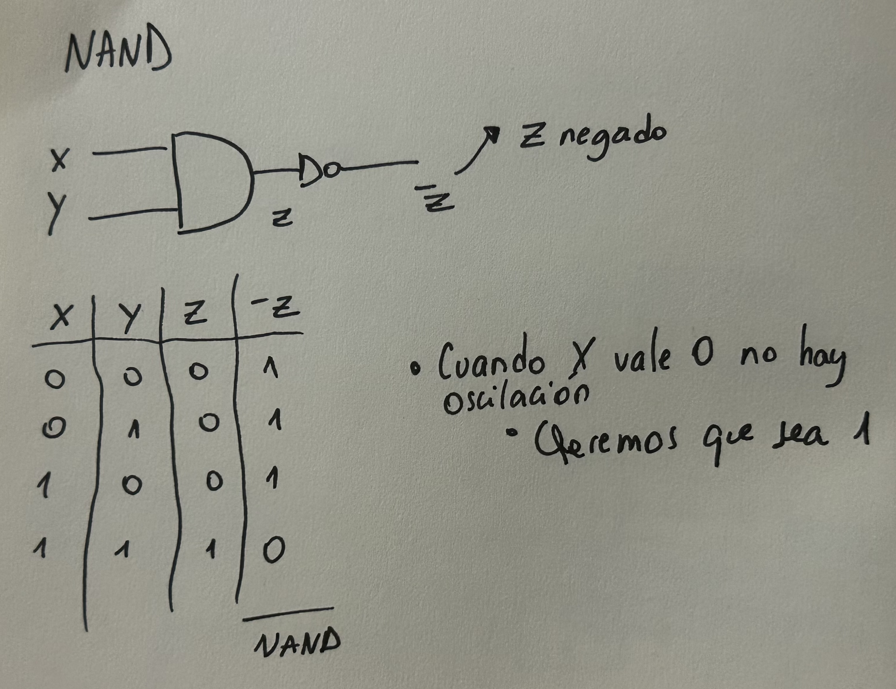
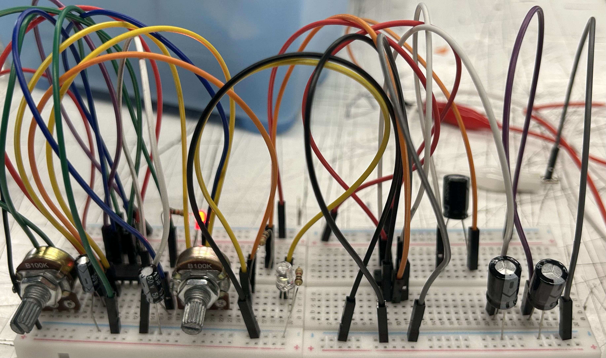
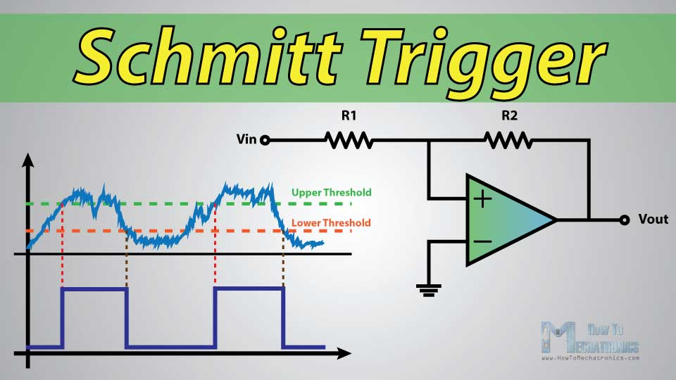
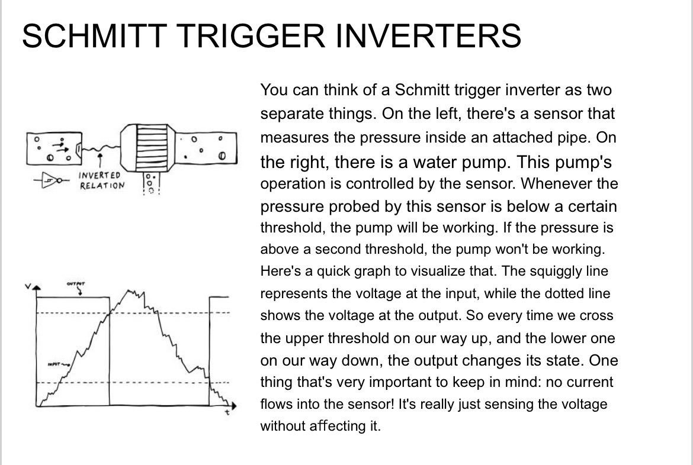

# sesion-05a

**Para hacer sintetizadores**

Gesto / control / dale / comoloensayamos

Voltaje: |‾‾|_|‾‾|

Oscilador: ~~~~~~~

Filtro RC: controla frecuencias 

+ VCA: amplificador controlado por voltaje 
+ VCV Rack: sintetizador modular 

(modulargrid.net) 

Eurorack: una forma de hacer sintetizadores 

Instalar (VCVRACK.com) 

+ Gate: compuerta que permite el paso del sonido (monoestable)

## OSCILADORES 

+ VCO: suenan 
+ LFO: de baja frecuencia <20 Hz (no suena :c) (ejemplo: movimiento de la mano)

Notas – frecuencia – oscilaciones – RUIDO 

### Lógica combinacional 

## ¿Qué es la lógica? 

Según Wiki: ciencia formal, derivada de la filosofía, que estudia las estructuras del pensamiento, las leyes y los principios para distinguir el razonamiento correcto del incorrecto. 

George Boole toma esa lógica y la convierte en operaciones matemáticas. 

Álgebra de Boole: se basa en la idea de que una variable solo puede ser verdadera o falsa. Utiliza únicamente los números binarios cero y uno, y se emplea principalmente en lenguajes de programación, teoría de conjuntos y estadística. 

0 (GND) y 1 (9V): si se hace rápido, es la onda cuadrada 

Tabla de verdad 

Compuertas 

Trabajamos con chip 4093

+ 3 y 4 (salidas) 
+ 1 y 2 / 5 y 6 (entradas)

NAND

 

Hicimos un circuito y ¡RUIDO! 

+ VCO: LED 
+ VVC: a positivo 
+ RV2 100k: pote 

Mientras más grande la capacitancia, más lento oscila 

___

Schmitt Trigger 

Según Wiki: un disparador Schmitt (Schmitt Trigger) es un circuito comparador con histéresis que convierte señales analógicas ruidosas o de flancos lentos (sinusoidales, triangulares) en ondas cuadradas limpias y estables. Utiliza dos umbrales de voltaje distintos (superior e inferior) para evitar conmutaciones falsas causadas por ruido cerca del punto de referencia. 

Por Erica Synths 

Puedes pensar en un inversor con disparador Schmitt como dos cosas separadas. A la izquierda, hay un sensor que mide la presión dentro de una tubería conectada. A la derecha, hay una bomba de agua. El funcionamiento de esta bomba está controlado por el sensor. Cada vez que la presión medida por este sensor está por debajo de un cierto umbral, la bomba estará funcionando. Si la presión está por encima de un segundo umbral, la bomba no estará funcionando. 

Aquí tienes un gráfico rápido para visualizarlo. La línea ondulada representa el voltaje en la entrada, mientras que la línea punteada muestra el voltaje en la salida. Entonces, cada vez que cruzamos el umbral superior al subir y el inferior al bajar, la salida cambia de estado. 

Una cosa muy importante a tener en cuenta: ¡no fluye corriente hacia el sensor! Realmente solo está “detectando” el voltaje sin afectarlo. 

