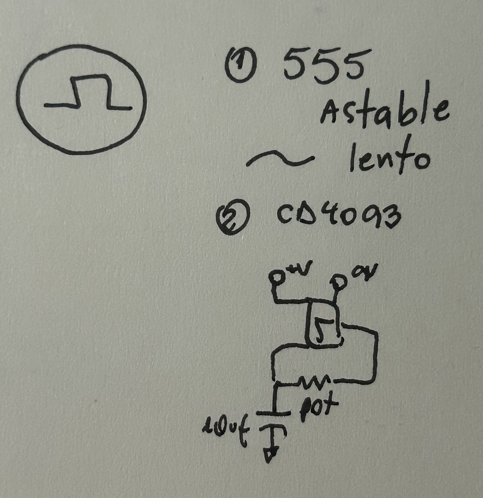
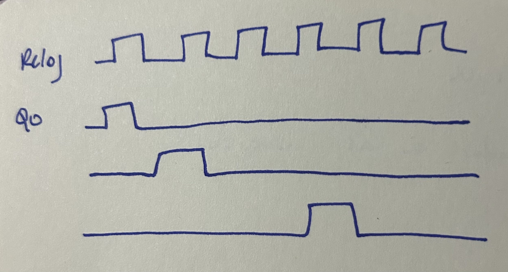
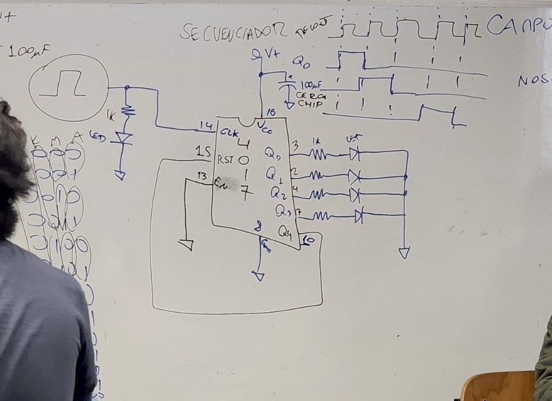

# sesion-05b

Clase más cortita, empezamos a las 11 

UX: entender a los usuarios 

Echarle un ojito:
+ Push, Turn, Move 
+ David Byrne 
+ St. Vincent
___
Campo de sentido 

AKA 

Nosotros decimos que es aesthetic

**SINTETIZADORES**

## CHIP NUEVO 4017

El orden de las salidas está desordenado
