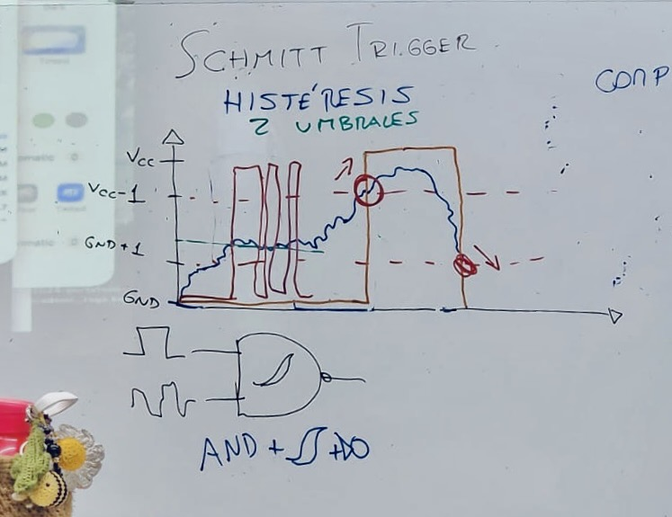
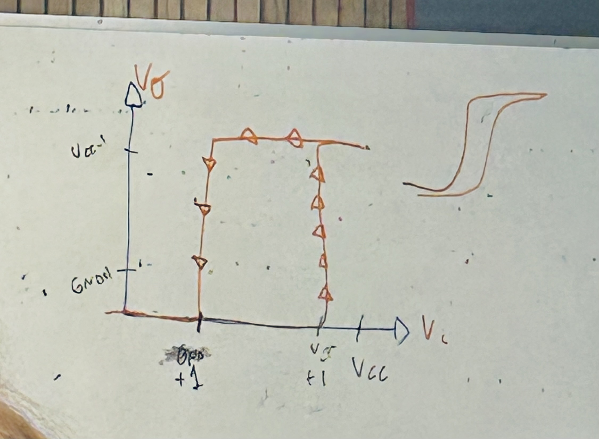
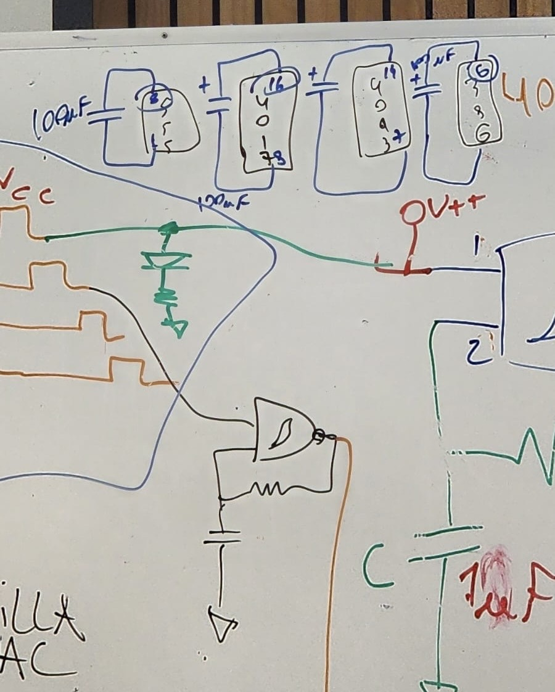
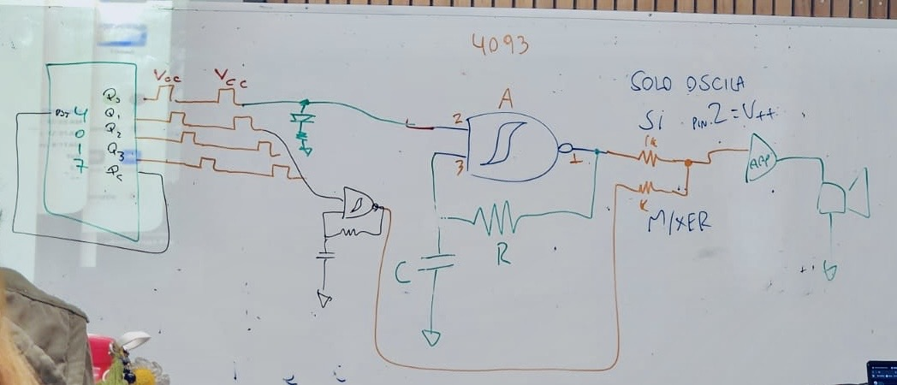
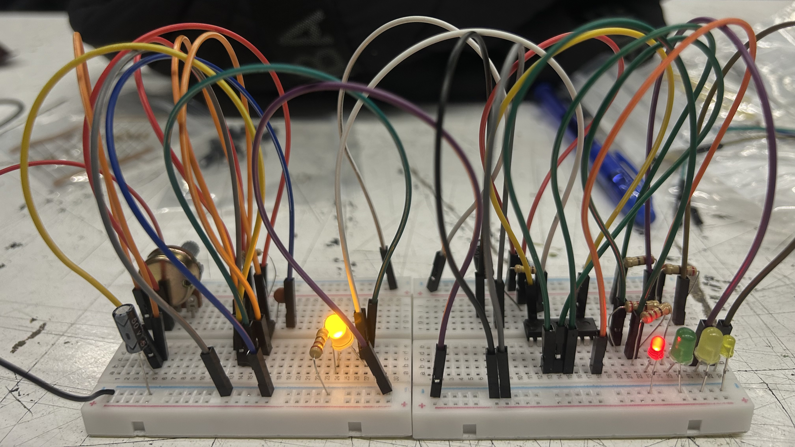
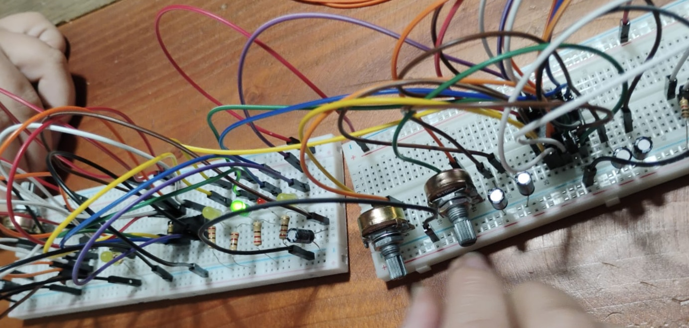

# sesion-06a

Mención a Jorge Gómez Mir 
+ Se destaca principalmente por su trabajo en el área de la ingeniería electrónica, especialmente en temas como circuitos integrados, semiconductores y sistemas embebidos.

## Schmitt Trigger
+ Ayuda a eliminar el ruido y mejora la estabilidad del sistema. 
+ Funciona con histéresis, lo que lo diferencia. Es un sistema interno que le permite lidiar con los problemas del mundo real.

**Momentos importantes**

+ Cuando sobrepasa VCC − 1 
+ Cuando baja más allá de GND + 1 
+ La señal solo cambia cuando se superan esos niveles. 
+ Tener dos umbrales da mayor seguridad.

### Sistema de luces, cómo pasamos eso a ruido 

Solo oscila si 
+ entrada 2 igual a V++ o VCC 

**¡SUENA!**

___

Luego hubo mucho, mucho, mucho trabajo en equipo para completar nuestro circuito y hacerlo funcionar. 

Spoiler, no funcionó. 

Las primeras dos partes del circuito estaban bien, funcionaban correctamente. En la tercera y cuarta hubo problemas. Solo se producía un sonido plano, sin variaciones, y los potenciómetros no estaban funcionando correctamente. Sonó un momento y luego dejó de hacerlo. El chip 4093 se quemó, lo cambiamos y volvió a funcionar, pero repetimos el proceso tres veces y el sonido seguía siendo el mismo. 

No logramos la variación de sonido que estuviera coordinada con los LED. Fue muy frustrante no obtener buenos resultados y también bastante triste. 

