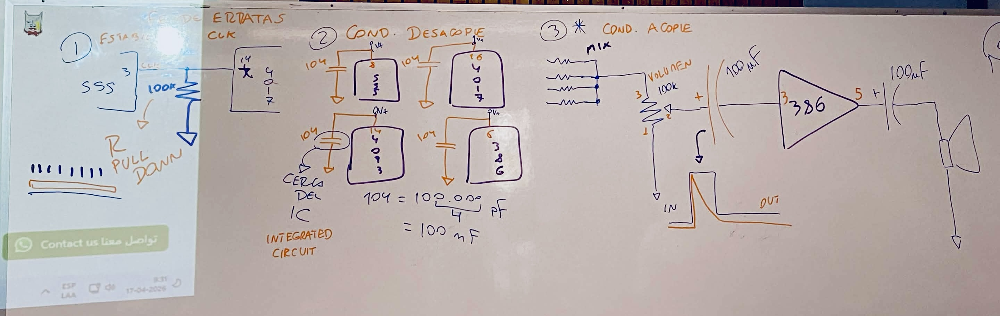
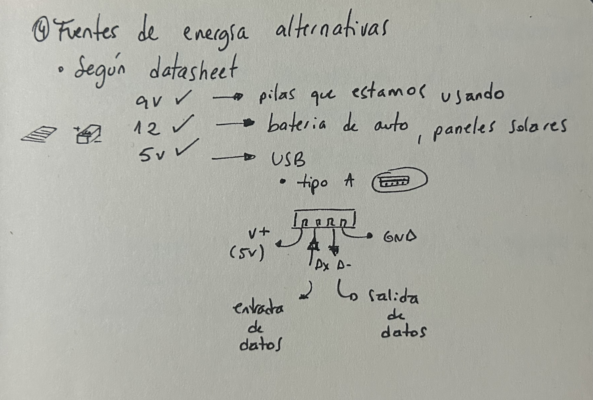
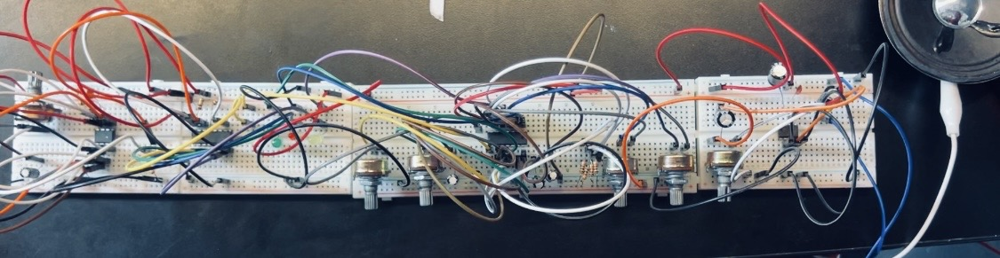

# sesion-06b

### Fe de erratas 

Por mi culpa, hubo errores, olvidé hacer cosas. 

___

Nos dieron algunas correcciones para hacerle al circuito y así lograr que funcionara correctamente. 

Datos 

+ Tener las baterías bien cargadas. También aprendí que no debo dejarla suelta en la cajita ni permitir que toque algún componente que la pueda descargar. Es mejor dejarla en su bolsita o en otro lugar. 
+ Revisar bien y no confiarse del compañero. Hay que asegurarse correctamente de cuál es el número de la patita de alimentación del chip.

Hay chips sensibles a la cantidad de energía. Por ejemplo, con 9 V pueden sonar más fuerte. 

___

Seguir trabajando con nuestros circuitos e implementar las correcciones. 

Llegamos con el circuito armado y en la noche funcionaba bien. Lo probamos en clase y ya no. Ajustamos todos los componentes por si se había soltado alguno, pero no pasó nada. Entonces cambiamos el chip y volvió a funcionar. Volvimos a sonreír, hasta que probamos la conexión del circuito completo y no sonaba. Al probar ambas partes por separado sí funcionaban, pero al conectarlo con los LED dejaba de sonar. 

Pedimos ayuda y llegaron a apoyarnos. 

Primero revisamos si el amplificador funcionaba correctamente y nos dimos cuenta de que el chip no funcionaba. El chip 386 estaba quemado. Luego hicimos un circuito con el chip 4093 para comprobar si ese era el problema y efectivamente lo era. Otro más quemado a la colección. 

Cuando ya teníamos eso resuelto volvimos al circuito principal y lo conectamos. Seguía funcionando por separado. Por error, en ese proceso descubrimos que al sacar las resistencias del LED sí se enviaba el sonido, lo que indicaba que el chip tenía problemas con la luz. Gracias, Misaa <3 

Ocurrió un momento chistoso. Probamos conectando los STEP de uno en uno y no sonaba, pero por accidente golpeamos la mesa y comenzó a sonar. Pasó lo mismo con todos. Luego notamos que el potenciómetro de volumen estaba suelto. Nos dio mucha risa y quería compartirlo. 

Pero finalmente funcionó y fuimos demasiado felices. 

