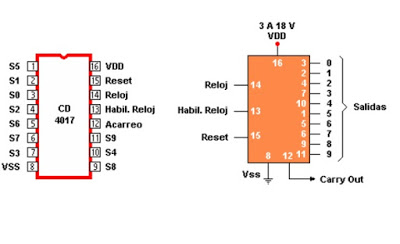
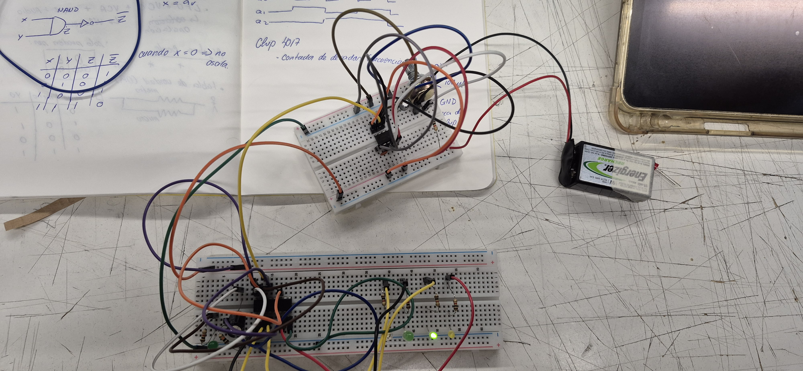
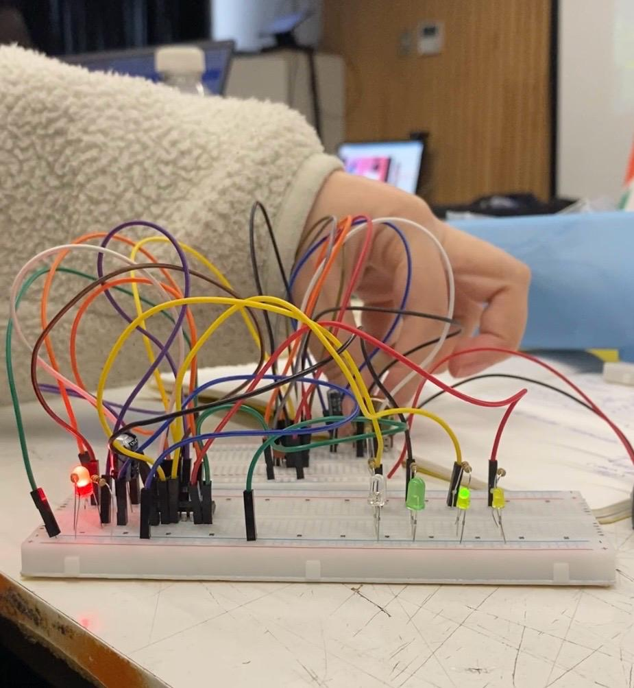

# sesion-05b
## Clase clase 100426

### pre-clase (teloneo Aaron)

La clase comenzó a las 11:00 am ya que nuestros profesores fueron a la cuenta anual de la escuela. Esto me hizo reflexionar que nunca he ido a una y sería interesante ir a una ya que yo también soy parte de un área que reside en la universidad y aquí es una instancia para saber qué puede pasar en ella o que podría pasar. 

Gracias a esto, no sé si lo he mencionado antes, pero hay algo que me ha estado rondando desde que entré a este taller y bueno, de que tome los 2 anteriores de que realmente yo no sé mucho de diseño ni de máquinas electrónicas “entre más sé, más sé que no sé” como me dijo Pancho Galvez, ¿pero saben que si he aprendido? valores, valores muy importantes que sin eso, no podría ser buena diseñadora ni buena persona. Me han enseñado a ver la vida de otra forma, encontrar la belleza en cosas tan pequeñas, cercanas y bueno, que hay cosas que tengo que descubrir. Ahora cada vez que mencionan algo nuevo es una oportunidad de aprender, no me siento tonta por no saberlo, si no que me motiva a saber algo sobre eso. 

- 4smits stringers nand 
- **ux:** Entender a los usuarios. El producto debe tener conciencia del usuario.
- Escuchar con la vista y discriminar. 
- Puch turn move
- Filtro RC: para que suene más apagado
- **David Byme:** gesto, figura y forma (el estuvo en mis pensamientos en cosas que hice el fin de semana jeje**
- **ST vincent:** guitarra para no molestar los pechos. Otro instrumento que está hecho para hombres, como lo es el celular, ya que está hecho al estándar de mano del hombre, hombre refiriéndose al sexo masculino)
- compo de sentido

### clase

- Misaa

Esta parte de la clase fue mucho más rápida y realizamos mucho trabajo en grupo (puedo ser honesta que en el segundo ejercicio no participe mucho por estar pendiente de otra cosa, pero en el primer ejercicio estuve al 100%)

**reloj con 555:** astable

- reloj CD9093

Hoy implementamos el chip 4017

- Contador de décadas es de Q0 a Q9

### proceso

### post-clase

El mismo día de la clase, por la tarde tuve la oportunidad de poder ir al lanzamiento del álbum Umbral de cómo asesinar a felipes (CAF) y en este álbum participa Martín Benavides el cual toca el theremin y fue increíble la experiencia. Quedé impresionada con la agilidad que podía tocar y hacer lo mismo que en la grabación. También como mencioné más arriba David Byme estuvo en mis pensamientos porque CAF hacía algo parecido, los movimiento coreográficos, pero cada uno por su lado. 

https://github.com/user-attachments/assets/b8bd47d0-6359-42ea-8088-7a1d83153d39

https://github.com/user-attachments/assets/7f12ef6c-0c6b-4c55-a8c6-adcbc0a480ba

