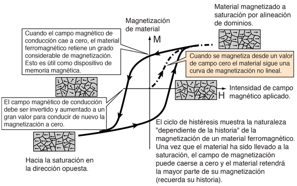
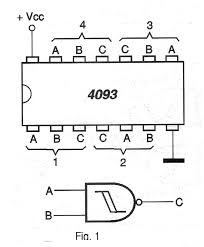
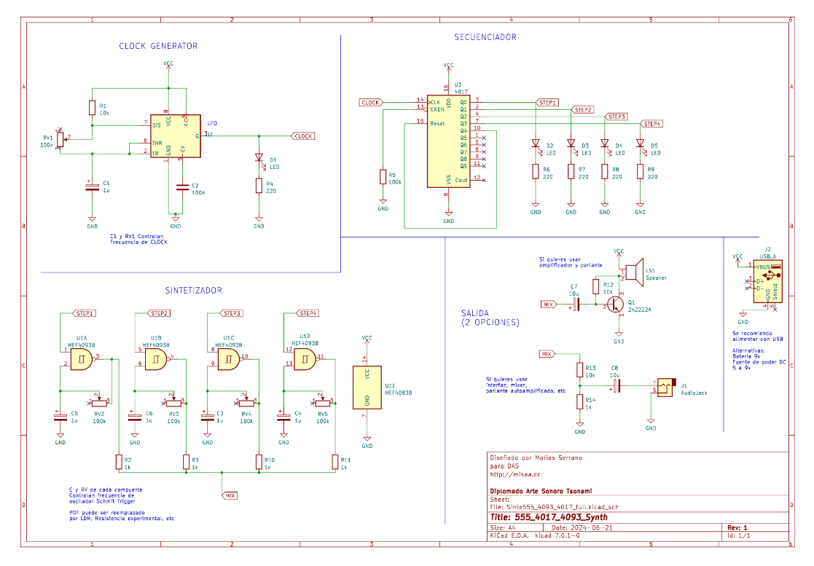

# sesion-06a
## Clase  140426

### pre-clase (teloneo Misaa)

Misaa nos comentó cómo realizar su portafolio sin tener que hacerlo “a mano” gracia s a que él mismo lo programo con markdown también buscando que al pasar de este lenguaje quedara bien en PDF y así, se acordó del libro “Aesthetic programming” qué está hecho de esa misma forma. Entonces él nos entregó como utilizar el template de portafolio entre otros. 

Me gustaría poder usar esto ya que como él mencionó, uno debe tener un portafolio dependiendo de lo que necesites y eso me pasa constantemente. Necesitas entregar lo justo y necesario. 

### clase

- Misaa

Es importante saber que la vida no es una grilla y eso también lo saben los chips.

**Schmitt Trigger:** es un circuito comparador con histéresis (2 umbrales) que convierte señales analógicas ruidosas o de forma irregular (sinusoidal, triangular) en ondas cuadradas digitales limpias. Utiliza dos niveles de voltaje umbral (alto y bajo) para evitar conmutaciones falsas provocadas por ruido.

**Histéresis:** es un comportamiento que tiene memoria. No responde solo al estado actual, sino también a lo que le ocurrió antes. 
 
Por ejemplo, si algo se enciende el 18°C y apaga con el 24°, no estará encendido y apagado en 20°C. Entonces cuando la temperatura baje a 18°C el calefactor encenderá, pero cuando llegue a 24° se apagará. 

- Las imperfecciones se filtraran y las transiciones serán más estables (eliminará ruido)
- Las compuertas NAND están hechas con Schmitt Trigger

- El chip 4011 es el único NAND sin Schmitt Trigger y el 4069 es un inversor.
- Existe ua serie completa de chip 4000, al igual que hay de 7000
- 4093 tiene 4 NANDS
- 4017 es un contador de decadas, secuenciador.

En esta clase ya nos adentramos a realizar el sintetizador, a algunos les funciono, pero a nosotros solo nos funcionó la primera parte (555 y 2017)

