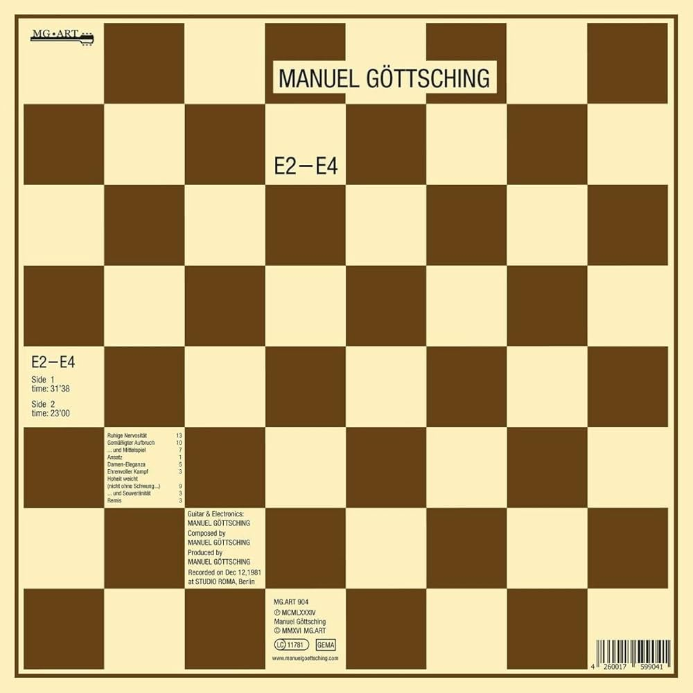
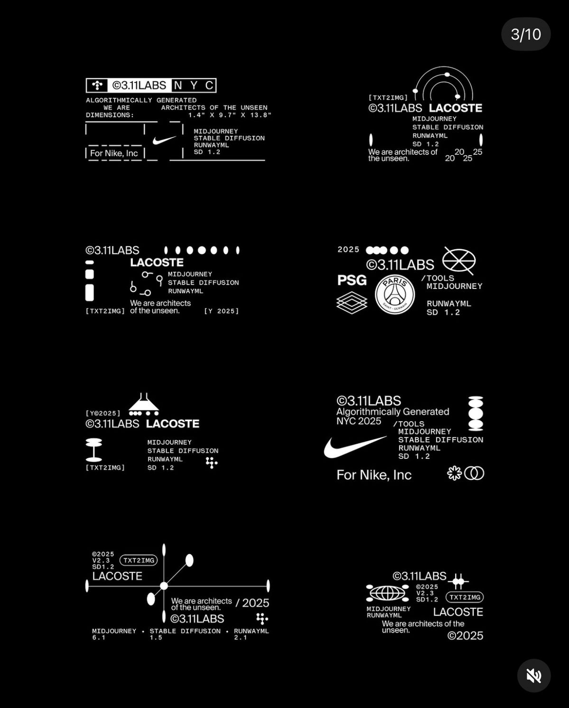
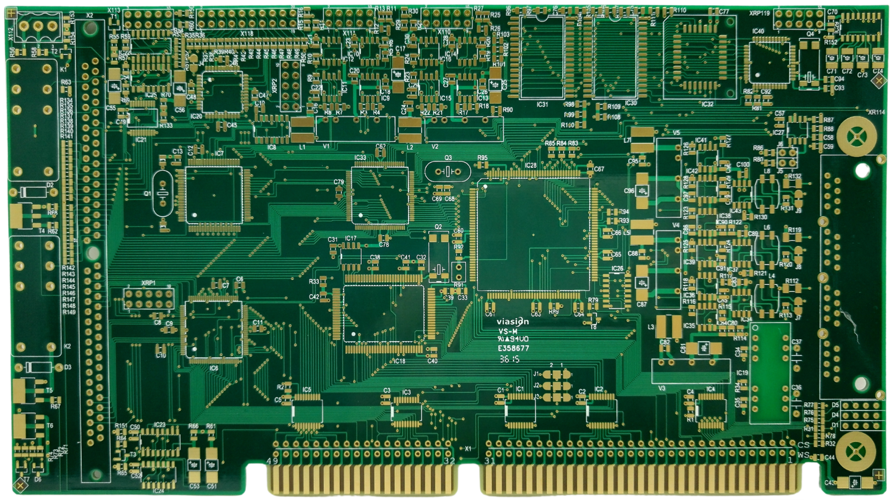
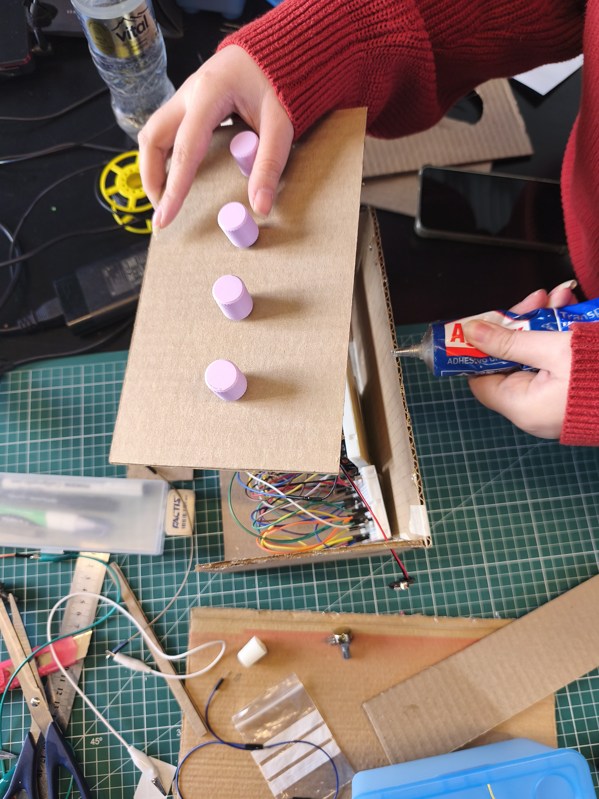
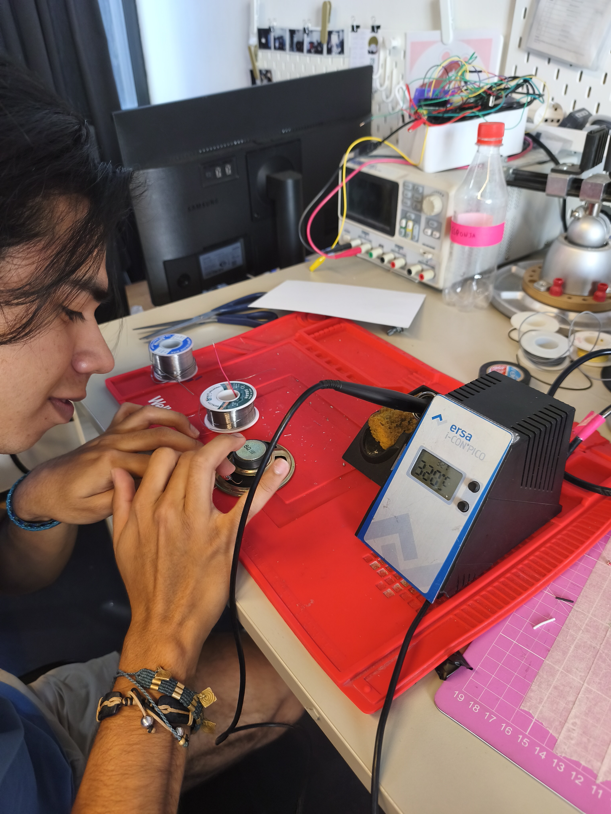
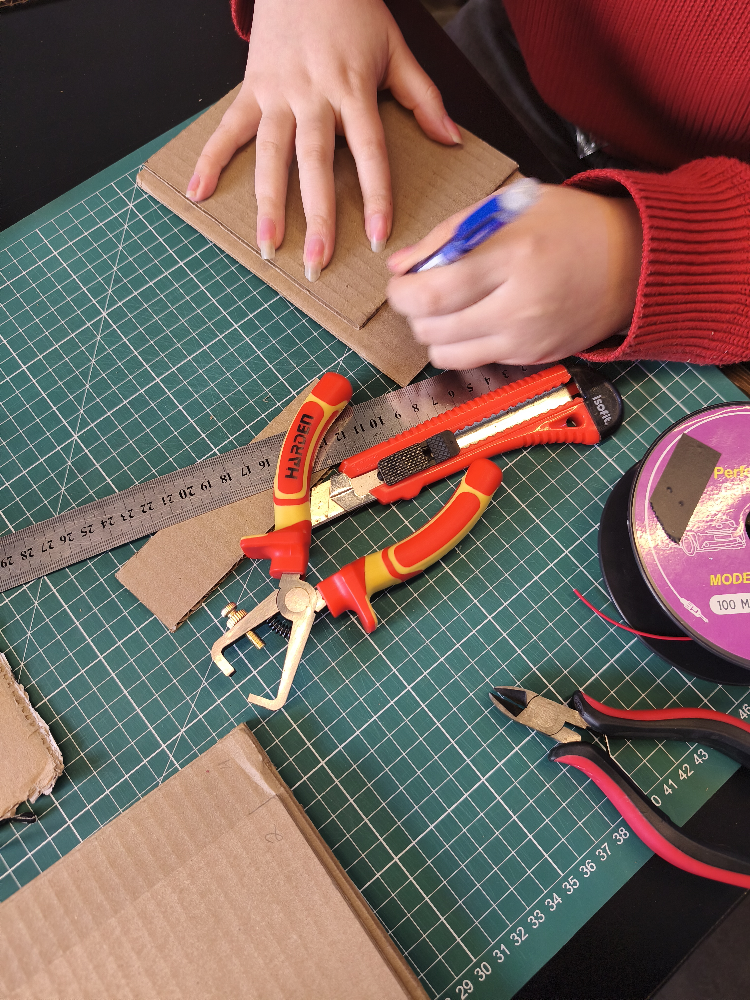

# sesion-07a
## Clase 210426

### pre-clase (teloneo Misaa)

Hoy comenzó la clase colocando a Manuel Gottsching que fue un compositor y guitarrista alemán considerado uno de los fundadores de la música electrónica contemporánea (mi sección favorita de la clase es cuando recomiendan musica, asi me motiva a seguir escuchando mejores cosas, conocer nuevos artistas y bueno, que mejor cuando te recomiendan, es una sensación cálida y qué mejor que venga de gente que sabe)

 

### clase

- Misaa

No pasamos materia como tal, pero sí nos dieron una mini introducción a kicad que comenzaremos a aprender la otra semana antes del receso, además de donde se realizarán nuestras PCB. Esta tienda se llama JBCPCB ( https://jlcpcb.com/ ) en china, Shenzhen.

Misaa nos enseñó sus proyectos nuevamente desde su página ( https://misaa.cc/index.html ) cada vez que lo busco en internet me lleva a páginas de la iglesia, misaa me va a terminar bendiciendo. Bueno, fue interesante volver a vernos y que pudiera entender algo de lo que estaba diciendo y mostrando, porque esto y por eso dije nuevamente, lo presentó las primeras clases y no se entendía nada. 

**SMT:** sistema de ensamblaje que consiste en una soldadura directa sobre el PCB sin necesidad de hacer agujeros previamente en la placa

**THT:** sistema de ensamblaje que consiste en insertar elementos con terminales metálicos a través de orificios perforados en la placa de circuito impreso (PCB), para luego soldarlos en el lado opuesto.

https://ammitechnologies.com/diferencias-montaje-smt-tht/

 

Una frase que me gusto escuchar y que la estuve reflexionando desde que vi el trabajo de misa la primera clase es que la placa es un soporte gráfico. Por ejemplo, jamás se me hubiera ocurrido que puede ser la tarjeta de presentación de una persona, además hablando de costos no es tan caro, es llamativo, tiene ese microdesign que me encanta.

--------

Se suponía que teníamos el sintetizador listo, pero un cable suelto nos hizo dudar de todo y no volvió a sonar, pero podemos decir que si lo logramos y esta fue una oportunidad para poder practicar una vez más. Le agradezco mucho a Santi por llevarselo y hacerlo todo de nuevo. Él realmente ha sido un gran aporte a nuestro equipo, muy aguerrido. Misaa nos dijo que el problema de que suene ahogado es por el amplificador (dejare un video de como debería escucharse), así que vimos eso, pero nada. 

Nos frustramos y como menciona, lo haremos de nuevo, lo cual nos retrasó en ciertas cosas como la carcasa, pero bueno, todo esto es por algo y no quiero adelantar proceso. Me dará ansiedad, si. 

Un punto muy importante a mencionar y algo que mencionaremos en nuestro informe es la disposición de nuestros compañeros en ayudar. La semana pasada muy amablemente Anto, Vania y Nico nos ayudaron con nuestro circuito y ahora Cami nos ha ayudado con las perillas que utilizaremos en nuestro sintetizador. Elle ha sido un punto importante en nuestro trabajo, sintiendo su presencia se siente agradable estar trabajando en clases. 

https://github.com/user-attachments/assets/f6a878d9-8f7b-4323-9d94-7d768596e73b

https://github.com/user-attachments/assets/9e04852c-9ef2-4be5-85fc-c07c88aff6c9

### post-clase

Aquí ya era seguir trabajando en volver a realizar nuestro sintetizador y seguir adelante. 
Comenzamos a crear la carcasa y como nos la imaginamos, igual en el resultado final cambiamos algunas cosas, como por ejemplo, dejar que la luz se vea.

También Santi logró soldar, nos ayudó mucho eso porque solucionamos el tema de los potenciómetros y lo lejos que estaban de la carcasa, además de como mencione, colocar la luz por fuera. Hicimos que precarias tuviera un poquito de color

videos:

https://youtube.com/shorts/NSwSG6KaihU?feature=share

https://youtube.com/shorts/y3wmMXkBmb8?feature=share

