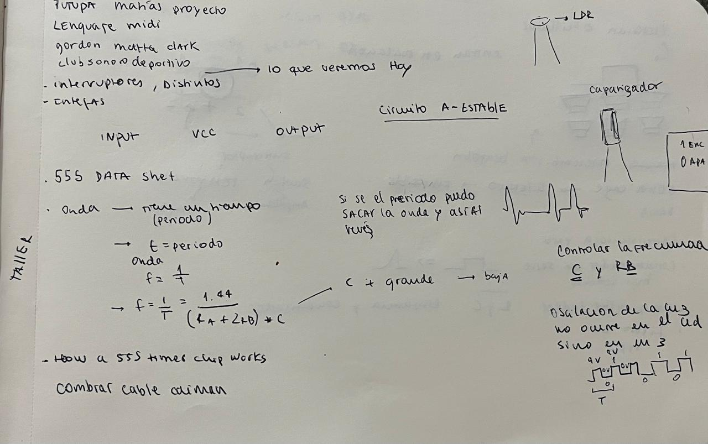
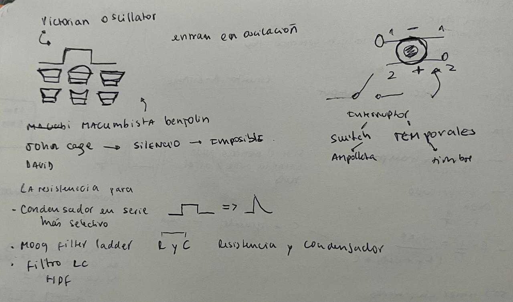
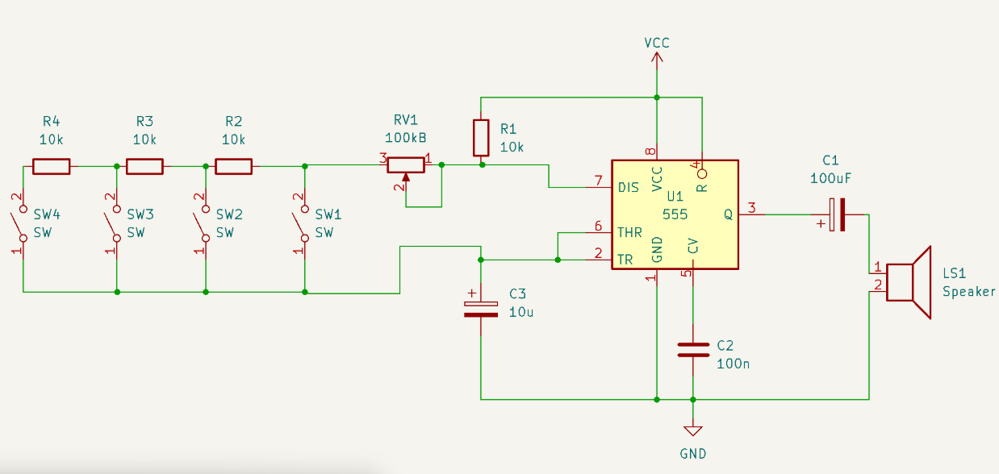
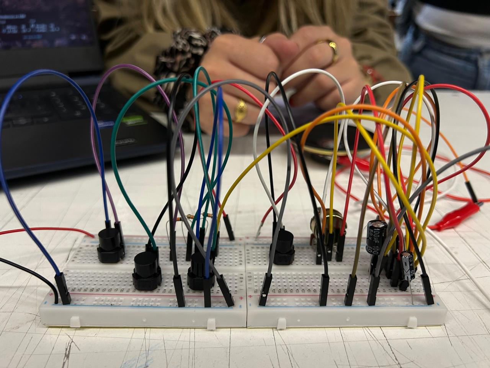
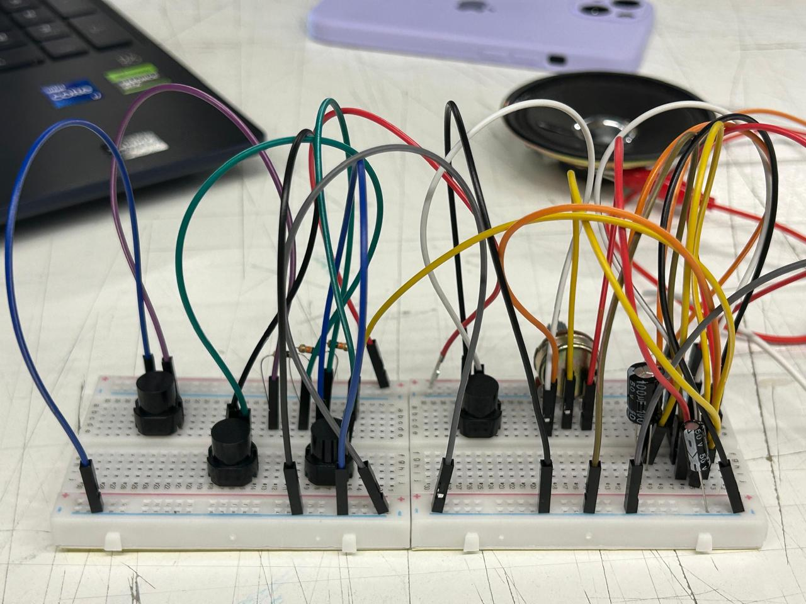

# sesion-03a

## Oscilación en el circuito
Oscilar es que el circuito nunca se queda quieto: sube y baja, va y viene, siempre cambiando.  
En el NE555 astable esa oscilación se convierte en una onda cuadrada, un pulso constante.  
Lo que escuchamos en el parlante no es la parte plana de la onda, sino el momento del cambio,  
el salto de bajo a alto y de alto a bajo.

## El papel del condensador
El condensador es el que marca el ritmo. Se carga y descarga como un “pulso interno” del circuito.  
- **Cuando se carga**: la tensión sube hasta un límite.  
- **Cuando se descarga**: la tensión baja hasta otro límite.  

Ese ciclo de carga y descarga define el tiempo de cada oscilación.  
el condensador “suaviza” o “filtra”: corta lo constante y deja pasar el cambio.  
En el parlante, lo que suena es justamente ese cambio, el instante en que el condensador obliga al circuito a saltar de un estado al otro.

## Encargo: Circuito y expansión
En clase nos pasaron **interruptores switch**, y con ellos pudimos experimentar cómo controlar el flujo de corriente para encender o apagar cargas.  
La expansión consiste en poner varios interruptores en paralelo, cada uno con una resistencia distinta.  
Cada botón que se aprieta cambia la frecuencia y por lo tanto el tono.  
Es como un teclado full casero: cada tecla es una nota.

El encargo lo hicimos con algunos compañeros después de que terminara la clase, ya que nos intrigaba mucho mucho hacerlo. 
 

## Referentes
- **David Tudor**: pianista y compositor experimental, clave en la música de vanguardia.  
- **John Cage**: el silencio como parte del arte, la música aleatoria, el uso no estándar de instrumentos.  

## Apuntes del documental *Variaciones espectrales*
- Inspirado en la vida y obra de **José Vicente Asuar**, pionero chileno de la música electroacústica.  
- Asuar creó el **COMDASUAR**, el primer computador musical en Latinoamérica, hoy abandonado en una parcela.  
- El documental muestra el reencuentro de Asuar con este artefacto, revelando un relato perdido y la importancia de su legado.  
- Asuar fue ingeniero y músico, uniendo ciencia y arte en la exploración del sonido.  
- Se destaca cómo la tecnología puede ser instrumento creativo, y cómo el espectro sonoro se convierte en materia artística.  
- Más allá de lo técnico, se rescata la dimensión humana: la pasión de Asuar por el sonido, su visión de la música como exploración y su lugar esencial en la biografía sonora chilena.
- Siento que se abandono algo muy genial, José Vicente Asuar no estaba tan interesado en reivindicar su computador musical (el COMDASUAR) ni en presentarlo como bacán o revolucionario. De hecho, aparece como alguien que lo había dejado atrás, casi olvidado, y que no lo valoraba tanto en ese momento.
- Lo interesante es que, en contraste, la gente que lo rodeaba, los investigadores y músicos más jóvenes, sí estaban muy interesados en ver el computador, en rescatarlo y entender su importancia histórica. Para ellos era un hallazgo, un artefacto único que marcaba un hito en la historia de la música electroacústica en Latinoamérica.
- Me gusta ver estos docuemntales que ni sabia que existian, algo nuevo todas las semanas.
