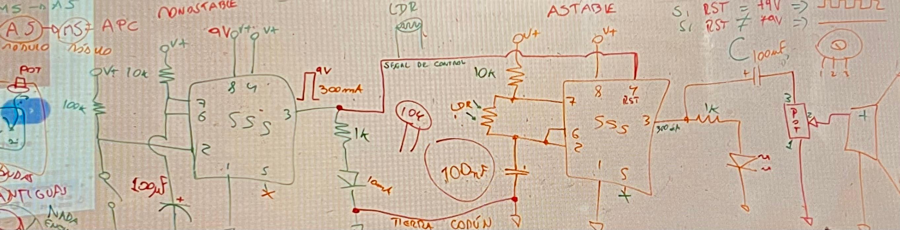
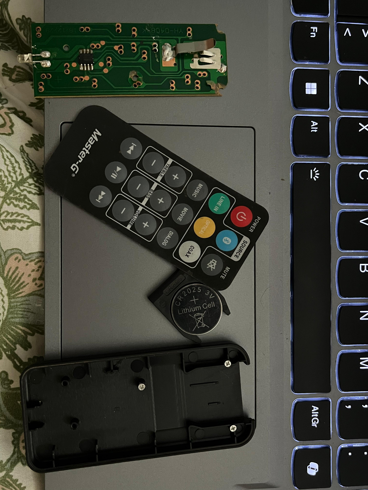
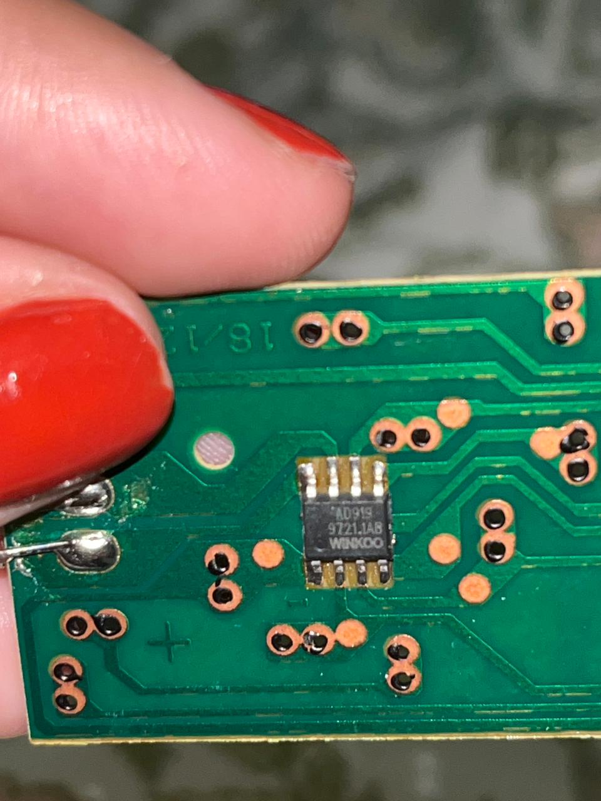
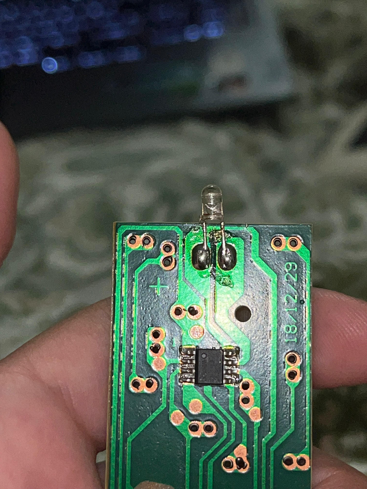

# sesion-04a
## Escalas y unidades electrónicas

### Prefijos de baja magnitud (capacitores)
| Valor decimal       | Prefijo | Símbolo | Potencia de 10 |
|---------------------|---------|---------|----------------|
| 0,000000000001      | pico    | p       | 10⁻¹²          |
| 0,000000001         | nano    | n       | 10⁻⁹           |
| 0,000001            | micro   | μ       | 10⁻⁶           |
| 0,001               | mili    | m       | 10⁻³           |

### Prefijos de alta magnitud (resistencias)
| Valor numérico      | Prefijo | Símbolo | Potencia de 10 |
|---------------------|---------|---------|----------------|
| 1                   | unidad  | —       | 10⁰            |
| 1.000               | kilo    | k       | 10³            |
| 1.000.000           | mega    | M       | 10⁶            |
| 1.000.000.000       | giga    | G       | 10⁹            |
| 1.000.000.000.000   | tera    | T       | 10¹²           |

**Ejemplo de conversión:**  
10.000 picoF → 100 nanoF → 0,1 microF

---

## Circuito con 555 en modo astable

### Pinout del 555
| Pin | Nombre     |
|-----|------------|
| 1   | Ground     |
| 2   | Trigger    |
| 3   | Output     |
| 4   | Reset      |
| 5   | Control    |
| 6   | Threshold  |
| 7   | Discharge  |
| 8   | Vcc        |

### Funcionamiento
El 555 en modo astable genera una **onda cuadrada**.  
La frecuencia depende de la resistencia (incluyendo la LDR) y el capacitor.  
Al variar la luz sobre la LDR, cambia la frecuencia de parpadeo del LED.

---

## Metrología

### Prefijos métricos
| Prefijo | Símbolo | Potencia de 10 |
|---------|---------|----------------|
| Tera    | T       | 10¹²           |
| Giga    | G       | 10⁹            |
| Mega    | M       | 10⁶            |
| Kilo    | k       | 10³            |
| Unidad  | —       | 10⁰            |
| Mili    | m       | 10⁻³           |
| Micro   | μ       | 10⁻⁶           |
| Nano    | n       | 10⁻⁹           |
| Pico    | p       | 10⁻¹²          |

### Símbolos
- **R (Ω)** → resistencia  
- **C (F)** → capacitancia  
- **Faraday (F)** → unidad de capacitancia

### Circuito en clases 
 

Bueno, el ejercicio que se hizo en la clase me frustró tanto que no lo pude terminar. Creo que son cosas que pasan... mi cabeza no daba más. En general nunca me pasa eso :c, siempre quiero más y más hasta lograrlo, pero ese día no pude. Estaba mentalmente cansada y destrozada. Así que, bueno, lamentablemente no hay imágenes del ejercicio.

 
# Encargo-04a: 

##  Documentación del proceso

Destripe el control remoto petite Master-G y lo abrí con cuidado, separando la carcasa plástica.  
Dentro apareció la **placa PCB**, con sus trazas verdes y doradas, el **LED** en el extremo, la **almohadilla de goma** con los botones y la **batería** que alimenta todo el sistema.  

Al observar la placa, distinguí los elementos que hemos estudiado:  
- **Resistencias (R):** pequeñas piezas rectangulares que moderan el paso de la corriente.  
- **Capacitores (C):** guardan energía en breves pulsos.  
- **Chip integrado (IC):** actúa como el cerebro del control.  
- **LED infrarrojo:** emite la señal invisible hacia el televisor.  

También documenté las conexiones:  
- Los **botones de goma** presionan sobre contactos metálicos de la PCB, cerrando el circuito.  
- La **batería** se inserta en su compartimento y conecta con terminales metálicos.  
- El **LED** se alinea con la ventana de la carcasa para transmitir la señal.

 
 
 
Nunca antes había desarmado un dispositivo por mi cuenta, y aunque este control es sencillo, la experiencia me sorprendió. Descubrí que detrás de cada pieza hay una lógica silenciosa que sostiene la interacción cotidiana. Me gustaría aprender más sobre las placas, porque siento que son como mapas de energía y comunicación, un mundo que nunca imaginé que podía explorar y desarrollar. Lo que parecía básico se transformó en una puerta hacia un universo desconocido, lleno de posibilidades.  

---

##  Texto encargo 
La electricidad corre como un río subterráneo, y cada botón que presiono abre una compuerta:  
el agua invisible fluye hacia el LED, que se enciende como un faro diminuto en la noche.  

Las resistencias son guardianes que moderan la voz del río,  
los capacitores guardan energía en vasijas invisibles,  
y el chip escucha todas esas voces para transformarlas en un canto.  
Ese canto se convierte en luz, un mensaje secreto que viaja por el aire.  

Cada presión de mi dedo es un latido que despierta la máquina,  
y el haz infrarrojo que escapa es como un conjuro cotidiano:  
un puente invisible entre mi mano y el televisor, capaz de transformar la quietud en movimiento.  

