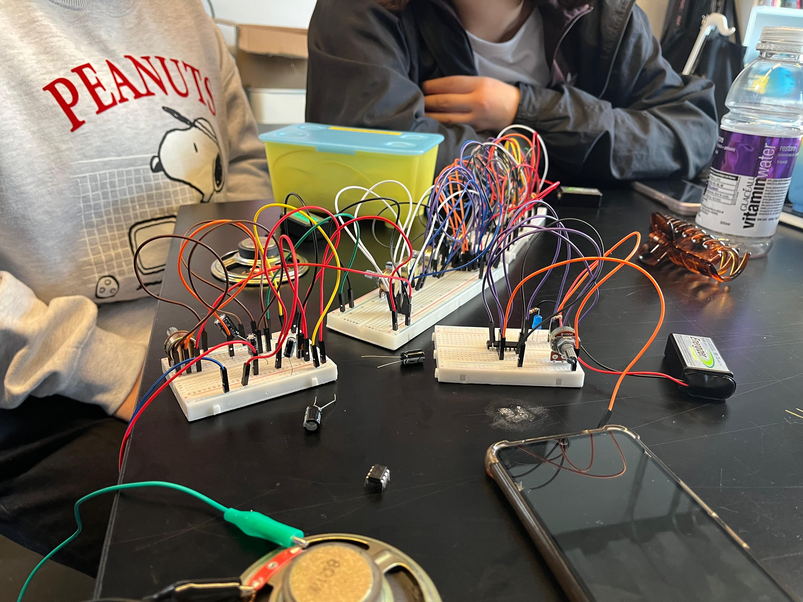
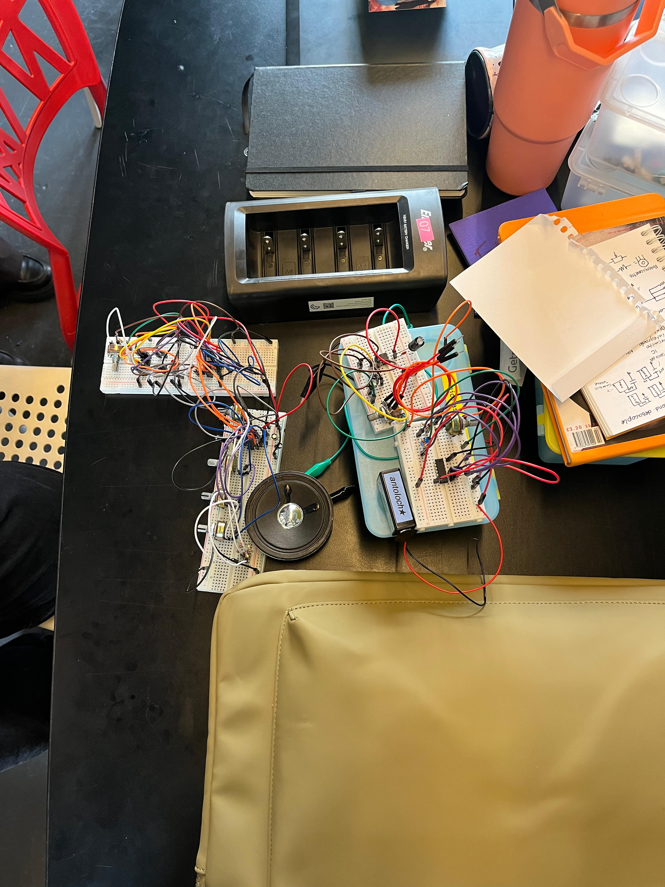
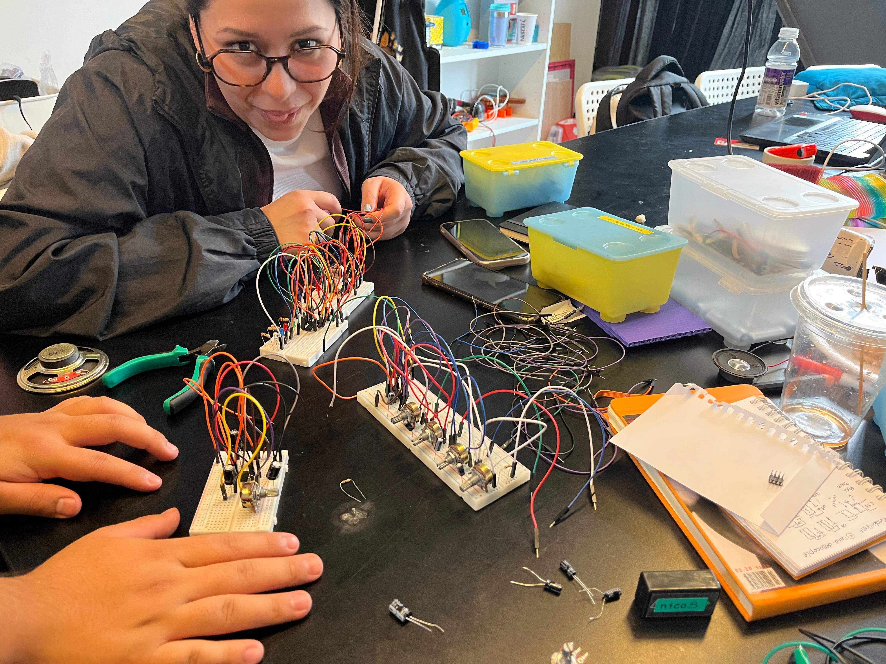
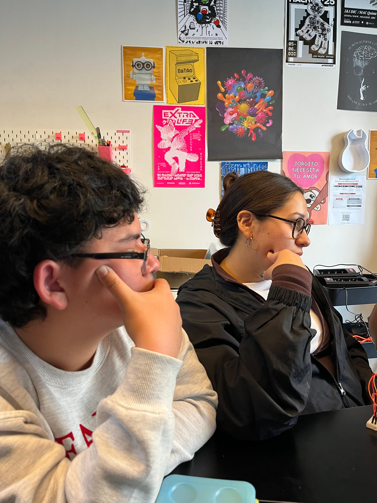

# sesion-06b

En esta clase tuvimos que rehacer completamente el circuito porque no estaba funcionando bien. Básicamente lo armamos y desarmamos muchas veces hasta ir encontrando qué podía estar fallando y mejorar poco a poco.

Fue un proceso medio pesado porque repetimos varias veces lo mismo, revisando conexiones y componentes, pero como grupo nunca nos rendimos. Aunque ya estábamos cansados, seguimos intentando hasta ver avances reales.

Nos quedamos hasta tarde en el lab, lo que igual dice mucho del compromiso que teníamos con el trabajo. En ese tiempo también recibimos ayuda de otros compañeros, especialmente Vania y Nico. A Nico le agradecemos mucho porque nos ayudó bastante a entender mejor lo que estaba pasando y a poder avanzar.

Cuando por fin el circuito empezó a funcionar, sí emitía sonido, pero era muy débil. Había que acercar mucho el parlante al oído para escucharlo, y sonaba como un “tic-tic”, parecido a un reloj muy lejano.

Después de eso, empezamos a cambiar los capacitores (los µF) constantemente, probando distintos valores, y eso fue clave para que el circuito mejorara. Esto pasa porque los capacitores, junto con las resistencias, controlan los tiempos y la frecuencia de la señal (especialmente en el 555 y en las compuertas 4093). Al cambiar los valores, estábamos modificando la velocidad de los pulsos y también cómo se acoplaba la señal hacia el amplificador. Algunos valores hacían que la señal fuera muy débil o lenta, y otros permitieron que se escuchara mejor.

También influye que el LM386 necesita cierta amplitud de señal para amplificar bien. Si la señal que entra es muy pequeña o no está bien acoplada (por ejemplo, por el capacitor de entrada), el sonido sale muy bajo, que fue lo que nos pasó al principio.

Al final, logramos que el circuito sonara más claro. Seguía siendo un sonido tipo reloj, bien marcado, no se saturaba mucho, pero ya era mucho más audible y estable.

Para la próxima clase (el lunes), la idea es seguir experimentando con el circuito, cambiando valores y configuraciones, para ver si logramos generar sonidos más raros y extraños, no solo el típico sonido de reloj.

Algo que me quedó súper claro de esta experiencia es lo importante que es el compañerismo. Entre todos nos apoyamos, nos motivamos y eso hizo que siguiéramos adelante incluso cuando se ponía difícil.

En lo personal, me sentí muy agradecida con mi equipo, porque siempre hubo apoyo y ganas de seguir intentando. Al final, más que solo el circuito, fue una experiencia que nos enseñó a trabajar juntos y no rendirnos fácil.

GRACIAS NICO Y CARLA POR NO RENDIRNOS, LOGRAREMOS LA SOLEMNEEEEE, SOMOS SECOS!

