# sesion-02a

17-03-2026  

## Apuntes  
En esta clase se explicaron los componentes del kit electrónico entregado. Estos elementos se encuentran descritos en el punto **1.b** de este repositorio. El objetivo fue reconocer cada componente y comprender su función básica dentro de un circuito eléctrico.

---

## Cómo identificar una resistencia  

Las resistencias utilizan un **código de colores** para indicar su valor y tolerancia. Cada banda representa un número, un multiplicador o la tolerancia del componente.

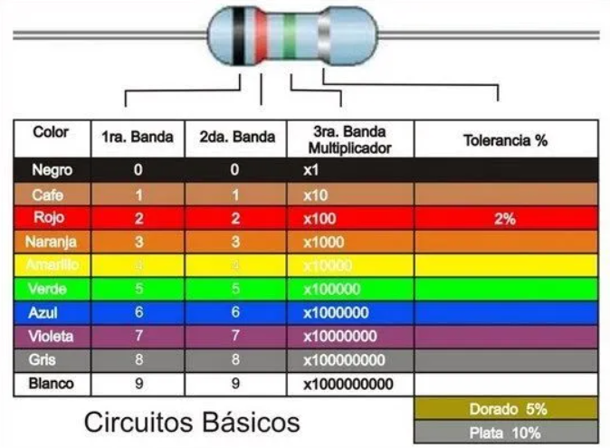

## Resistencias identificadas en clases

| Color 1 | Color 2 | Color 3 | Color 4 | Resultado |
|-------|--------|--------|--------|----------|
| Rojo (2) | Rojo (2) | Café (1) | Dorado (±5%) | 220 Ω |
| Café (1) | Negro (0) | Rojo (2) | Dorado (±5%) | 1.000 Ω (1 kΩ) |
| Amarillo (4) | Violeta (7) | Naranja (3) | Dorado (±5%) | 47.000 Ω (47 kΩ) |

**Nota:**  
- Las dos primeras bandas indican los dígitos principales.  
- La tercera banda corresponde al multiplicador (cantidad de ceros).  
- La cuarta banda indica la tolerancia.

---

### Circuitos 

### Circuito eléctrico  
Un circuito eléctrico es un lazo cerrado por el cual circula corriente eléctrica. Está compuesto por una fuente de energía, conductores y uno o más componentes eléctricos. Si el circuito se interrumpe, la corriente deja de circular.

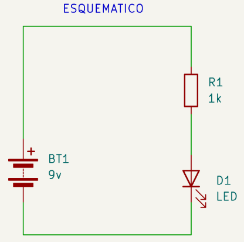

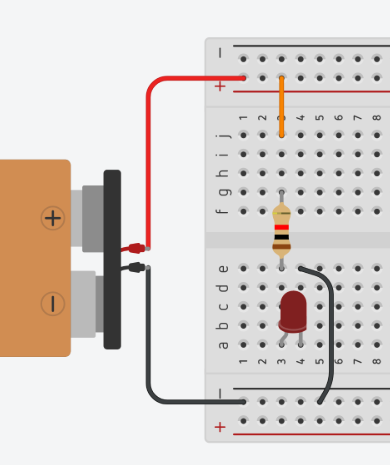

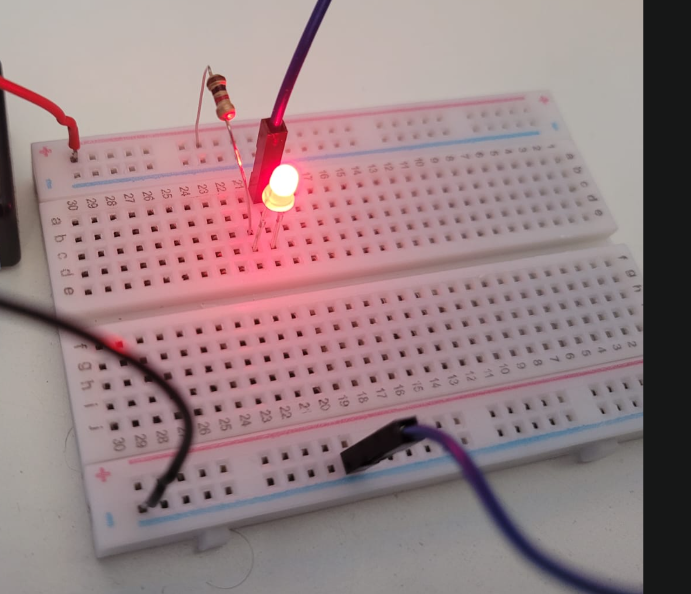

---

### Circuito en serie  
Es una configuración donde los componentes se conectan uno tras otro, formando un único camino para la corriente.

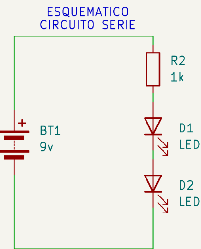

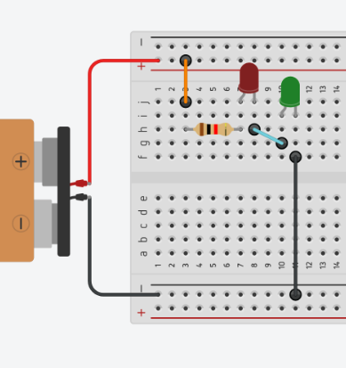

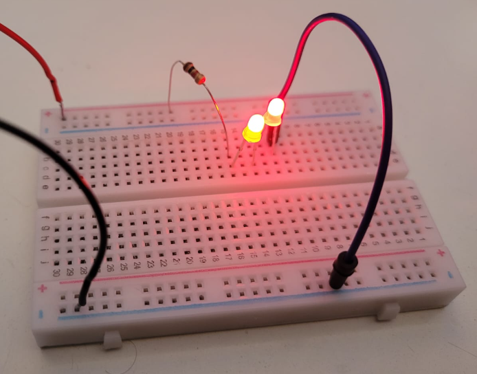

**Características:**  
- La corriente es la misma en todo el circuito.  
- El voltaje total se divide entre los componentes.  
- La resistencia total es la suma de todas las resistencias.  
- Si un componente falla, el circuito completo deja de funcionar.

---

### Circuito en paralelo  
Es una configuración donde los componentes se conectan en ramas independientes, compartiendo los mismos puntos de entrada y salida.

i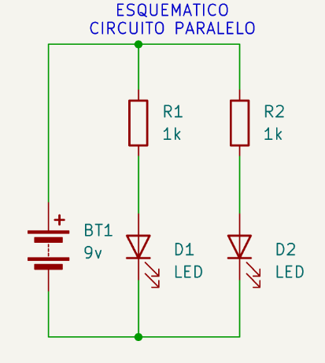

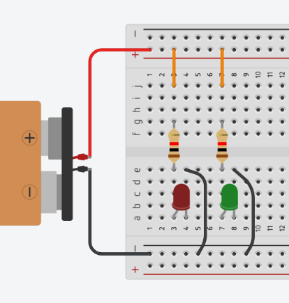

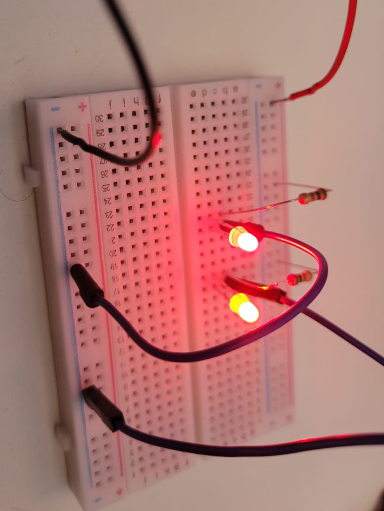

**Características:**  
- El voltaje es igual en todas las ramas.  
- La corriente se divide entre los componentes.  
- Cada rama funciona de manera independiente.  
- Si un componente falla, los demás siguen funcionando.

---

#### Encargo  

- Hacer los ejercicios anteriores y documentar los resultados.
- Elegir un disco particular de Kraftwerk, investigar avances de esa era, contexto de grabación, revisar presentaciones en vivo de esa época y contrastar con actuales. explicar qué escuchas en el disco, qué te llama la atención, describir en largo, no en corto.
- Lo mismo pero con un disco de LCD Soundsystem.

Ejercicio 1

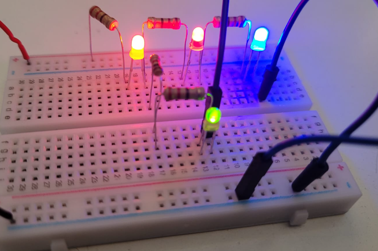

| loquitoportilocoloco  | D1    | D2    | D3    | D4    |
| ---                   | ---   | ---   | ---   | ---   |
| R1                    |   0   |   0   |   0   |   0   |
| R2                    |   1   |   0   |   0   |   1   | 
| R3                    |   1   |   1   |   1   |   0   |
| R4                    |   1   |   1   |   1   |   0   |  
| R5                    |   1   |   0   |   0   |   1   |

Ejercicio 2

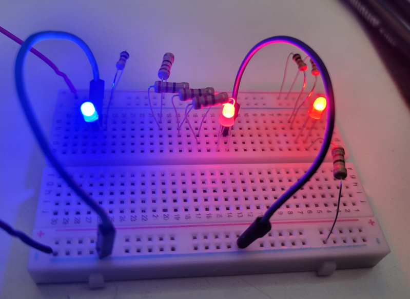

| loquitoportilocoloco  | D1    | D2    | D3    |
| ---                   | ---   | ---   | ---   |
| R1                    |   1   |   0   |   1   |
| R2                    |   1   |   0   |   1   | 
| R3                    |   1   |   0   |   1   | 
| R4                    |   1   |   0   |   1   |  
| R5                    |   0   |   1   |   1   |
| R6                    |   1   |   1   |   1   |
| R7                    |   1   |   1   |   1   |
| R8                    |   1   |   1   |   0   |

Ejercicio 3

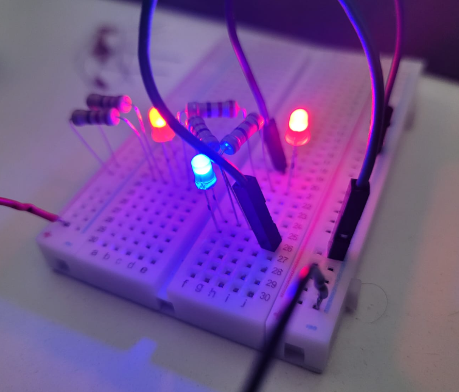

| loquitoportilocoloco  | D1    | D2    | D3    |
| ---                   | ---   | ---   | ---   |
| R1                    |   1   |   1   |   1   |
| R2                    |   1   |   1   |   1   | 
| R3                    |   1   |   1   |   1   | 
| R4                    |   1   |   0   |   1   |  
| R5                    |   1   |   1   |   1   |
| R6                    |   1   |   1   |   1   |

---

#### Kraftwerk

Escuché el álbum Trans-Europe Express de Kraftwerk y me gustó mucho por su sonido electrónico repetitivo y simple. Me recordó a cuando jugaba Terraria, ya que su música tiene una estética similar al 8-bit, generando una sensación nostálgica y envolvente.

#### LCD Soundsystem
Escuché el álbum Sound of Silver de LCD Soundsystem y me gustó en general por su energía y ritmo constante. Sin embargo, la última canción me descolocó, ya que corta el ritmo que venían construyendo las canciones anteriores y se siente como un cierre distinto al resto del disco.
