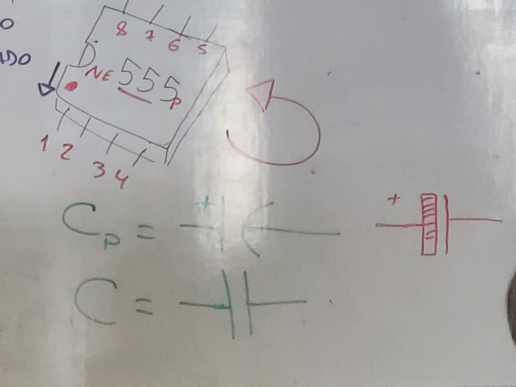
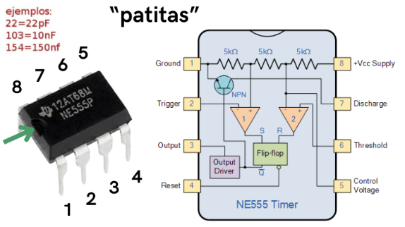
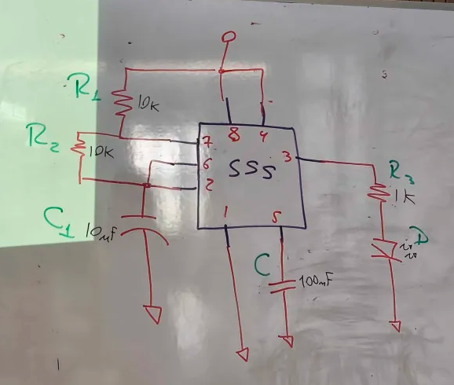
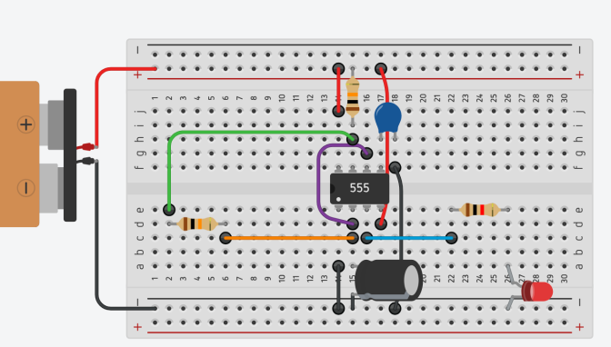
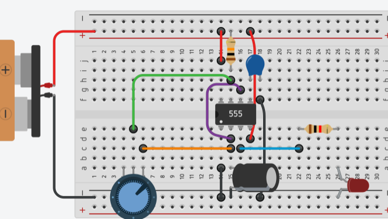
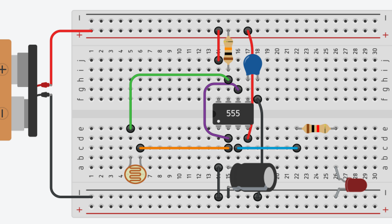

# sesion-02b

20-03-2026

## Apuntes de la clase

### Componentes nuevos

**Fotoresistor (LDR):**  
Es un componente electrónico cuya resistencia varía según la cantidad de luz que recibe. A mayor intensidad de luz, menor resistencia; y en la oscuridad, su resistencia aumenta. Se utiliza principalmente como sensor de luz en distintos circuitos electrónicos.

**Capacitor / Condensador:**  
Es un componente electrónico pasivo que almacena energía eléctrica de forma temporal en un campo electrostático. Se emplea para filtrar, regular o estabilizar señales eléctricas dentro de los circuitos.

**Capacitor cerámico tipo lenteja:**  
Es un capacitor cerámico de tamaño compacto y alta confiabilidad, muy utilizado en circuitos electrónicos. No posee polaridad, por lo que puede conectarse en cualquier sentido sin riesgo de daño.

**Chip NE555P:**  
Es un circuito integrado de temporización de precisión, utilizado para generar retardos de tiempo, pulsos y señales oscilantes en una gran variedad de aplicaciones electrónicas.

---

### Conocer los pines del chip

### circuito Astable 

### Configuración del circuito

Se realizó la conexión utilizando un potenciómetro y un fotorresistor como entradas del circuito. La salida se conectó a un LED, observando que la frecuencia de parpadeo del LED depende directamente de los capacitores utilizados en la etapa de entrada.

### Conclusión

El experimento demuestra que el valor del capacitor afecta directamente la frecuencia de parpadeo del LED. Con un capacitor de **1 µF**, el parpadeo es tan rápido que genera una sensación de vibración en la luz, siendo difícil de percibir a simple vista. Al usar **10 µF**, el parpadeo continúa siendo rápido, pero ya es visible. Finalmente, con un capacitor de **100 µF**, el parpadeo se vuelve lento y claramente perceptible.

---

#### Encargo

Practicar cualquiera de las materias que se hayan visto en clase, dejar ese registro en la bitácora. Ademas, escribir en la bitácora al menos 10 preguntas para la próxima sesión, sobre cualquier tema que hayamos revisado o mencionado. pueden ser preguntas técnicas, conceptuales, de diseño, etc.

#### Practica

Para esta práctica, trabajé reforzando lo aprendido en clase a través de la lectura de esquemáticos electrónicos, armando y desarmando los circuitos que se nos habían entregado durante la sesión. Además, practiqué con otros circuitos que el mismo profesor había facilitado a las y los estudiantes de la carrera de Arte, lo que me permitió comprender mejor la relación entre el esquema y el montaje físico del circuito, así como afianzar el uso de los componentes electrónicos vistos en clase.

#### Preguntas

1. ¿Qué otros sensores se podrían agregar al circuito además del fotorresistor?

2. ¿Cómo cambiaría el comportamiento del circuito si se reemplaza el fotorresistor por otro tipo de sensor?

3. ¿Cómo puedo saber si un componente electrónico se quemó o está dañado?

4. Además de un LED y un parlante, ¿qué otros tipos de salidas se podrían utilizar en el circuito?

5. ¿Cómo se podría adaptar este circuito para aplicaciones interactivas o artísticas?

6. ¿Qué modificaciones serían necesarias para controlar más de un actuador al mismo tiempo?

7. ¿Cómo se podría optimizar el circuito para reducir el consumo de energía?

8. ¿Qué diferencias hay entre una señal analógica y una digital dentro de este circuito?

9. ¿Qué sucede si se alimenta el circuito con un voltaje mayor o menor al recomendado?

10. ¿Cómo se puede medir la frecuencia de salida del circuito sin usar instrumentos especializados?
