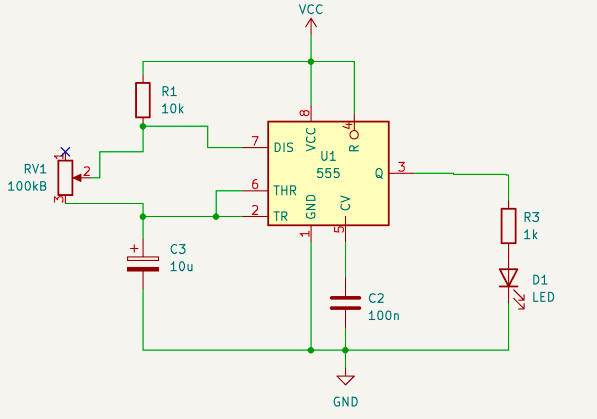
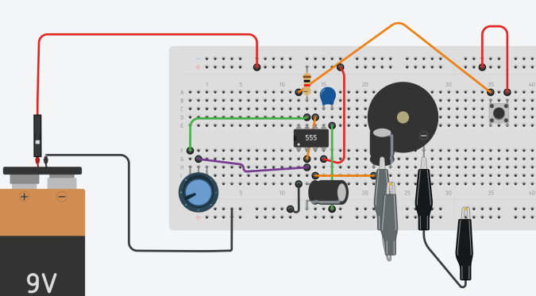
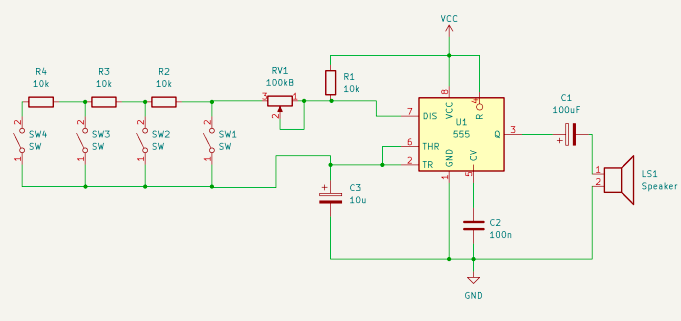
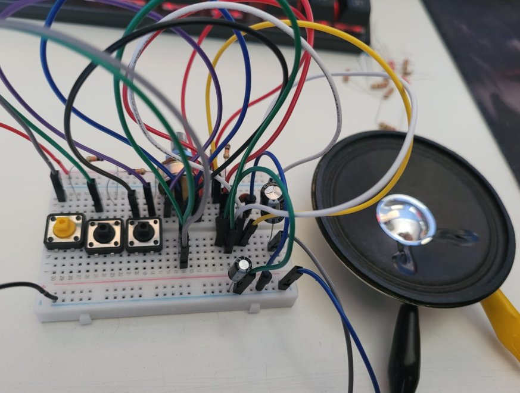

# sesion-03a

24-03-2026  

## Apuntes de Clase  
 
## CHIP NE555P  

**Circuito Astable** 

El **NE555P** es un circuito integrado temporizador usado en electrónica para generar señales periódicas.  
En modo **astable**, el 555 no tiene estado estable, por lo que produce una **onda cuadrada continua** (encendido y apagado repetitivo).

---

## Funcionamiento  
El circuito funciona mediante la carga y descarga de un capacitor, lo que provoca que la salida cambie constantemente entre nivel **alto (HIGH)** y **bajo (LOW)**, generando una oscilación continua.

---

## Conexión de pines del NE555P (Modo Astable)

| Pin | Conexión |
|---|---|
| 1 | GND (tierra) |
| 2 | Unido al pin 6 |
| 3 | Salida (LED / parlante) |
| 4 | VCC (positivo) |
| 5 | Capacitor 10 nF a GND (opcional) |
| 6 | Unido al pin 2 |
| 7 | Entre R1 y R2 |
| 8 | VCC |

---

## Concepto clave: Oscilar  

**Oscilar** significa que una señal cambia continuamente entre encendido y apagado, representado como:  
- 0 y 1  
- LOW y HIGH  

Este comportamiento es característico del modo astable del NE555P.

---

### Aplicaciones 

**Circuito Astable**

Lo hice en clases, pero se me olvidó sacar registro.

---

#### Encargo

expandir el circuito usado, agregando más interruptores para crear el circuito toy organ disponible en <https://www.555-timer-circuits.com/toy-organ.html.>
otra versión del circuito se incluye a continuación, diagramada por misaa hoy. documentar todos los aciertos y errores en la bitácora.

---

Me faltó un botón para completar el circuito, pero igualmente pude realizarlo. No me costó mucho, ya que entendí bien el esquemático.
