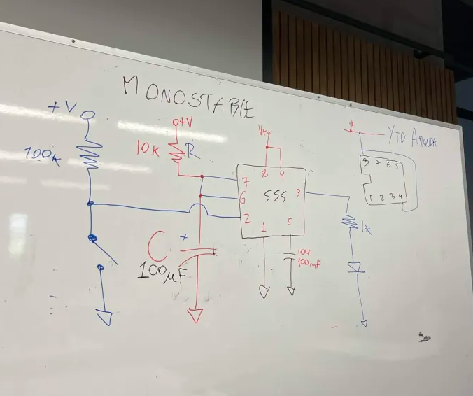
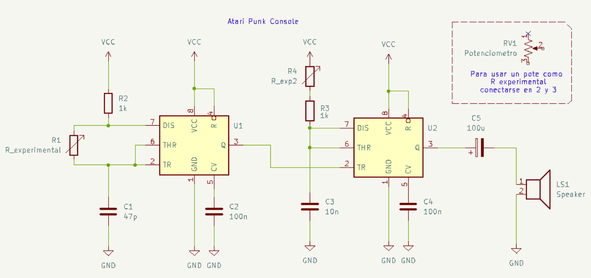
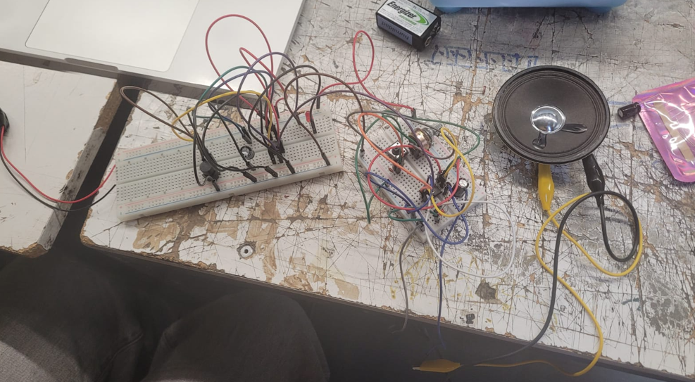

# sesion-03b

27-03-2026  

---

## Apuntes de clase

En esta clase se realizó un repaso del circuito astable, revisando el concepto de resistencia equivalente.

- **Resistencias en serie:**  
Req = R1 + R2

- **Resistencias en paralelo:**  
1 / Req = 1 / R1 + 1 / R2  
Req = (R1 × R2) / (R1 + R2)

Además, se conoció el **circuito monoestable**, el cual emite un único pulso de corriente durante un tiempo determinado al ser activado.

---

### Atari-Punk

Un sintetizador de sonido DIY hecho con dos temporizadores 555, uno en modo astable y otro en modo monoestable.

---

### Ejercicio 

Este ejercicio para realizar la Atari-Punk lo hice con Vania. Al principio tuvimos problemas con el fotorresistor, ya que no funcionaba correctamente, pero luego logramos solucionarlo. Posteriormente experimentamos con distintos condensadores para alterar las frecuencias y obtener diferentes sonidos.

