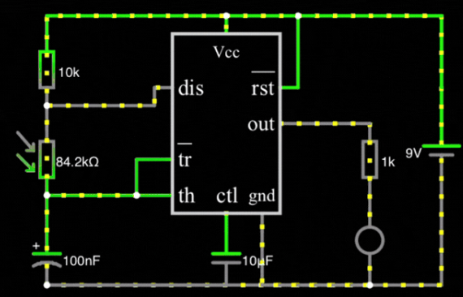
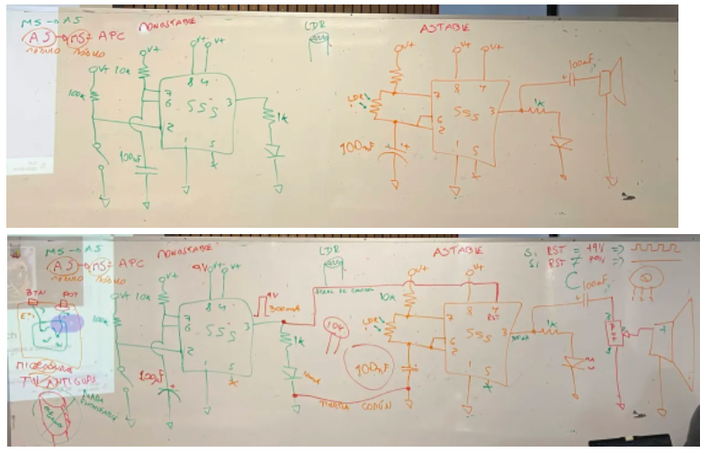
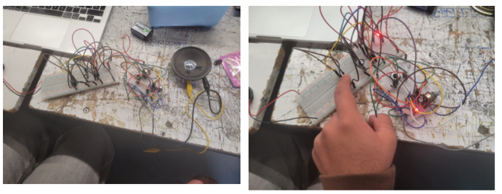
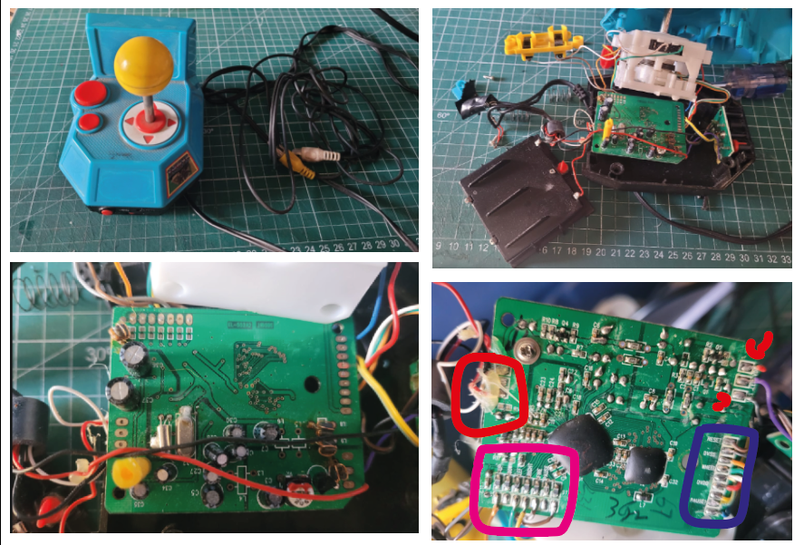

# sesion-04a

31-03-2026  

## Apuntes de clase  

## Escala y unidades en electrónica

En electrónica se utilizan prefijos para representar valores de **alta y baja magnitud**, lo que facilita la lectura e identificación de componentes como **resistencias** y **condensadores**.

---

### Prefijos de alta magnitud  
*(Usados principalmente en resistencias)*

- Mega (M)  
- Kilo (k)  
- Unidad (Ω)  

Las resistencias se representan con la letra **“R”**.

---

### Prefijos de baja magnitud  
*(Usados principalmente en condensadores)*

- Mili (m)  
- Micro (µ)  
- Nano (n)  
- Pico (p)  

Los condensadores se representan con la letra **“C”** y su unidad es el **Faradio (F)**.

---

### Equivalencias comunes en condensadores

- 10.000 pF = 100 nF = 0,1 µF  

El **µF (microfaradio)** es una de las unidades más utilizadas para expresar el valor de los condensadores.

---

### Falstad

Falstad sirve para **simular circuitos electrónicos de forma interactiva y visual**, directamente desde el navegador.  
 
 <https://www.falstad.com>

---

### Ejercicio en Clase

En grupo conectamos un circuito monoestable con uno astable. Al principio, como teníamos las protoboards separadas, creímos que cada una necesitaba su propia batería. Luego entendimos que no era necesario, ya que se podía compartir el VCC y el GND entre ambas protoboards sin problema.

---

#### Encargo

Destripar un dispositivo electrónico, documentar con texto e imagen el proceso, distinguir los elementos de la PCB que hemos estudiado como R y C y chips. + documentar las conexiones entre la PCB y los componentes en la carcasa. + escribir un texto de 3 párrafos explicando de forma poética imaginaria el funcionamiento especulativo del dispositivo electrónica, usando metáforas y analogías para describir el flujo de electricidad y la interacción de los componentes. el texto debe ser creativo y evocador, transmitiendo la esencia del dispositivo sin ser técnico, ni tampoco necesariamente real.

---

#### Identificación PCB – Ms. Pac-Man TV Plug ’n Play (2004)

Esta PCB pertenece al **Ms. Pac-Man TV Plug ’n Play (2004)** fabricado por **Jakks Pacific** bajo licencia de **Namco**. Es un sistema embebido simple que integra CPU y ROM en un solo chip (chip-on-board).

Este arcade lo tengo desde que tengo noción de conciencia, y siempre quise saber cómo funcionaba internamente, lo que motivó este análisis y documentación de la placa.

#### Zonas identificadas en la placa

- **Alimentación (rojo)**  
  Entradas de **VCC** y **GND**, con regulador de voltaje y condensadores de filtrado.

- **Botones de sistema (azul)**  
  Entradas digitales para **pausa / menú / reset**, funcionando como cierres a tierra (GND).

- **Joystick y botones (rosado)**  
  Entradas digitales del joystick (**UP, DOWN, LEFT, RIGHT + común**) y botón principal.

#### Otros elementos relevantes

- **Salida de video compuesto (NTSC)**  
- **Salida de audio mono**  
- **CPU + ROM integradas (gota negra, no reprogramable)**  
- **Oscilador que define la velocidad del sistema**
