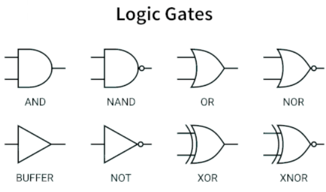
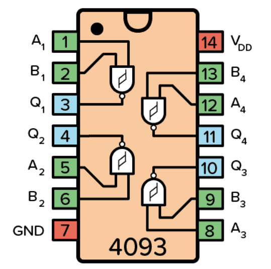
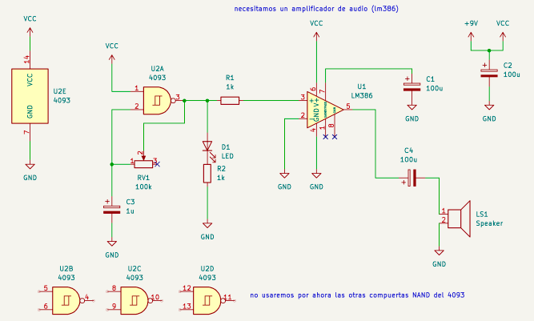
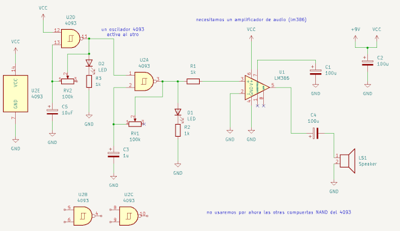
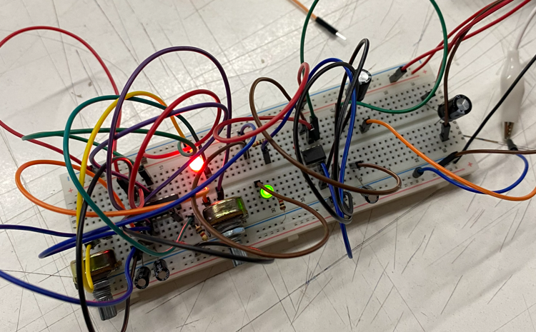
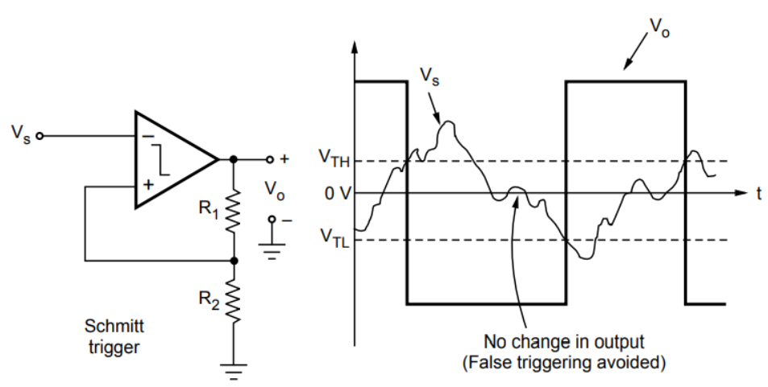

# sesion-05a
 
07-04-2026

---

## Apuntes

## Operadores Lógicos

Los operadores lógicos se usan en electrónica digital y programación para trabajar con valores binarios:
0 = falso / apagado  
1 = verdadero / encendido

---

## AND (Y)
Significa: la salida es 1 solo cuando A y B son 1.

A | B | Salida
--|---|-------
0 | 0 | 0
0 | 1 | 0
1 | 0 | 0
1 | 1 | 1

---

## OR (O)
Significa: la salida es 1 cuando al menos uno es 1.

A | B | Salida
--|---|-------
0 | 0 | 0
0 | 1 | 1
1 | 0 | 1
1 | 1 | 1

---

## XOR (O exclusivo)
Significa: la salida es 1 solo cuando A y B son diferentes.

A | B | Salida
--|---|-------
0 | 0 | 0
0 | 1 | 1
1 | 0 | 1
1 | 1 | 0

---

## NAND (NO AND)
Significa: es la negación de AND.
La salida es 0 solo cuando A y B son 1.

A | B | Salida
--|---|-------
0 | 0 | 1
0 | 1 | 1
1 | 0 | 1
1 | 1 | 0

---

## NOR (NO OR)
Significa: es la negación de OR.
La salida es 1 solo cuando A y B son 0.

A | B | Salida
--|---|-------
0 | 0 | 1
0 | 1 | 0
1 | 0 | 0
1 | 1 | 0

---

## XNOR (NO XOR)
Significa: la salida es 1 cuando A y B son iguales.

A | B | Salida
--|---|-------
0 | 0 | 1
0 | 1 | 0
1 | 0 | 0
1 | 1 | 1

---

## Resumen rápido
AND  → ambos activos  
OR   → al menos uno activo  
XOR  → solo uno activo  
NAND → no ambos  
NOR  → ninguno activo  
XNOR → iguales
### Trabajo en clase

---

### Chip 4093

Trabajamos con el **CD4093**, un circuito integrado que contiene **cuatro compuertas NAND con disparador Schmitt (Schmitt Trigger)**.

El chip tiene **14 pines en total** y su alimentación se conecta de la siguiente manera:
- **Pin 7**: GND (tierra)
- **Pin 14**: VCC (alimentación)

Las **cuatro compuertas NAND** incluidas permiten trabajar con señales digitales y analógicas, siendo muy usado en osciladores, temporizadores y circuitos de lógica digital.

No me funcionó al principio y no encontraba el problema en el esquemático, ya que aparentemente tenía todo bien conectado.  
Después me di cuenta de que me equivoqué en algo muy básico: la posición de los LEDs.  
Una vez corregido eso, funcionó al tiro jajaja

---

#### Encargo: Schmitt Trigger

Un **Schmitt Trigger** es un circuito que limpia y estabiliza señales, convirtiendo una señal ruidosa o lenta en una señal digital clara (0 o 1) mediante dos umbrales de activación.

