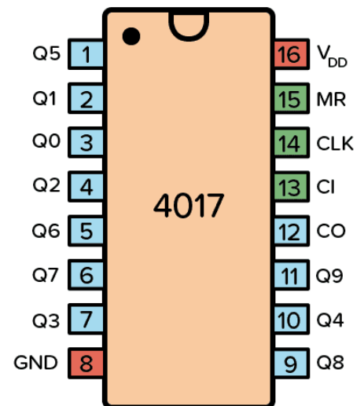
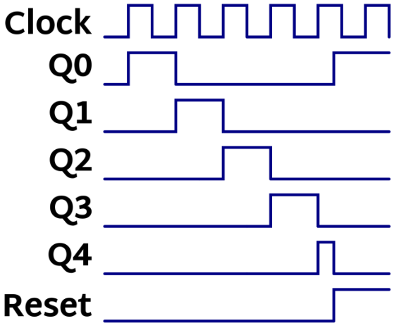
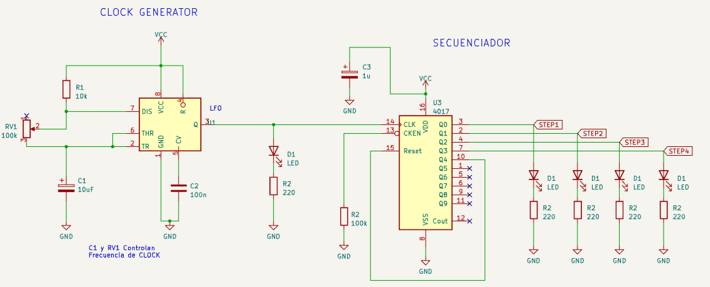
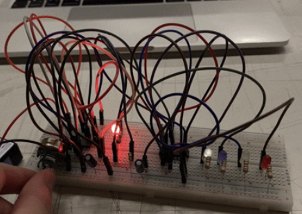

# sesion-05b

10-04-2026
 
# Apuntes de clase  

## Entregas y enfoque de diseño (UX / UI)

Repasamos lo que debemos entregar el **viernes 24 de abril**.  
Se enfatizó la importancia de **pensar y definir claramente** los siguientes aspectos del proyecto:

### UX (User Experience)
- Qué controla el usuario.
- Qué tan intuitiva es la experiencia.
- Cómo se entiende la interacción.

### UI (User Interface)
- Qué tan estética es la interfaz.
- Si la estética tiene un sentido real y funcional, y no solo decorativo.

---

## CD4017

### Introducción
En esta clase comenzamos a trabajar con **sistemas secuenciales**, es decir, circuitos que organizan eventos en el tiempo mediante un orden definido.

### Chip CD4017
El **CD4017** es un **contador de décadas** que cuenta con **10 salidas (Q0–Q9)**.  
Estas salidas se activan **una a una** de forma secuencial cada vez que el chip recibe un pulso de reloj.  
Al llegar a Q9, el conteo vuelve a comenzar desde Q0.

### Clock (Reloj)
Para funcionar, el CD4017 necesita un **clock**, que define el ritmo del conteo.  
Este clock puede generarse utilizando:
- 555  
- 4093  

La frecuencia del reloj determina la velocidad de la secuencia.

### Experiencia en clase
Durante la explicación, **me usaron como ejemplo para simular los tiempos del chip**, lo que ayudó a comprender cómo cada pulso de reloj controla el orden y el ritmo de las salidas.

---

#### Trabajo en clase

Realizamos un **circuito secuenciador** en el que los LEDs se encendían de forma progresiva en distintos tiempos, controlados por una señal de **clock**. Para esto utilizamos un **chip 4017** como contador/secuenciador y un **555** como generador de pulsos que definía la velocidad de la secuencia.

A mí me resultó a la primera al realizar el circuito, y me gustó que tuviera un orden y una estructura clara, donde todo ocurre a su debido tiempo. Además, fue interesante ver cómo cada componente cumple un rol específico dentro del sistema, logrando una secuencia lógica y controlada que hace evidente el funcionamiento del circuito.
