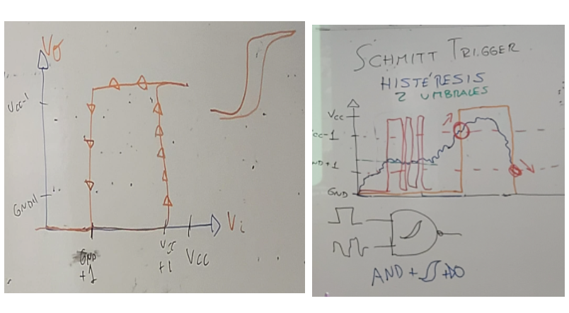
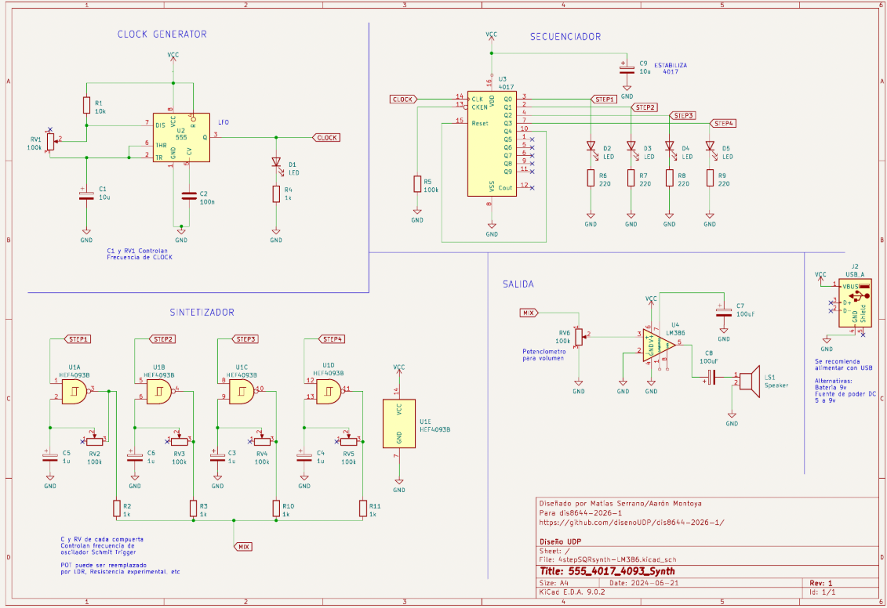
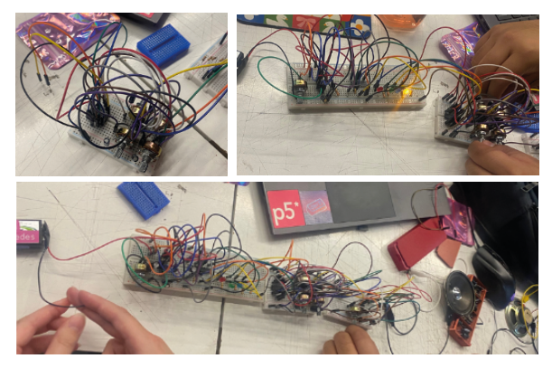

# sesion-06a

## 14-04-2026

## Apuntes de clase

Durante la clase se nos presentó el libro que están desarrollando Aaron y Misa, el cual será publicado tanto de forma gratuita como en versión pagada. El proyecto está siendo realizado completamente en código, lo que permite mayor flexibilidad, acceso y posibilidades de modificación.

## Histéresis – Schmitt Trigger

El Schmitt Trigger es un tipo de comparador electrónico que utiliza retroalimentación positiva para convertir una señal de entrada analógica ruidosa en una señal de salida digital limpia y estable.

A diferencia de un comparador estándar, que trabaja con un solo nivel de umbral, el Schmitt Trigger emplea dos niveles de voltaje distintos, lo que introduce el concepto de histéresis. Esta característica evita que pequeñas variaciones o ruidos en la señal de entrada provoquen cambios rápidos e indeseados en la salida.

### Conceptos clave

**Umbral Superior (UTP):**  
La salida cambia de estado bajo a alto únicamente cuando la señal de entrada supera este valor.

**Umbral Inferior (LTP):**  
La salida cambia de estado alto a bajo solo cuando la señal de entrada cae por debajo de este valor.

**Zona Muerta:**  
Área comprendida entre ambos umbrales en la que el circuito mantiene su estado actual, ignorando pequeñas fluctuaciones de la señal.

Este comportamiento hace que el Schmitt Trigger sea especialmente útil para limpiar señales ruidosas y mejorar la estabilidad en sistemas digitales.

### Trabajo en clase

#### Resumen – Trabajo Grupal

Armamos el sistema completo y detectamos un problema de conexión entre el paso 2 (secuenciador) y el paso 3 (sintetizador). Para solucionarlo, implementamos un código de colores para cada *step*: **step 1 azul, step 2 verde, step 3 amarillo y step 4 rojo**, lo que permitió ordenar mejor las conexiones y redistribuir algunos componentes. Además, revisamos todo el cableado para asegurar que estuviera correctamente conectado.

Yo armé el **paso 3**, correspondiente al **sintetizador**. Posteriormente, surgió una falla en el **potenciómetro del paso 4**, que solo funcionaba en un punto muy específico. Revisamos conexiones y componentes, pero no logramos identificar la causa del problema.

Finalmente, conectamos los **pasos 1 y 2 directamente al paso 4**, lo que sí funcionó, aunque no era una solución válida para la entrega final.

