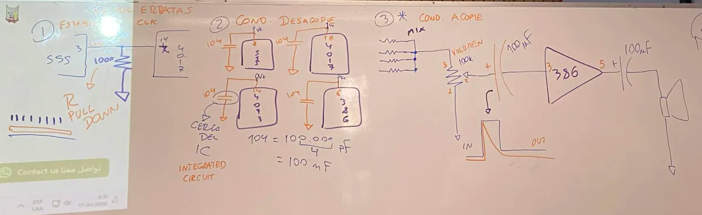
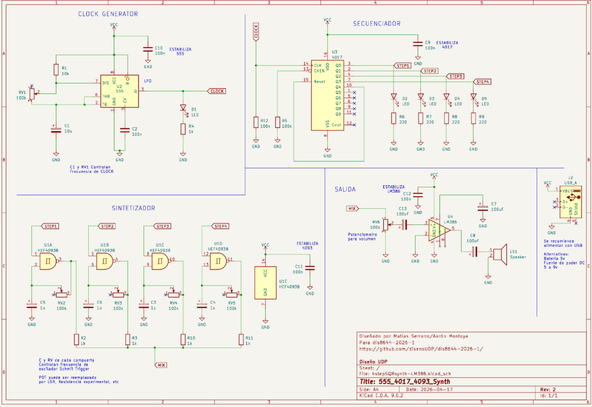
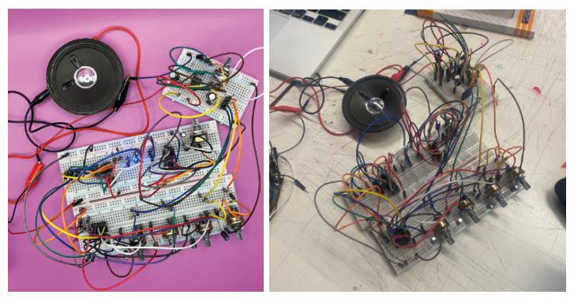

# sesion-06b

17-04-2026

## Trabajo en clases

Misa trajo un nuevo esquemático que incorporaba capacitores de apoyo emocional en cada módulo y resistencias de 100k en la conexión entre el chip 555 y el 4017.

Durante el trabajo surgieron varios problemas. Al reconectar el circuito armado en la clase anterior, este dejó de funcionar, por lo que decidimos desarmarlo completamente y reconstruirlo desde cero. Para esto, utilizamos protoboards de mayor tamaño, lo que permitió un mejor orden y mayor espacio de trabajo.

Durante el proceso se quemaron dos chips 555, pero al ser reemplazados, la secuencia volvió a funcionar correctamente.

Al continuar con los sintetizadores, notamos que los potenciómetros estaban afectando a toda la secuencia en lugar de controlar cada step de forma individual. Siguiendo la sugerencia de Misa, retiramos los LEDs y las resistencias del step 02, lo que permitió que cada paso fuese controlado por su propio potenciómetro.

Finalmente, ajustamos los sintetizadores utilizando condensadores de 1 µF para obtener un sonido más agudo, logrando el resultado esperado para el **Proyecto 01**.

### Ayuda a otros grupos

Ayudamos al **grupo 6** a hacer funcionar su circuito. Yo ordené y reconecté desde cero el paso correspondiente al chip 4089, mientras que Vania detectó los errores de conexión. Finalmente, reemplazamos el condensador por uno de menor capacitancia y el circuito logró sonar correctamente.

También apoyamos al **grupo 4**, ya que su circuito no sonaba y presentaba varios problemas relacionados con el chip 386. Intenté ayudarlos armando nuevamente el sistema paso a paso y ordenando el montaje para facilitar la identificación de las conexiones del esquemático. Como resultado, se consiguió obtener un sonido leve.
