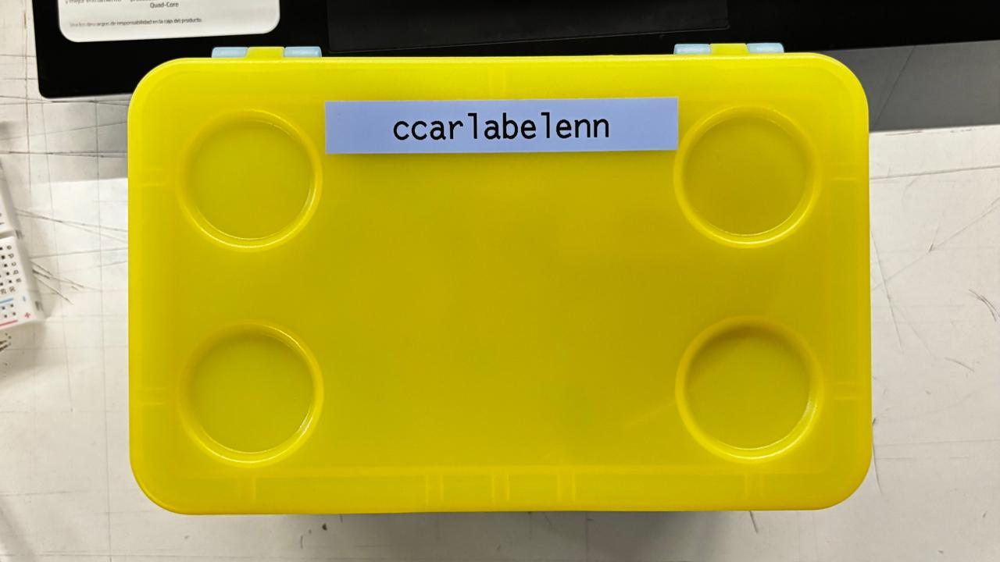
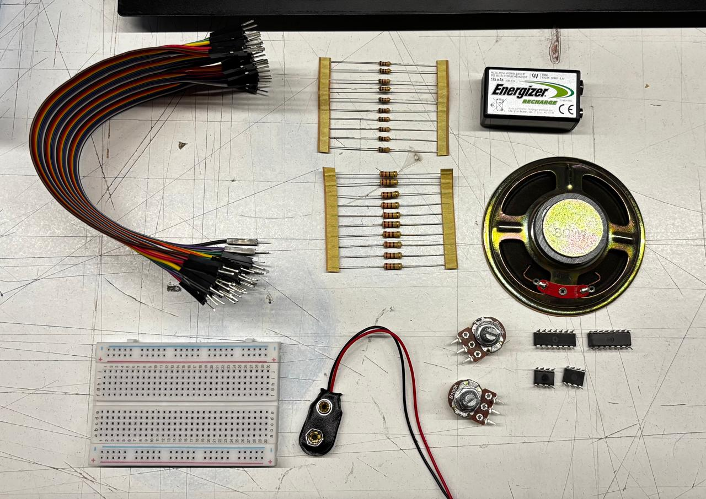
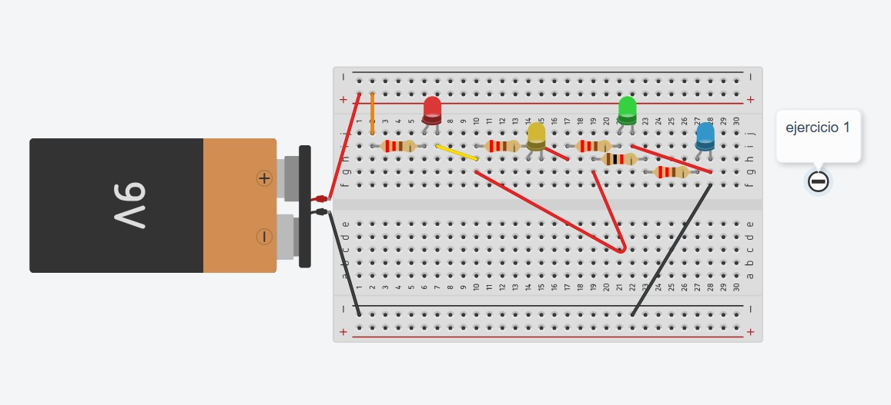
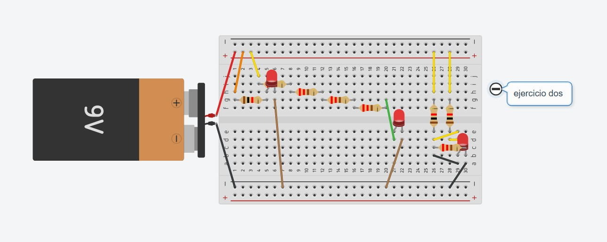
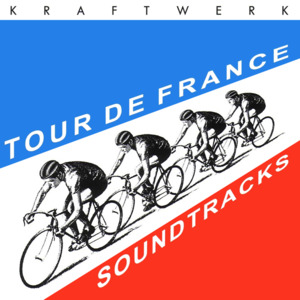

# sesion-02a

# entrega de materiales :)
martes 17/26

facutura propia jeje

## meteriales<3
+ potenciometro B100K, los más baratos
+ cables dupont: nos ayudarán como conectores, ciertos colores los utilizaremos para distintas cosas, buenos modales para leer bien los circuitos
+ parlante chico
+ chip ic: simetricos y tienen patitas a cada lado, se posicionan en el eje de la protoboard, puede contar y hacer secuencias, patrones repetitivos
+ broche de bateria
+ resistencia: más largo más resistencia, menor area menos resistencia, se mide en ohm 
---
|conductor|aislante|
|---------|--------|
|hierro   |tierra  |
|plata    |plástico|
|cobre    |vidrio  |
|oro      |madera  |
|aluminio |cuero   |
---
# encargo loquitoportilocoloco
+ ejercicio 1

|loquitoportilocoloco| d1 | d2 | d3 | d4 |
|--------------------|----|----|----|----|
|         R1         | 0  | 0  | 0  | 0  |
|         R3         | 1  | 1  | 1  | 0  |
|         R4         | 1  | 1  | 1  | 0  |
|         R2         | 1  | 0  | 0  | 1  |
|         R5         | 1  | 1  | 1  | 0  |

+ ejercicio 2

|loquitoportilocoloco| d1 | d2 | d3 | 
|--------------------|----|----|----|
|         R1         | 0  | 1  | 1  | 
|         R2         | 1  | 0  | 1  | 
|         R3         | 1  | 0  | 1  | 
|         R4         | 1  | 0  | 1  | 
|         R5         | 1  | 0  | 1  |
|         R6         | 1  | 1  | 1  | 
|         R7         | 1  | 1  | 1  | 
|         R8         | 1  | 1  | 1  | 
|         R9         | 1  | 1  | 1  | 

+ ejercicio 3

este no me resultó pero lo intentaré nuevamente jeje 

---

+ Análisis Kraftwerk:

personalmente me fascinó, si bien no es una banda que conocia o el tipo de música que escucharía pero este álbum cambió esa visión, mientras sus discos anteriores eran mucho más de deshumanización y futuro industrial este álbum se siente mucho más humano. 
en este caso Kraftwerk se mantuvo sin sacar música por casi dos décadas. A diferencia de sus discos grabados con sintetizadores análogos y secuenciadores hechos exclusivamente a medida, este disco marcó una transición total al dominio digital, el uso de software, computadoras y estaciones de trabajo digitales, haciendo que todo suene muchísimo más preciso.

A decir verdad en el disco como tal logro apreciar ritmos más especiales, no tan solo la base de cada canción. 
Note la respiración como punto central, la utilizan casi como percusión. En canciones como "tour de france étape 2" o "elektro kardiograma", el ritmo principal está construido sobre respiración humana y latidos del corazón. Es bastante genia como mezclan la biologia con la música y lo que logra llamar tu atención es eso. 

El disco no usa ritmos típicos del techno de club, son más patrones hipnóticos y repetitivos constante, es como estar en un trance, como el mismo hecho de la respitración al agitarte. Hay muchos sonidos ya conocidos que no sabría como explicar, es una experiencia auditiva casi táctil. 

Las presentaciones en vivo, en esta época las presentaciones eran el inicio de su estética "laptop". Cuatrob hombres inmóviles detras de sus consolas. Se podían ver visuales vectoriales muy sencillos y proyecciones de ciclistas antiguos en blanco y negro mezclado con gráficos muy de los 80.

 En la era actual hay una evolución brígida, el ver una presentación de tour de france de la época es una experiencia cinematográfica. El grupo ahora usa trajes con luces led que reaccionan a la música, pasaron de simples proyecciones a sistemas de sonido inmersivo y visuales que vuelan por el público, la diferencia es que ahora el espectador es parte de la experiencia y no solo lo observa.

Me atrajo aún más este disco porque a comparación de los otros que a mi parecer son más frios y distantes. este tiene algo más orgánico, basicamente es como el cuerpo humano suena dentro de la música y es menos robótico. 

