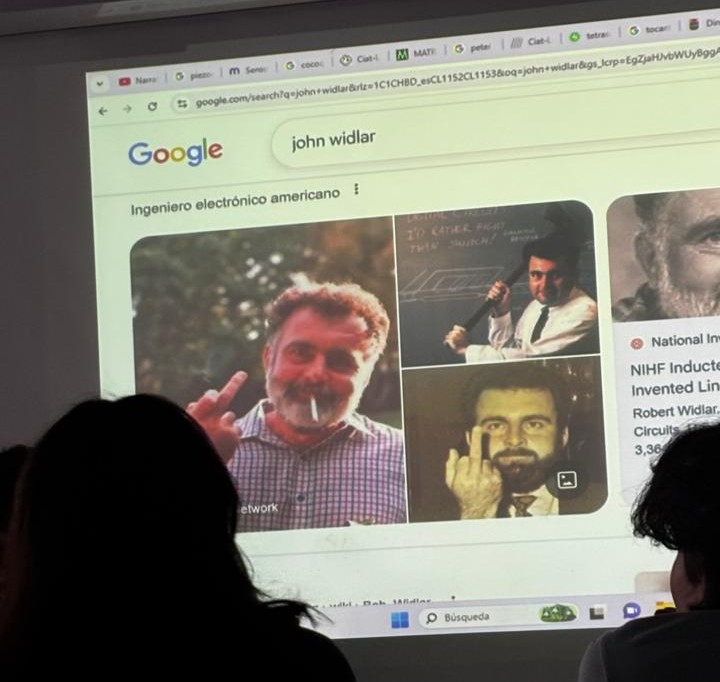
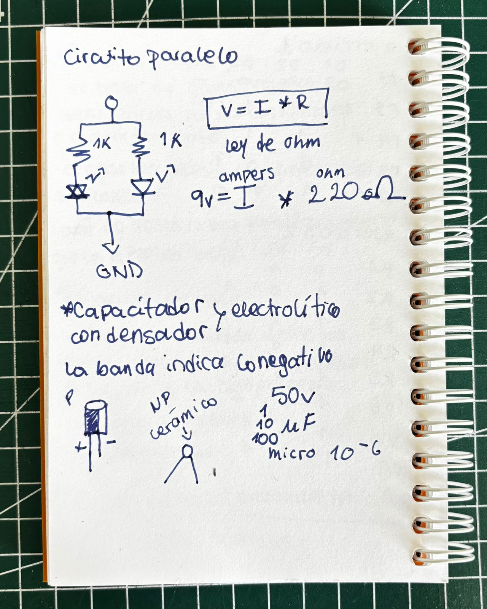
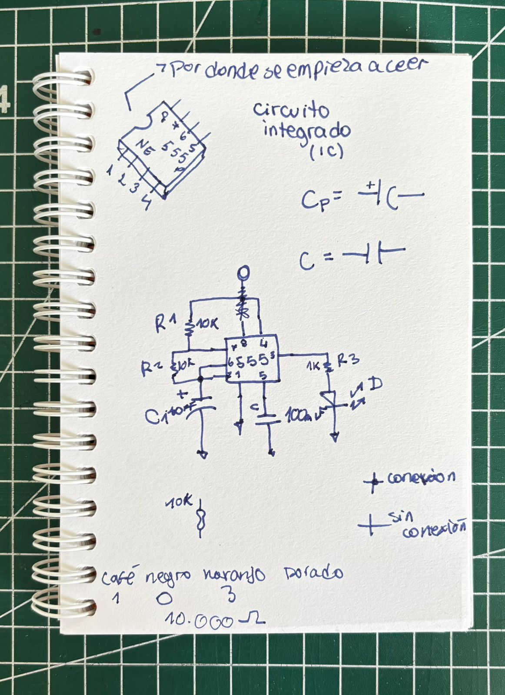
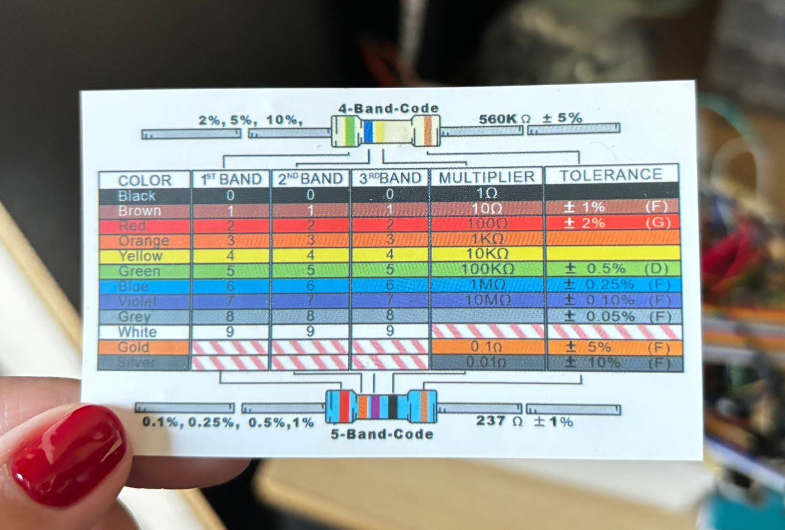

# sesion-02b

teloneo muy interesante a mi parecer: 

cada vez que un componente/material se estropee tenemos la facultad de widlarizarlos (pulverizar con un mazo estos mismos).

## ley de ohm Ω  

establece la intensidad de la corriente eléctrica que circula por un conductor es directamente proporcional al voltaje aplicado e inversamente proporcional a la resistencia del mismo. 

V = R × I

+ voltaje (V): se mide en volt
+ resistencia (R): se mide en ohm
+ corriente (I): se mide en ampere (A)

nos entregaron capacitadores!!

## ejercicio 555 (chip 555)

## codigo de colores de resistencia 

un poco de punteo:

+ potenciometro: B100K, los más baratos
+ cables dupont: nos ayudaran como conectores, ciertos colores los utilizaremos para distintas cosas, buenos modales para leerlo bien 
+ parlante chico
+ chip ic: simetricos y tienen patitas a cada lado, se posicionan en el eje de la protoboard, puede contar y hacer secuencias, permite hacer patrones repetitivos 
+ broche de bateria: nos permite conectarnos a la bateria 
+ material aislante: tierra, plástico, vidrio, madera, cuero 
+ conductor: hierro, plata, cobre, oro, aluminio, 
