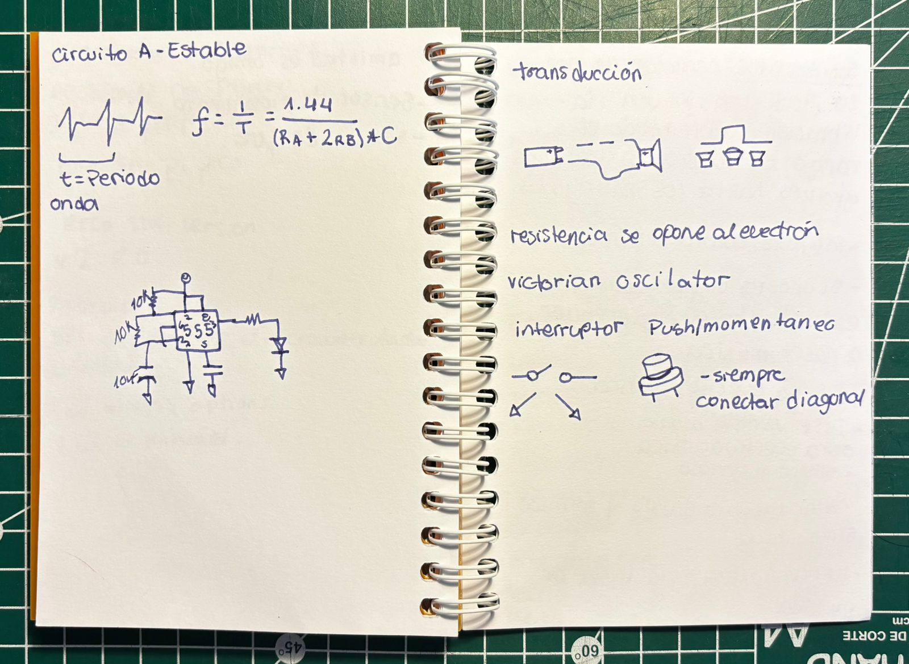
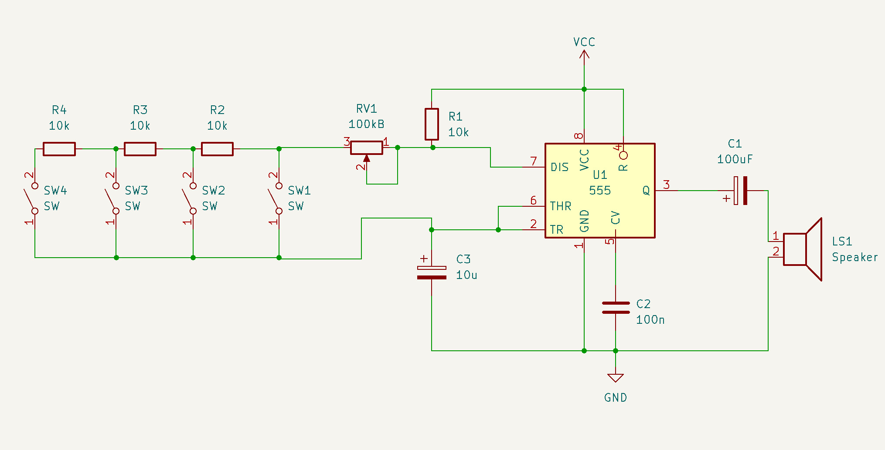
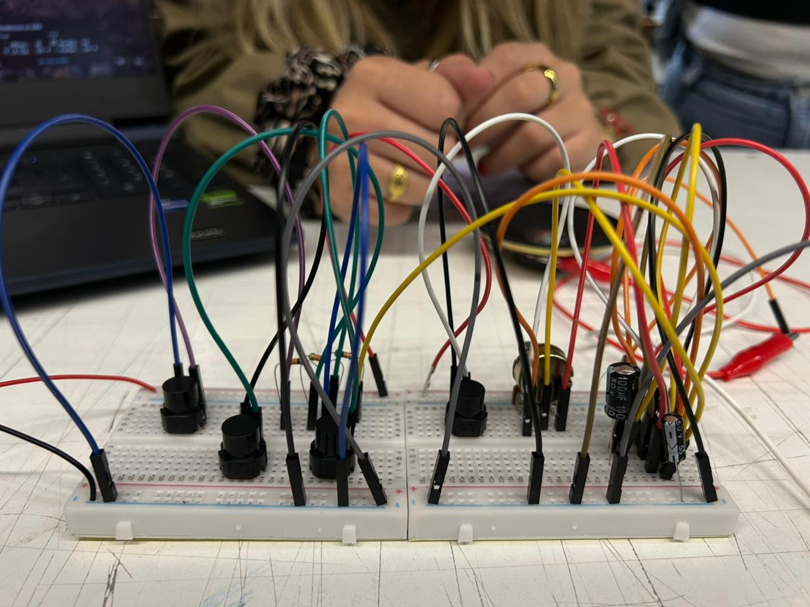
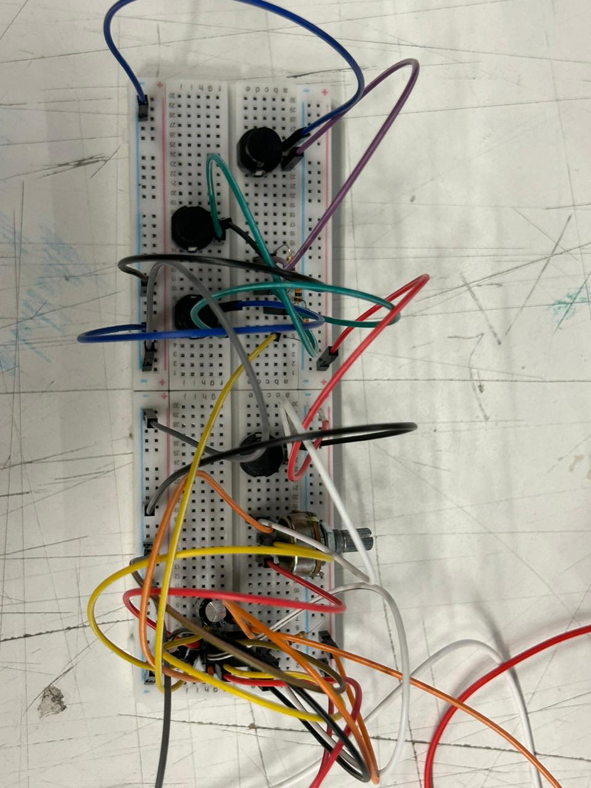

# sesion-03a

## materia 

+ el tiempo que hay que se repite un ciclo es una onda
+ periodo: cuanto dura una onda
+ frecuencia: cada cuanto ocurre algo, suceso  tiempo
+ si se el periodo puedo calcular la frecuencia

## sonamos 

+ transducción: conversión de una señal, estímulo o energía de una forma a otra

circuito A-estable con parlante 

## segundo bloque 
+ condensador en serie: atenua ciertos comportamientos de la onda
+ la resistencia hace que no sea tan agresivo el paso de los electrones
+ con resistencia y condensador se puede filtrar, escalera de moog (mood filter ladder)
+ (R) atenua (C) filtra 
+ las diferencias son importantes porque son productivas 

## encargo 03 

expandir el circuito anteriormente usado, incorporando más botones.

  + este ejercicio lo hicimos en un grupo de 5 personas, fuimos siguendo el circuito paso a paso dividiendolo por partes, izquierda, centro y derecha. Aplicamos conocimientos anteriormente aprendidos para que este mismo funcionara de manera exitosa jejejejej, no se como poner un video asi que solo tengo fotos.

evidenciamos cambios de frecuencia dependiendo del boton que presionábamos, uno frenaba todo el paso de sonido, otro hacia que fuese más agudo y por lo que recuerdo otro hacia que el sonido subiera y bajara. Fue super gratificante poder hacer el circuito y que funcionara, no creí que con poquitas clases llegariamos a lograrlo, locura total. Me está fascinando caleta lo que se puede hacer con estas cositas. 

## variaciones espectrales 

la música electro acustica según asuar fue una nueva manera de escuchar, una nueva abstracción de los sonidos. Tiene que ver con el significado técnico de lo que es un espectro, variaciones espectrales fue su proyecto de tesis con el cúal obtuvo el título de ingeniero y lo que dio paso a que pudiera seguir estudiando su propia creación en alemania, lo hizo como método analítico, para analizar todo lo que está dentro de una obra, educar el oído y reconocer simbolos en la partitura con los estimulos sonoros de la obra (locura total que genio). 

**un poco de punteo que hice mientras veía el documental:**

+ sonidos puros: se caracterizan por ser producidos por una sola vibración, cubren todo el rango de audicón, de tonos graves hasta los más agudos
+ interfaz sonora lumínica (cool) 
+ si uno es un poco computín es bastante fácil aprender a hacer música
+ josé vicente asuar: ingeniero y compositor, obra electroacustica (músico misterioso), representante del estado de la investigación en chile 
+ la naturaleza está llena de música
+ derrepente de la locura puede emerger la lucidez
+ música concreta: apropiarse concretamente del sonido, la grabación de sonidos concretos. se cortaban cintas de distintas grabaciones de distintios sonidos, se intentaban variaciones con distintos tipos de corte
+ música con computadoras: construyó el computador pensando cosas que se hicieron despues, hizo que el computador controle el voltaje a perifericos, o sea a otros sintetizadores. podia sintetizar mayor cantidad de voces que cualquier otro computador 
+ el protocolo midi: ( musical instrument digital interface), es un estándar técnico internacional que permite a instrumentos electrónicos, controladores y ordenadores comunicarse entre sí
+ la música no puede ser mercancia
+ capacidad de visualizar un futuro a través de una maquina 

