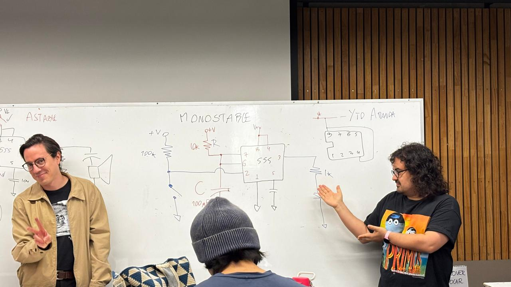
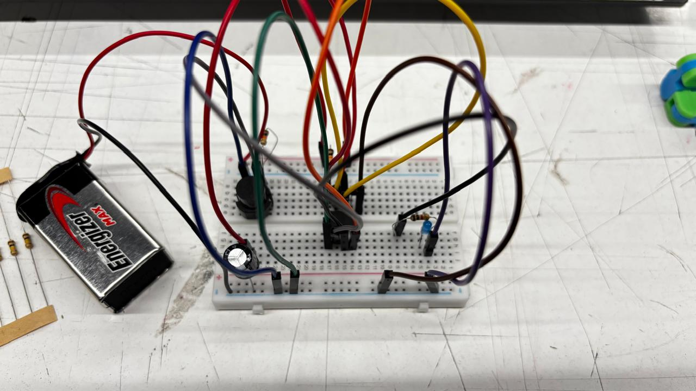
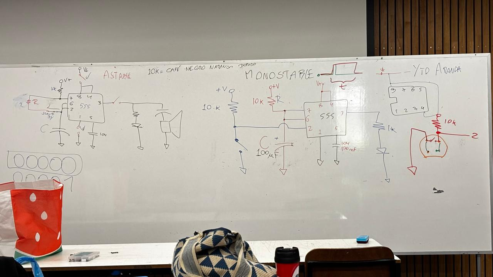

# sesion-03b

viernes 27 de marzo 

## teoria nerd 

missa y aaron con el circuito monostable :)

circuito que hice siguiendo los pasos, me está gustando mucho leer circuitos y entender en qué me puedo estar equivocando, así de esta manera ir mejorando de a poco 

circuitos mono y astable 
