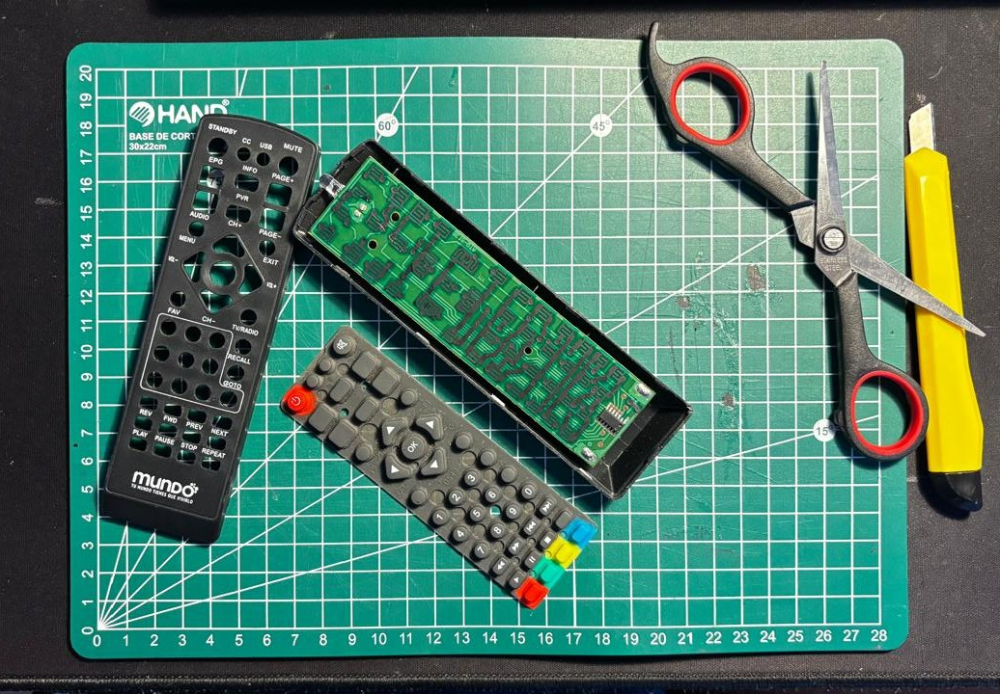

# sesion-04a

martes 31 marzo

+ practicamos los circuitos mono y astable, uniendo los dos

## encargo 04

se nos pidió destripar un objeto electronico y evidenciar sus componentes, los que conocieramos y explicar detalladamente lo que vimos de una forma más poetica!!

decidí destripar un control remoto que estaba tirado en mi casa (sin uso)

imagen propia 

## proceso de despiece 

para llegar a lo que se ve en la foto fue bastante directo.

+ apertura a la fuerza (con cariño): como estos controles casi nunca traen tornillos, hubo que usar el corta carton para ir haciendo palanca en el borde. se siente como si se fuera a romper, pero son solo las pestañas de plástico soltándose para separar la tapa de arriba de la de abajo.

+ sacar la goma: una vez abierto, lo primero que sale es la capa gris. es básicamente la cara del control, donde están todos los botones que tocamos.

+ PCB: por último, sacamos la placa verde (la PCB) que viene encajada a presión. sin tornillos, sin cables, todo muy limpio.

## que hay en esta placa verde llamada PCB?????

+ el chip (el que manda): es ese cuadradito negro con patas plateadas que se ve abajo a la derecha. ese es el que traduce que botón estás hundiendo y lo convierte en una señal que la tele entienda.

+ las "R" y las "C": esos puntitos soldados cerca del chip son las resistencias y los capacitores. las resistencias controlan que no pase más energía de la cuenta (para no quemar nada) y los capacitores guardan un poquito de carga para que la corriente sea estable y no de tirones.

+ caminos de cobre: esas líneas que parecen un mapa por toda la placa son las pistas que llevan la electricidad de un lado a otro. (esto tuve que investigarlo porque no tenia idea)

+ las rejillas de contacto: debajo de cada botón hay unos dibujos en forma de laberinto. ahí es donde ocurre la magia cuando presionas una tecla. (esto tambien que loco)
