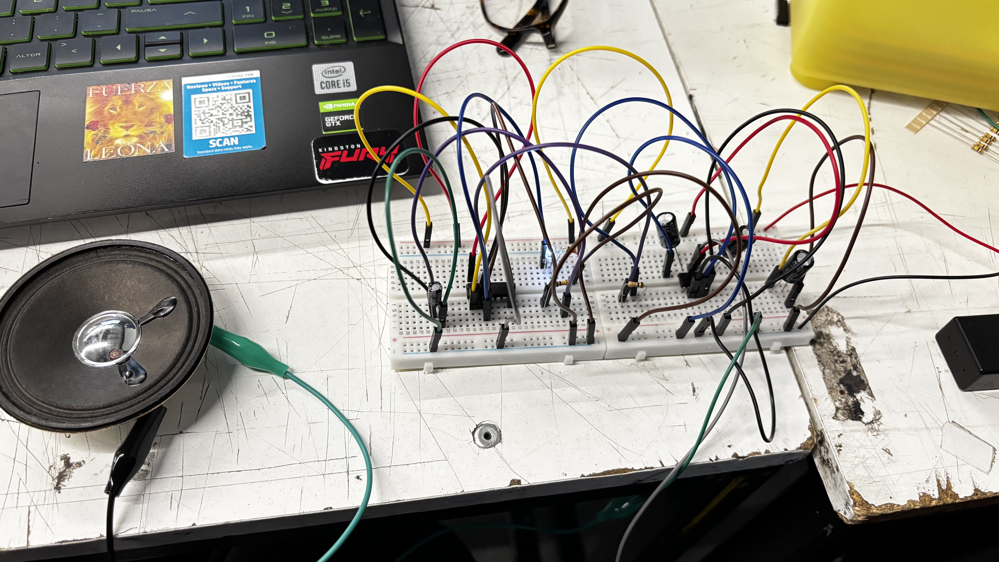

# sesion-05a
07 abril 

gates: compuertas que permiten el paso del sonido 

## vamos a conocer: 
+ vco: osciladores que podemos escuchar
+ lfo es tambien un oscilador pero de baja frecuencia, menos a 20 hz, para hacer modulaciones que son cambios en torno a un punto 
+ vcf: filtro que lo controlamos con voltaje
+ thres
+ logica combinacional
+ chip 4093: riquezas a nivel sonoro 

hicimos grupo para la primera solemne de taller, anto, nico y yo jejej, practicamos este primer circuito junto a nico y logramos que funcionara luego de muchos intentos fallidos, olvidamos conectar muchas veces cosas realmente basicas pero lo logramos!

este estaba compuesto por el 555 que nos permitio que el led encendiera y el 4093 que nos permitio que sonara 
