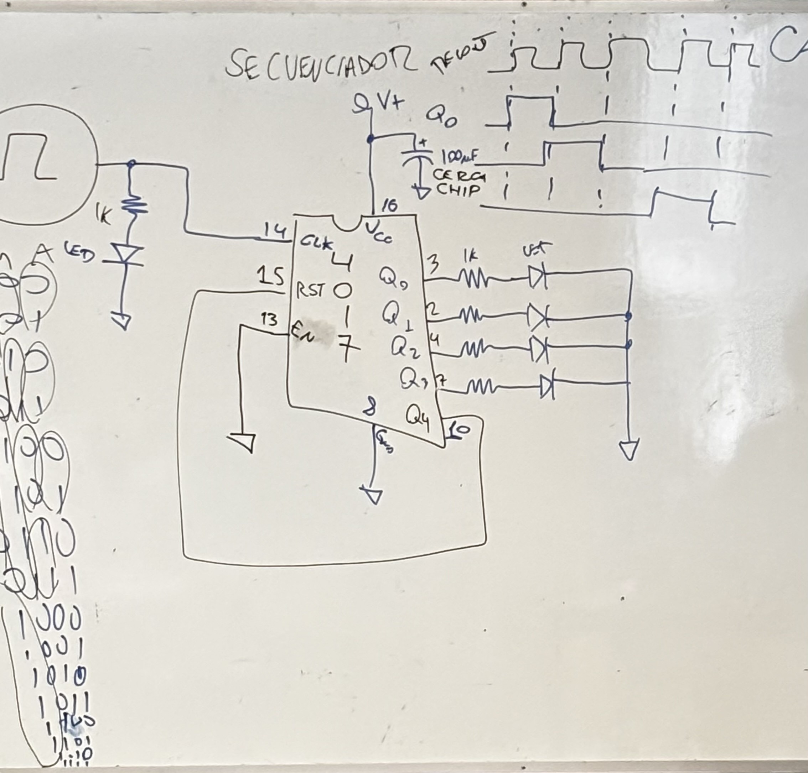
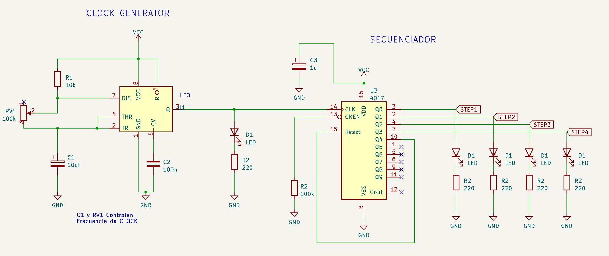
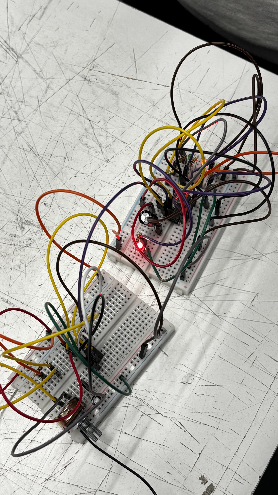

# sesion-05b
10 abril 

## secuenciador!!! 4017
aprendimos 

se nos explicó el funcionamiento del secuenciador (chip 4017) en parte del circuito que utilizaremos para nuestra primera solemne 

---
+ ux: experiencia de usuario
+ la materia es lo que es
+ campo de sentido aka nosotros decidimos que es aesthetic

## 4017 

555 funciona como reloj y 4017 como secuenciador 

hicimos este circuito complementando el 555 con el 4017, estos en conjunto generaban una secuencia donde el potenciometro determinaba la velocidad de esta misma, se prendia la primera intermitente en el 555 y luego la secuendia en las cuatro leds ubicadas en el 4017 

