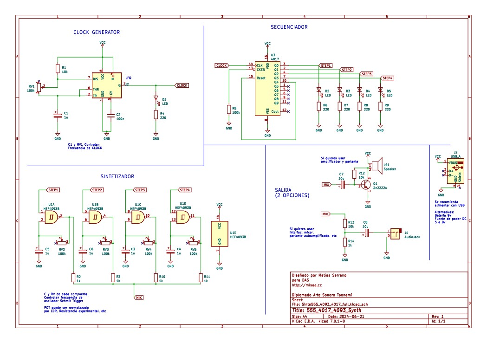

# sesion-06a
14 de abril 

falté a esta clase:(

mis compañeros de grupo me mantuvieron al tanto de lo que hicieron en esta clase.  

## solemne 01 criterios de evaluacion 

los primeros 3 son grupales, los siguientes 3 son individuales.

1. factura del sintetizador: orden del circuito, limpieza, organización, factura.

2. documentación textual del sintetizador: diagrama de bloques, esquemático, dibujos, textos, explicación de cada parte, de cada chip.

3. modificaciones del sintetizador: mejoras, decisiones de diseño, afinaciones, parámetros, experiencia de usuario.

4. bitácoras marzo

5. bitácoras abril

6. presentación oral
