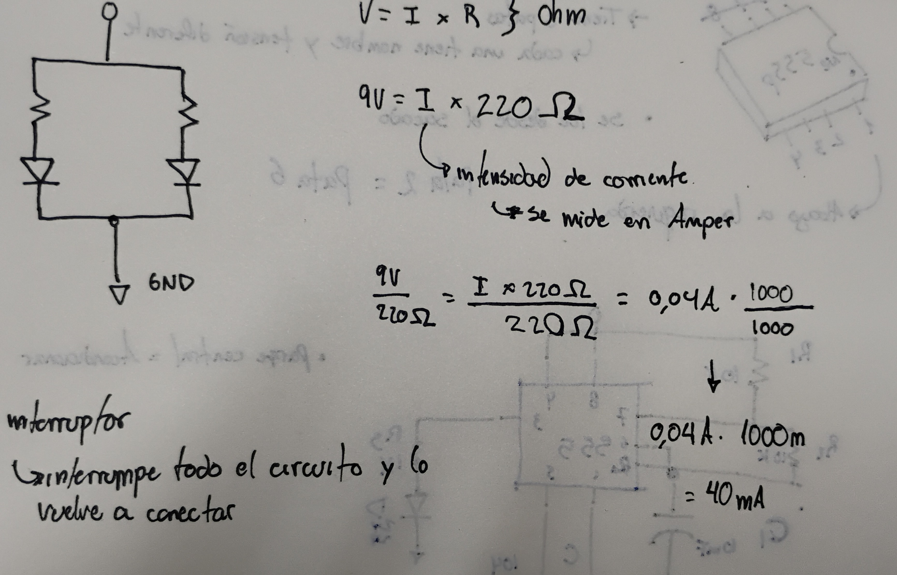
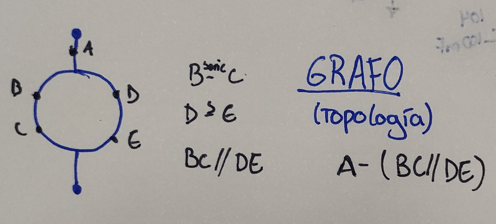
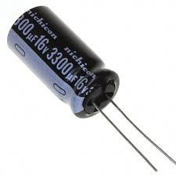
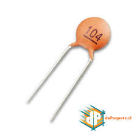
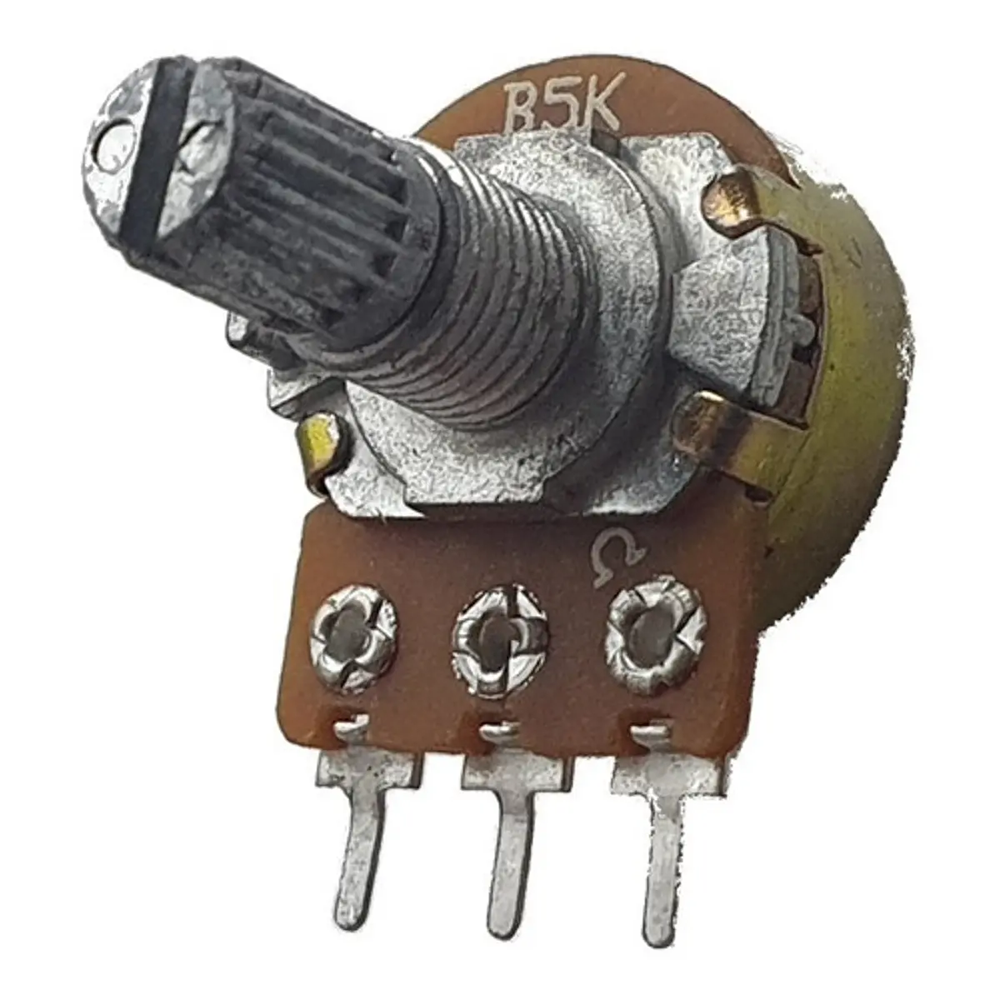
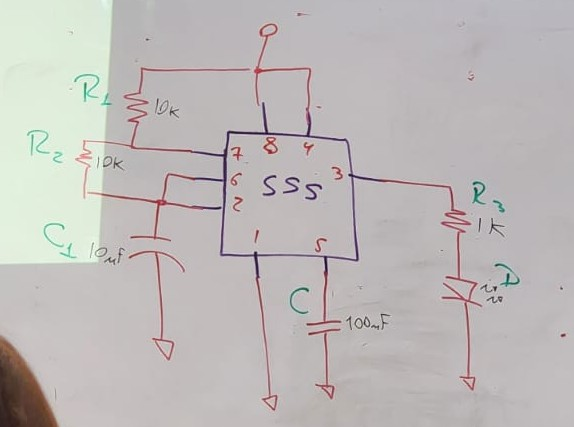
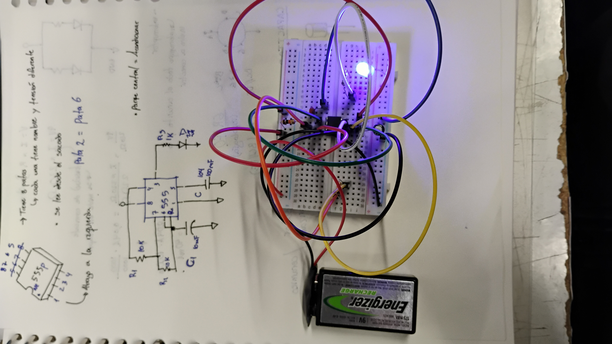

# sesion-02b

# Ley de ohm #

V = I · R

V: voltaje, se mide en voltios

I: corriente, se mide en amperios

R: resistencia, se mide en ohmios

# interruptor #

abre o cierra un circuito, permitiendo o impidiendo el paso de la corriente eléctrica

# condensador electrónico #

componente que almacena energía eléctrica temporalmente, tiene 50v de capacidad máxima

tiene polaridad

# condensador cerámico #

no tiene polaridad

# timer #

tiene 8 patas, cada una tiene nombre y tensión diferente.

se leen desde el sacado ( pata 1 abajo a la izquierda - pata 8 ariba a la izquierda)

pata 2 = pata 6

# potenciometro #

funciona como resistencia, permitiendo manipular la velocidad

# fotoresistor #

es una resistencia que varía con la luz, no necesita perillas.

no tiene polaridad

# circuito integrado #

parte central = acondicionar

Al realizar el ejercicio de forma autonoma tuve problemas para encender el led, pero con la ayuda de mis compañeros logré identificar que habia un cable mlas conectado, lo que causaba que el circuito no funcionara de forma correcta.

10mF = parpadeo rapido

100mF = parpadeo lento

girar a la derecha para más velocidad

invertir cables para definir velocidad

# 10 preguntas #

+ ¿Cómo puedo evitar quemar un led
+ ¿Existe alguna deferencia entre usar resistecias para generar conexiones en lugar de cables?
+ ¿Como puedo evitar reventar un condensador?
+ ¿Que sucede si conecto 2 cables o resistencias en un mismo espacio del protoboard?
+ ¿El circuito puede dañarse si uso una resistencia distinta a la que se muestra?
+ ¿Con que frecuencia debería cargar la batería?
+ ¿Existe una forma de generar conexiones con menos cables?
+ ¿Cómo puedo saber cuando un timer se quema?
+ ¿Afecta en algo si ordeno los componentes de distinta manera?
+ ¿Se pueden dañar los leds, resistencias o condensadores si deformo las patas?
