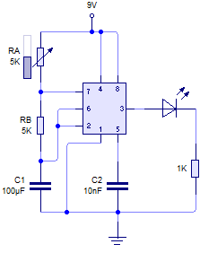
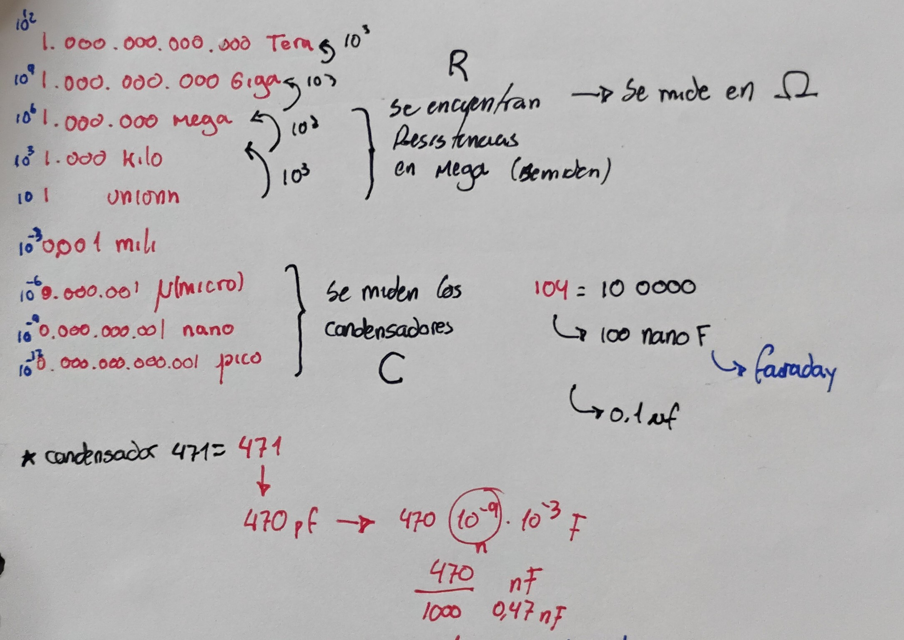
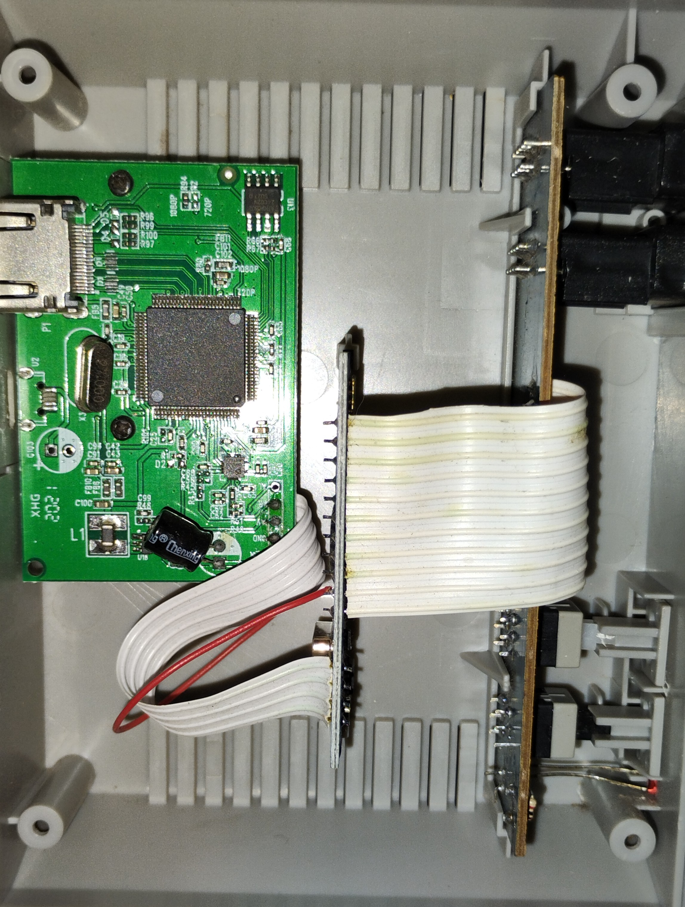
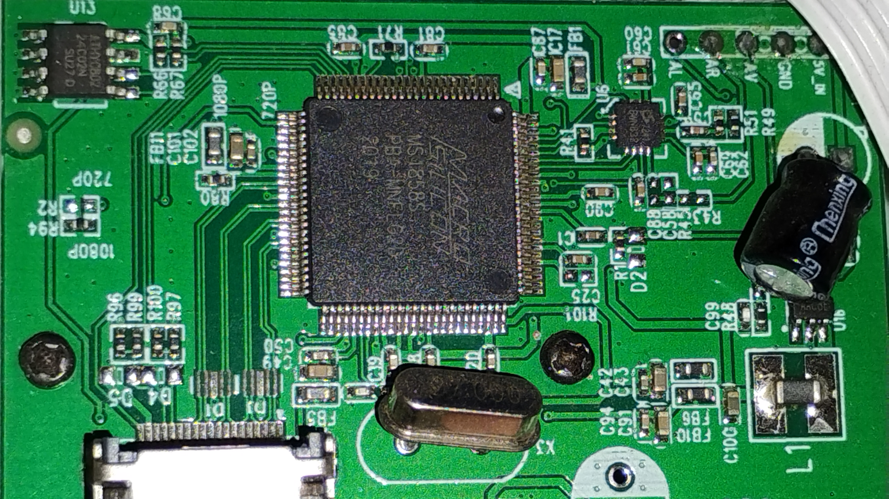
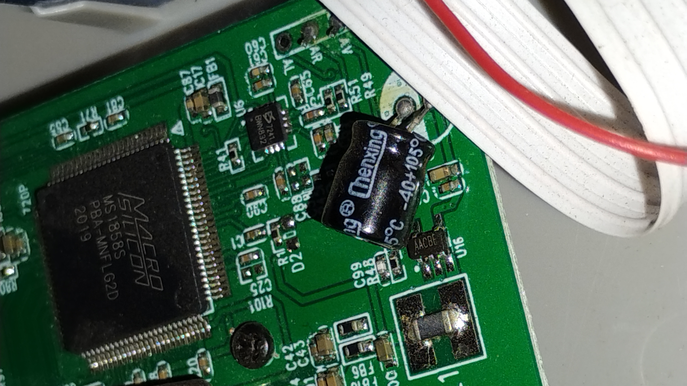
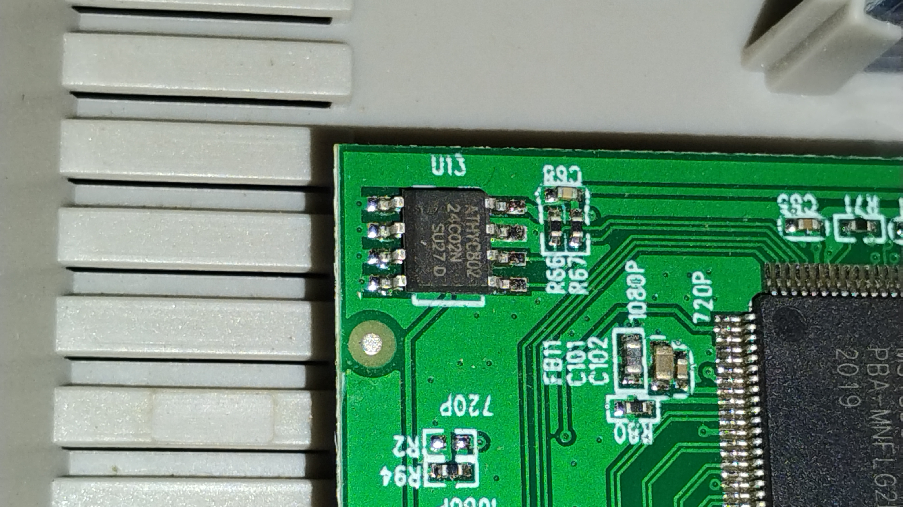
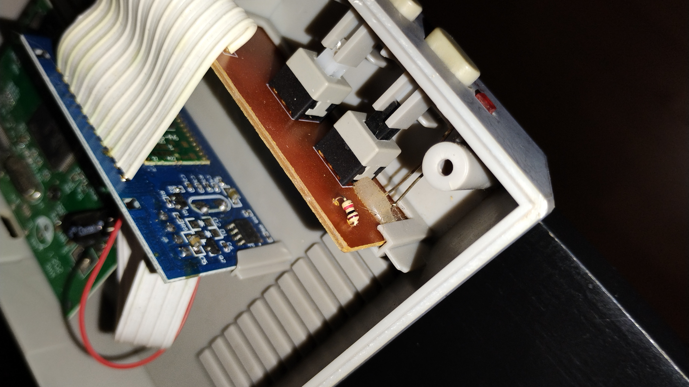
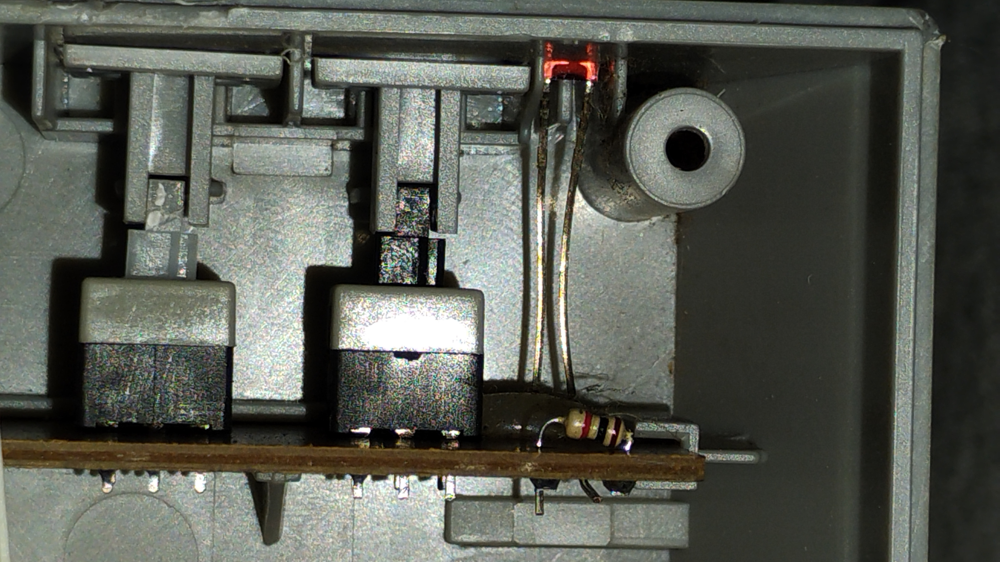
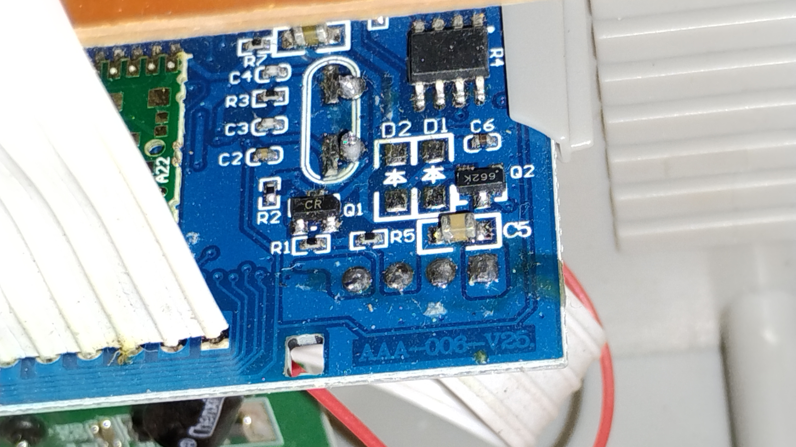

# sesion-04a
# Circuito Astable #

# MS a AS #

# Encargo #

El objeto que se escogió para destripar fue una consola retro ultra game. A simple vista parece ser una caja cuadrada en la que por fuera se aprecian dos botones, un led y un par de conexiones. Al destapar la caja se logran ver una pcv y distintos componentes, tambien se aprecia mejor el estado de los botones, uno funciona y el otro esta roto, igual que mi corazón. 

En el lado izquirdo hay una pcv que parece una versión mini del Parque O´higgins que contiene componentes como un condensador, un chip AT24C02N, tamnbien tiene muchos cuadritos metálicos que parecen edificios muy pequeños y al centro de todo hay otro chip mucho más grande que se parece al movistar arena y que se encuentra conectado a los demás componentes con  muchos caminos y tiene tambien muchos textos muy pequeños que parecen señaléticas.

En el resto del objeto se aprecian otros dos rectangulos azules que parecen ser placas, la más grande tiene conectada los botones, un led y una resistencia. Además tiene una bufanda de cables que llegan a la otra placa y le dan sombrita a lo que parece ser una pcv bebé, de la cual tambien sale un tobogán de cables que lleva la corriente hasta la veersión mini del Parque O´higgins, dandole energía al mini movistar arena con el poder de la amistad.

