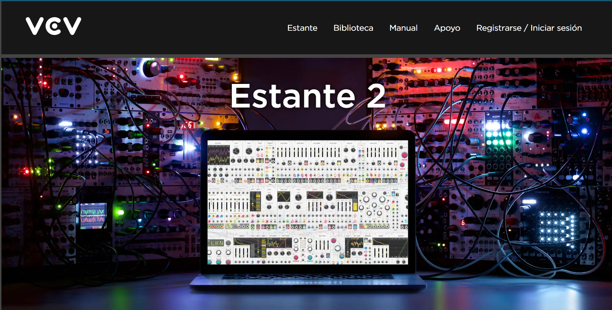
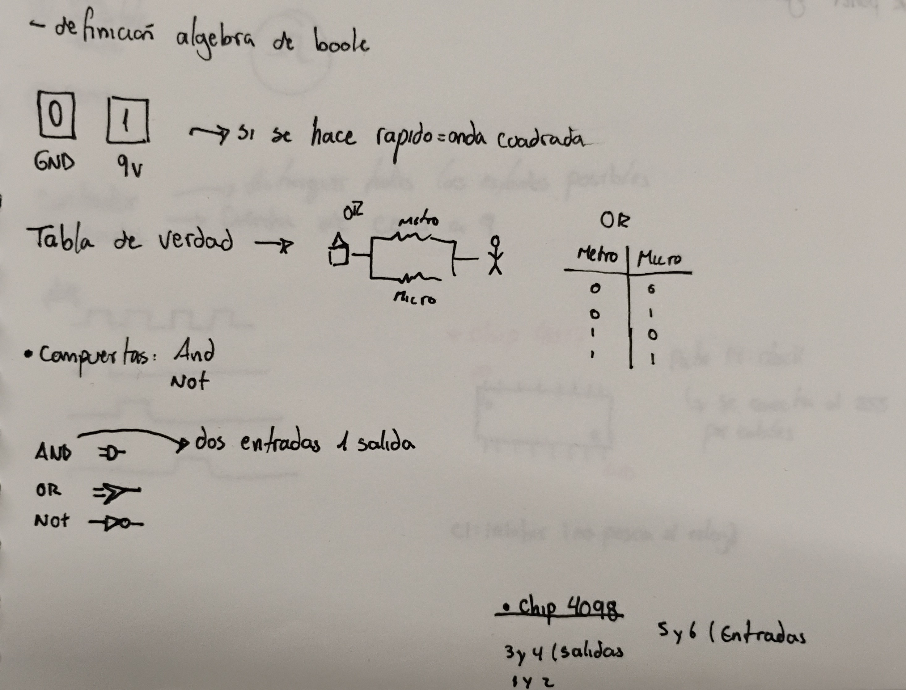
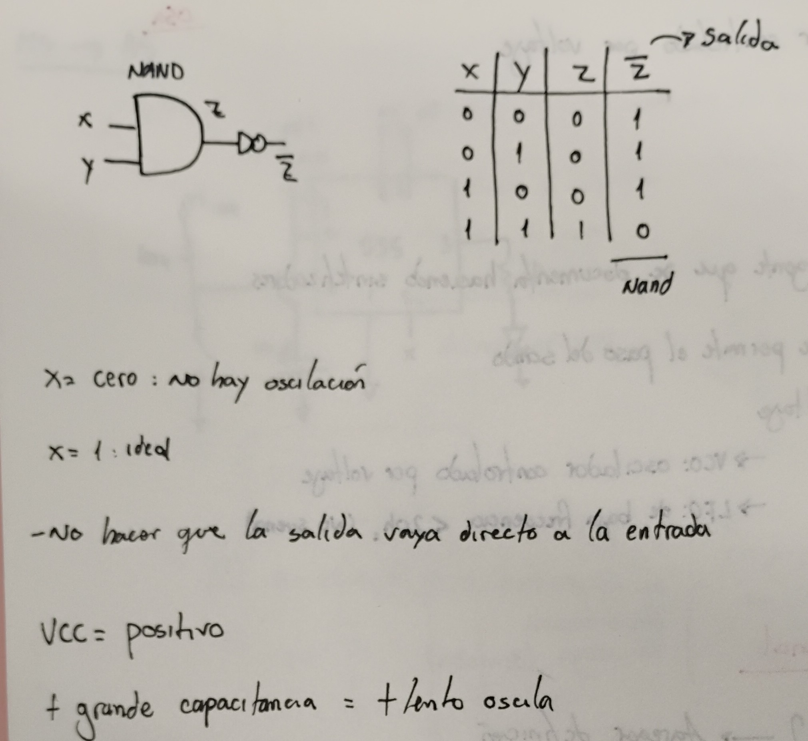
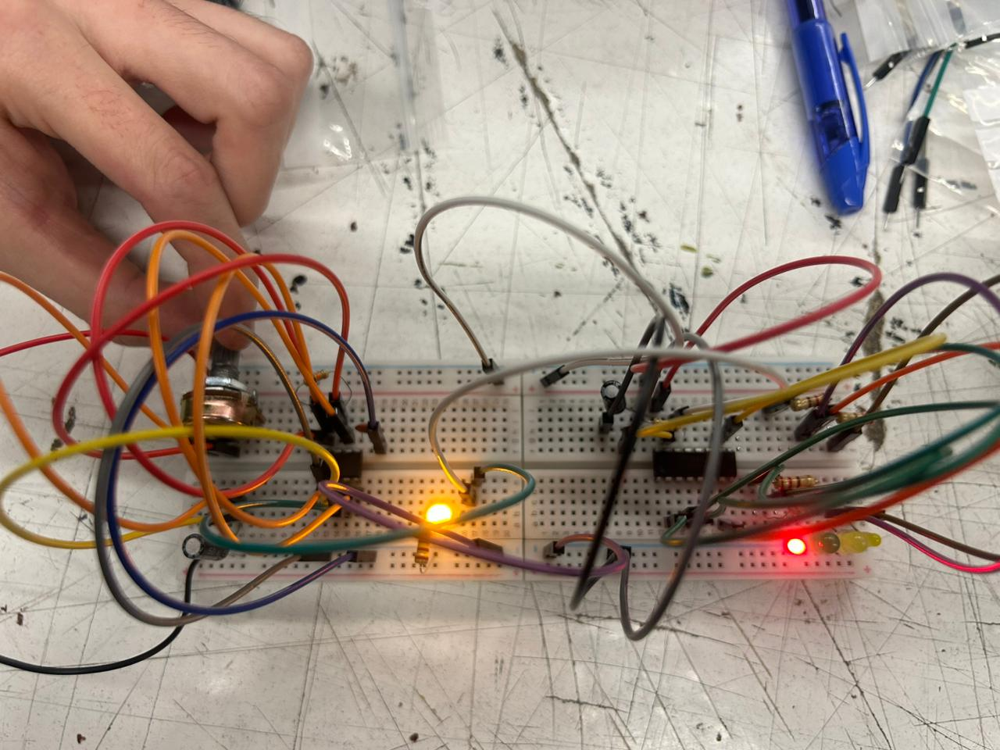
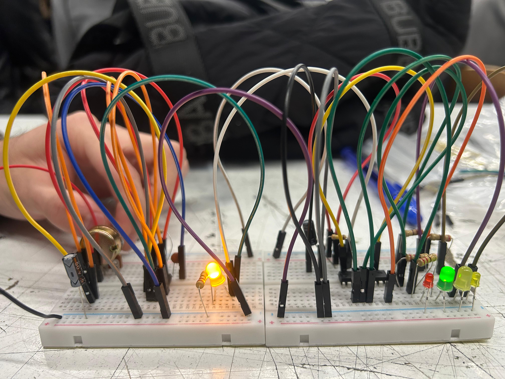

# sesion-05a
vca = amplificador controlado por voltaje

# vvc rack #

aprendimos a usar y descargar la versión gratuita de VCV RACK, es suficiente para poder experimentar con los recursos que tiene

# lógica combinacional #

Según gemmini la lógica es una ciencia formal y una rama de la filosofía que estudia los principios y leyes que gobiernan el razonamiento correcto y válido. 

y la lógica combinacional  es un tipo de circuito digital donde las salidas dependen exclusivamente de la combinación actual de las entradas, sin memoria ni retroalimentación.

# ALGEBRA DE BOOLE #

El álgebra de Boole es una estructura matemática fundamental para la informática y la electrónica digital

Realizando el ejercicio se pudo apreciar un parpadeo constante entre los leds el cual variaba su velocidad al girar el potenciómetror siguiendo todos una misma secuencia de encendido y apagado

