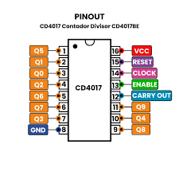

# sesion-05b
# UX #

La Experiencia de Usuario (UX, del inglés User Experience) es el conjunto de emociones, percepciones, respuestas y sensaciones que tiene una persona al interactuar con un producto, sistema o servicio, ya sea digital o físico. Su objetivo principal es asegurar que dicha interacción sea útil, fácil de usar, eficiente y placentera.

significa que se debe pensar en como se hace un producto y como el usuario puede interactuar con el mismo.

+ interfaz de cartón de 2 cajas (gestualidad / amplificador y parlante)

+ **campo de sentido:** nosotros decidimos que es aesthetic

# HACER UN RELOJ #

1) 555 astable
2) 4093

   
+ **contador de decadas:** sirve para distinguir todos los estados posibles y cuenta de 0-9

# CHIP 4017 #

