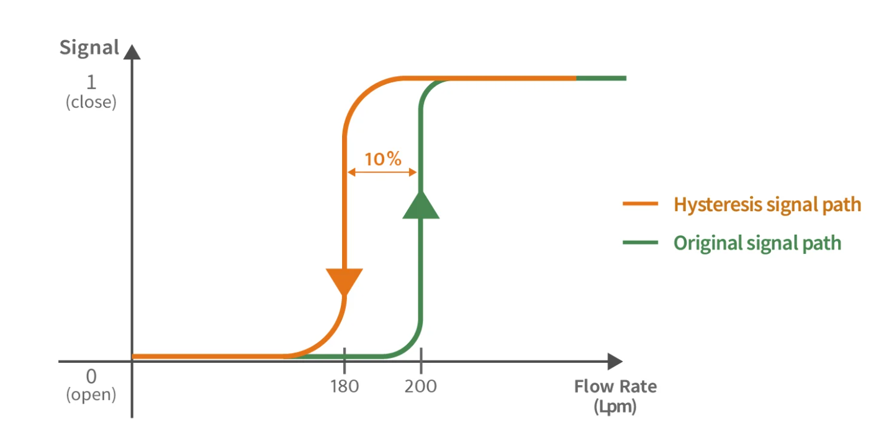
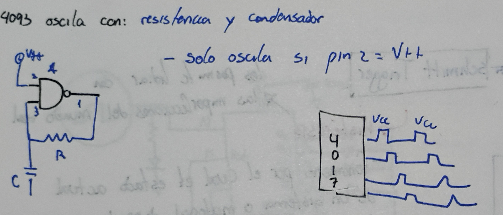
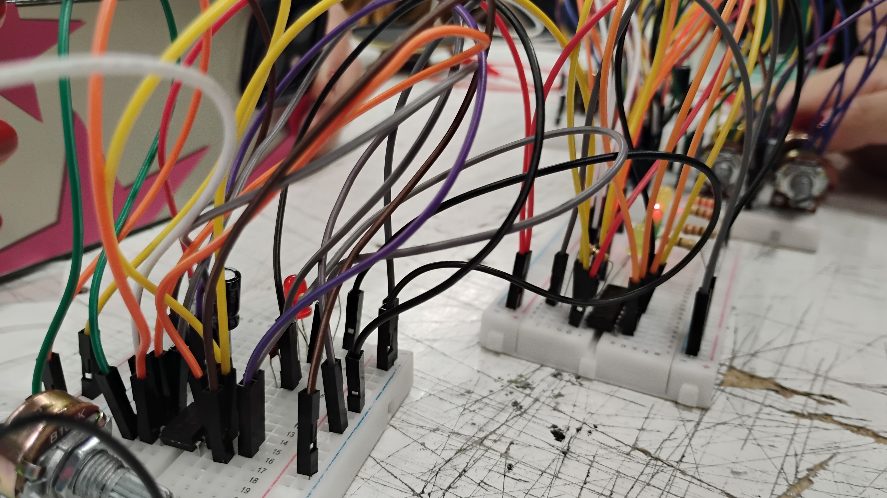

# sesion-06a

# SCHMITT TRIGGER #

+ la histéresis le permite lidiar con las imperfecciones del mundo real
  
+ **HISTÉRESIS:** fenomeno por el cual el estado actual de un sistema o material depende no solo de las condiciones presentes, sino también de su historia pasada.

- se podría decir que "tiene memoria"

  

- las transiciones con schmitt trigger son más controladas

- se trabaja con dos ubrales (uno sube y otro baja)

**4093**

# mix #

salidas ast se conectan con las ressitencas al mix que va hacia el amplificador

# trabajo en clases #

como equipo seguimos trabajando en nuestro circuito, no funcionó. solo funcionaban las dos primeras partes y en las ultimas tuvimos bastantes problemas para integrarlas. Se nos quemó el cihpo 4093 y los potenciometros no funcionaban correctamente.

