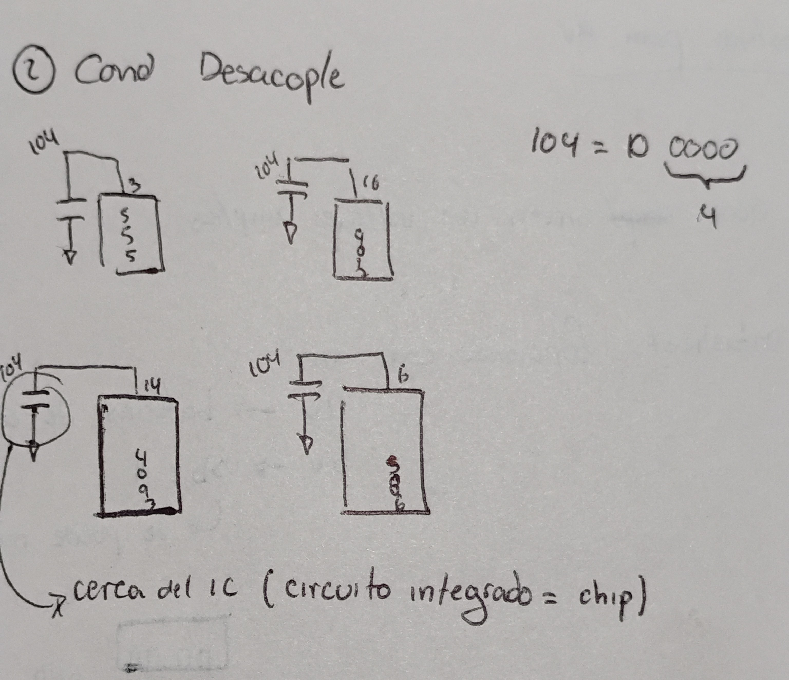
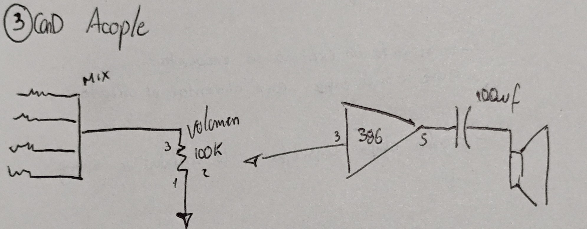

# sesion-06b

# FE DE ERRATAS #

no funciona = mala mia / algo mal conectado

1) estabilizador del clock:  pata 3 del 555 conectada a la entrada 14 del 4017

2) condensador desacople

3) condensador acople

faltó un condensador de 100 entre la pata 2 del potenciometro y la pata 3 del 386

4) alternativas para 9v

   - chips 4000 sirven con voltajes amplios
  
   - según datasheet:

     9v

     12v (baterías de auto y paneles solares)

     5v: usb (se puede modificar más fácil)
