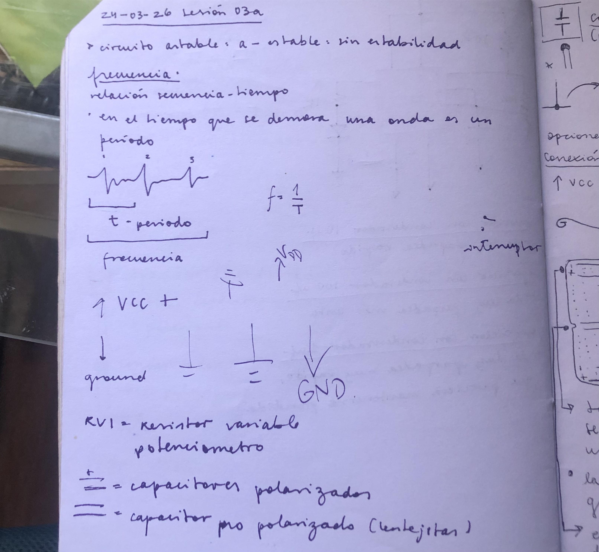
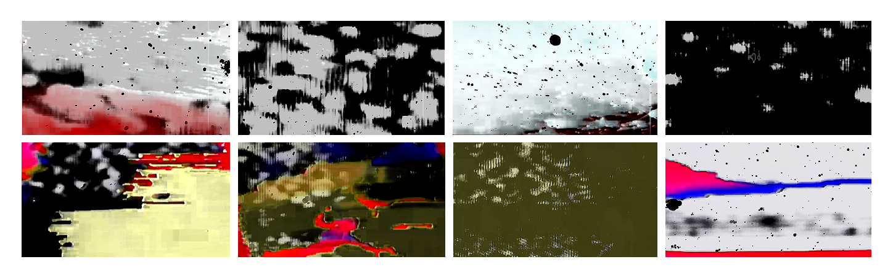
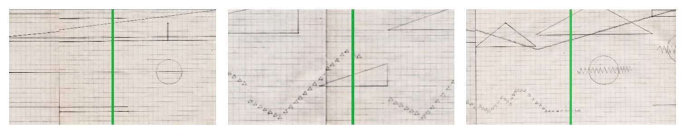
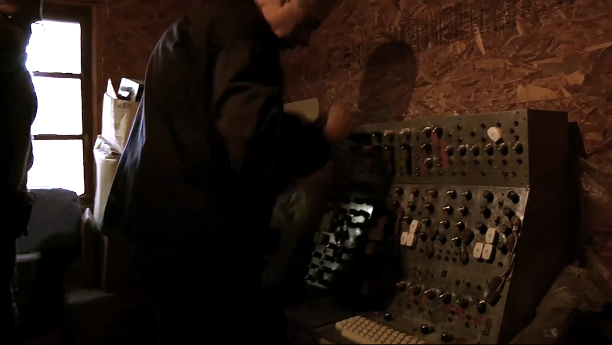

# sesion-03a

## apuntes de la clase

## Documental: Variaciones Espectrales - dereojo comunicaciones

*visuales muy lindas del comienzo del documental*

**Apuntes:**

- “Documental inspirado en la vida y obra del músico e ingeniero chileno José Vicente Asuar, destacado a nivel mundial por su trabajo en el desarrollo de la música electroacústica y creador del COMDASUAR, el primer computador musical en Latino américa, hoy abandonado en una parcela. El reencuentro de Asuar con este artefacto descubre un relato perdido, revelando la historia de un personaje esencial en la biografía sonora chilena.”
  
- El computador cambió muchas cosas, sobre todo en la música, haciendo mucho más accesible para todos aprender sobre ella.
  
- Asuar siempre estuvo asociado al músico misterioso, que hizo algo importante pero fue postergado en su época y que ahora vale la pena redescubrirlo.
  
- En una parte del documental, Asuar relata su experiencia escuchando a los pájaros en un atardecer al norte de Argentina, tratando de definir los sonidos, que empezaban agudos y terminaban bajos, que él esperaba que sonaran en ciertos momentos y no lo hacían y al revés, que ellos hacían lo que querían. Me parece muy lindo buscar inspiración desde la naturaleza, desde lo más cotidiano e intentar codificar esas experiencias para ser interpretadas como un arte, cuando en realidad ellas solo existen sin conocer nuestros conceptos.
  
- La música de Asuar, especialmente variaciones espectrales fue utilizada en la danza. Su sonido permite fácilmente expresar estados emocionales.

- Me parece muy interesante como las partituras son dibujadas, como se interpreta un sonido con formas distintas a las notas musicales ya conocidas. Me imaginaba que la música es dibujable, pero no que se pueda dibujarla de esa manera antes de crearlo.
  
- Asuar explica posteriormente el uso de la partitura y la creación de símbolos que representan sonidos. Es como un crear un idioma nuevo.
  
- Construyó un computador solo, haciendo cosas que en el futuro se harían. Su computador procesaba más sintetizadores que los comunes.

### Apuntes de otras fuentes:

- En el libro La música electroacústica en Chile. 50 años (2005), el músico e investigador **Federico Schumacher detalla aspectos de "Variaciones espectrales", su pieza de 1959, que abre en varios sentidos la era de la música electrónica.** De 12' 57'' de duración, se estrenó el 22 de junio de ese mismo año en el Teatro Antonio Varas, con motivo de los conciertos de cámara del Instituto de Extensión Musical. **Presenta cuatro secciones a modo de variaciones, equivalentes a las de la música tradicional.** El propio Asuar las describe como autónomas: una inicial conformada por sonoridades continuas, una segunda con elementos de pulso ligero, una tercera con efectos de sonido, y una cuarta sustentada en pedales rítmico-melódicos que desembocan en un final.
  
- Interesado además en los computadores y sus aplicaciones para la generación de sonidos y música, **Asuar se abrió paso de manera autodidacta en los territorios de la programación y análisis de sistemas.** Schumacher detalla en su investigación que ya en 1970 realiza una primera herramienta práctica para estos propósitos, y junto a un grupo de estudiantes programan el computador IBM 360. Así realizan la partitura orquestal "Formas I" (1971). En 1972 elabora un computador capaz de controlar la generación de sonidos de sintetizadores, lo que derivaría en el fundacional LP del sello IRT El computador virtuoso (1973).
  
- Pero en esa escalada creativa de los siguientes años, **Schumacher señala que Asuar vivió una experiencia de soledad y nulo apoyo,** además de avizorar que los cambios tecnológicos que se avecinaban (la digitalización de la música) le exigirían un nuevo esfuerzo y que tendría que emprenderlo sólo. **«Había arado en el desierto»**, escribió Asuar. Así se produjo su retiro, alrededor de los primeros años '90. **De esta manera desaparecería de un mapa musical hasta que los compositores que protagonizaron el resurgimiento de la electroacústica a comienzos del siglo XXI, recuperarían esa figura.**

Si quisiera definirlo, diría que fue un adelantado a su época, sensible a su entorno como forma de inspiración y con un amor por la música que lo llevó a extender las posibilidades que estaban preestablecidas. Que bueno que se dieron el tiempo de darle su lugar y establecer su nombre a través de este documental.
